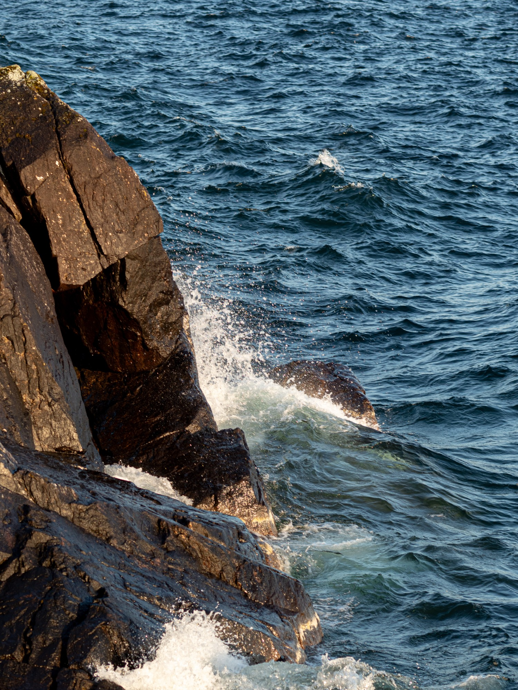
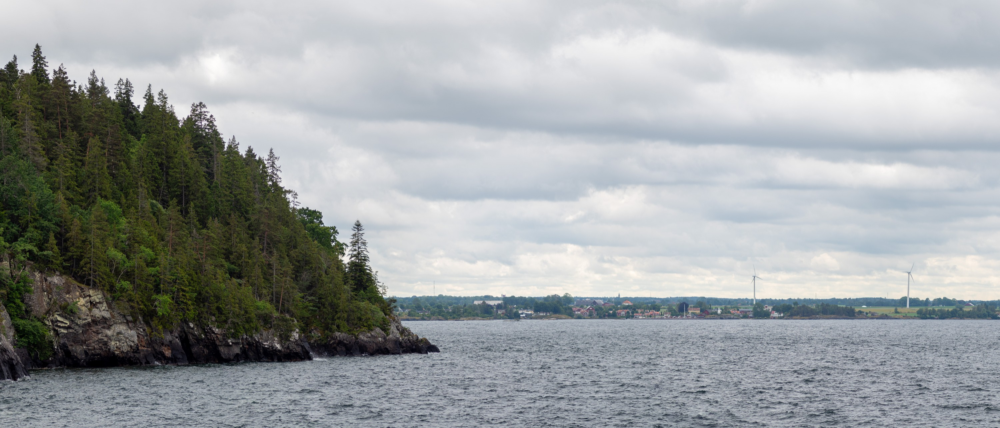
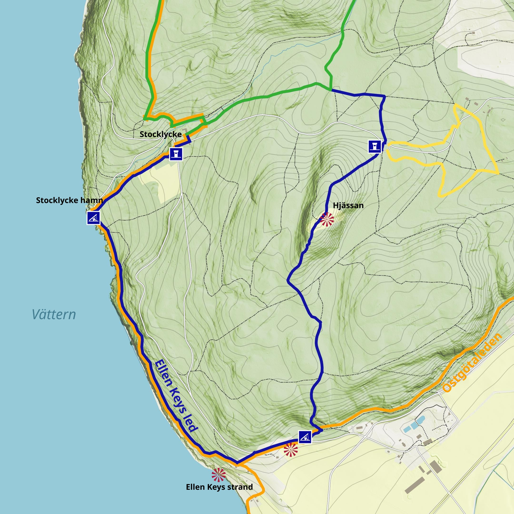
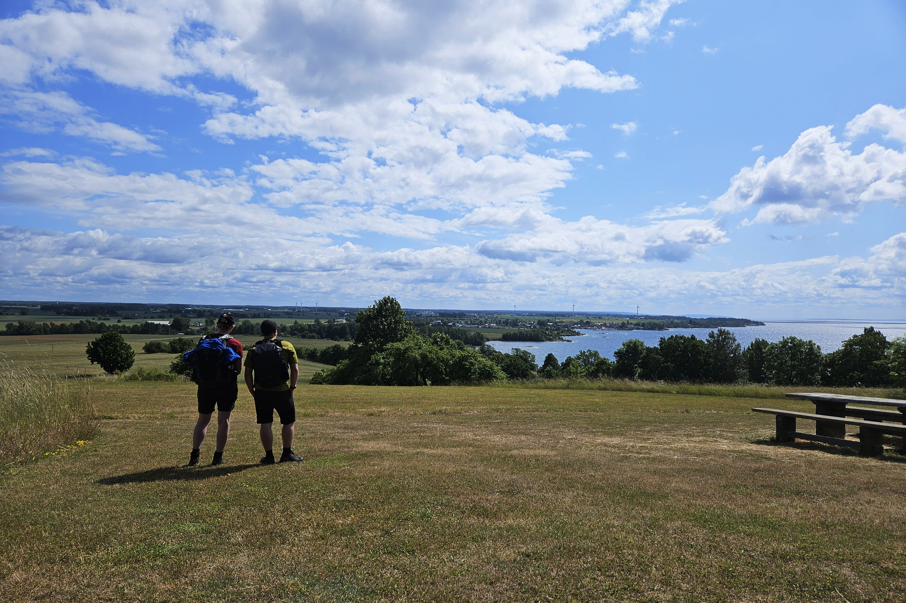
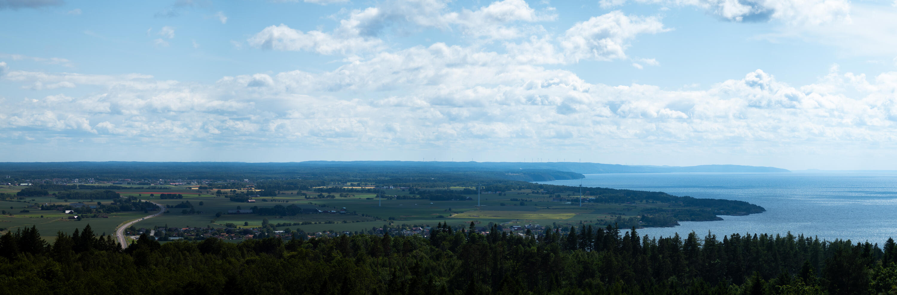
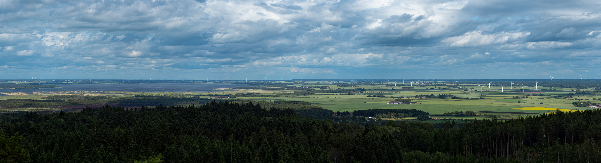
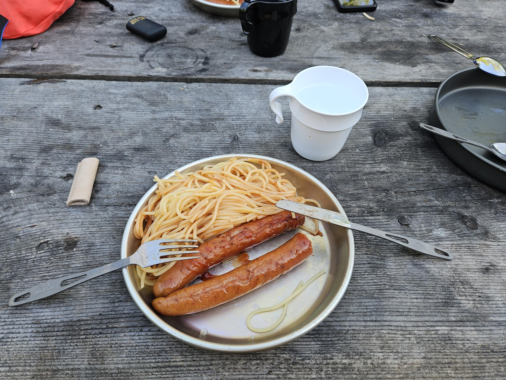
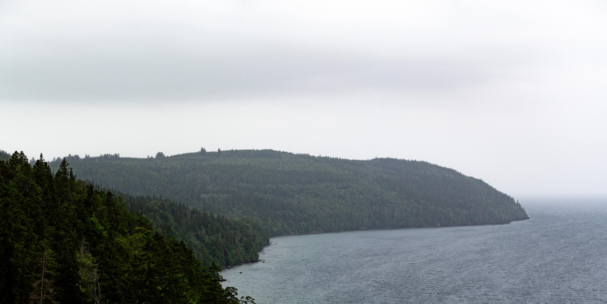

Tredje gången gillt?{.lead}

Vi har varit i Omberg två gånger tidigare, först 2017 då vi var där i två dagar. Första dagen [paddlade vi havskajak från Hästholmen upp till Stocklycke hamn i fantastiskt väder med sol och värme](https://photos.pokenet.cloud/share/Ka6yuQUNbiFN7xtwWBkEApgXe-6fKOn2N4dV0hc6dN5UOZVXXWMq1f-ciglM1z5oKZE). Andra dagen vandrade vi delar av Älvarumsleden men fick avbryta på grund av mycket kraftigt regn.

2020 var vi där ytterligare en tur men bara över dagen och det .

2025 var det dags för revansch. En dags vandring med övernattning, och vi hade kollat ut vädret dagarna innan så att det skulle vara bra förutsättningar.

Denna gången hade vi tittat ut Ellen Keys led som går söder om Stocklycke och passerar många fina områden. Vi gick leden moturs med att gå mot Stocklycke hamn. 

:::: gallery {.-wide}
::: row
{.-inline}
{.-inline}
:::
::: row
{.-inline}
:::
::::

Därifrån följer leden vattnet genom en fin gammal bokskog ner mot Ellen Keys strand

{.-wide}

:::: gallery {.-wide}
::: row
{.-inline}
{.-inline}
:::
::::

Sedan går stigen längs med bilvägen (med fina utsikter över Ödeshög) upp mot Omberg turisthotell, men svänger av in i skogen en bit innan. Sen är det en ganska lagom stigning upp till Ombergs högsta punkt, Hjässan, 263m över havet (175m över Vättern) med utsikt åt alla håll.

{.-full}

{.-full}

Från Hjässan går leden sedan förbi Hjässatorget och tillbaka till Stocklycke. Längs leden fanns flera fina tältplatser som vi kunde välja att slå upp vårt tält för natten. Det lockade lite att sätta upp det i söder med utsikt över Ödeshög, men vi valde till slut Stocklycke hamn.

Kvällsmaten blev grillad korv och spagetti.

:::: gallery {.-wide}
::: row
{.-inline}
{.-inline}
:::
::: row
{.-inline}
:::
::::

Dagen efter skulle vi bege oss vidare på vår tur runt Vättern upp mot Askersund och sen Tiveden.

Det finns flera att köra ut från Omberg, men om man ska norrut är det enda vettiga alternativet vägen via Ombergs västra väggar som går nästan lodrätt ner mot Vättern. De senaste två gångerna vi var här var det väldigt mulet och dålig sikt.

 Tyvärr var denna dagen inget undantag. Västra väggarna bjöd på svindel, men ingen utsikt.

{.-full}

Bättre lycka nästa gång?