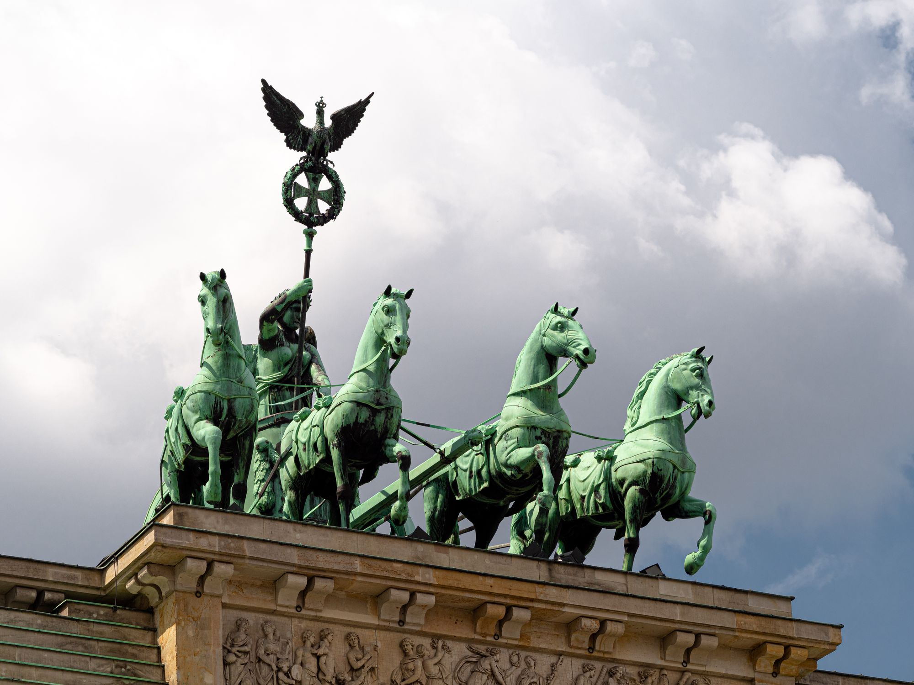
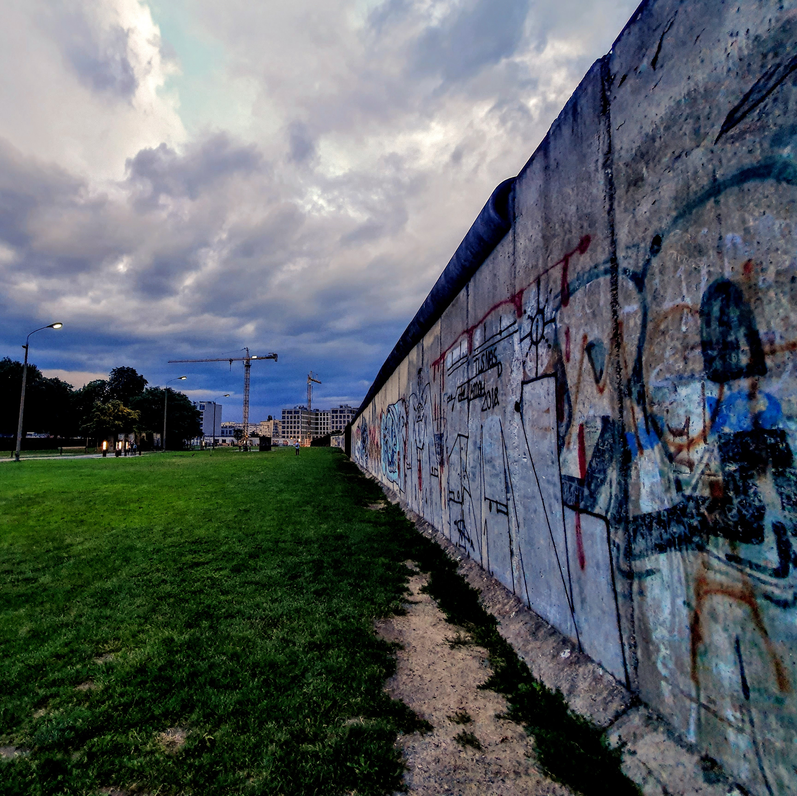

Andra dagen i Berlin började med en trevlig frukost på hotellet och sen en promenad bort till DDR-museet som låg precis intill Berliner Dom.



<figure class="kg-card kg-gallery-card kg-width-wide">
    

        

            

            

            

        

    

</figure>

Museet var väldigt intressant med en massa interaktiva moment som gav en inblick i livet i öst-Berlin från början till dess fall.

Därefter blev det ett besök på Decathlon som är en gigantisk sport- och friluftsaffär. Jag köpte ett par MTB-glasögon :)

<figure class="kg-card kg-gallery-card kg-width-wide">
    

        

            

            

            

        

    

</figure>

Sen gick vi bort till Brandenburger Tor och Tiergarten igen, denna gången för att besöka ett monument för judarna som mördades under andra världskriget som ligger precis intill. 

<figure class="kg-card kg-gallery-card kg-width-wide">
    

        

            

            

        

    

</figure>

Minnesmonumentet syftar till att "representera ett förmodligen ordnat system som har förlorat kontakten med mänsklig anledning" och var som en stor labyrint av betongblock. 

<figure class="kg-card kg-image-card kg-width-full"></figure>

På kvällen blev det ett besök uppe i Fernsehturm 203 meter upp.

<figure class="kg-card kg-gallery-card kg-width-wide">
    

        

            

            

            

        

    

</figure>

Dagen avslutade vi sen med en promenad bort till Berlin Wall Memorial.

<figure class="kg-card kg-gallery-card kg-width-wide">
    

        

            

            

        

    

</figure>

Efter DDR-museet på förmiddagen var det lite extra skrämmande att se muren på riktigt med vakttorn och allt.

I morgon (söndag) lämnar vi Tyskland och beger oss till Tjeckien och Prag.

