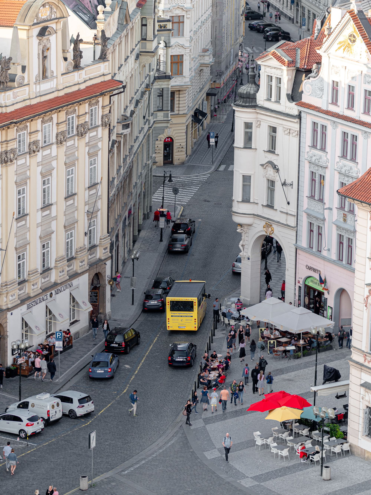

Första resan som kändes som tågluff på riktigt. Under de första två timmarna på tågresan mellan Berlin och Prag fick vi sitta på golvet ute i korridoren.

<figure class="kg-card kg-image-card"></figure>

I Dresden var det två som hoppade av och öppnade upp två säten i en hytt som vi snabbt norpade. Resten av resan var sedan olidligt bekväm i jämförelse med att sitta på golvet.

Väl framme i Prag möttes vi av tungt regn som lyckligtvis snabbt avtog.

<figure class="kg-card kg-image-card kg-card-hascaption"> <figcaption>Vårt hotell</figcaption>
</figure>

I Prag var vi i två dagar så vi lyckades se allt vi ville. Först ut var Old Town Hall som vi klättrade längst upp på.

<figure class="kg-card kg-image-card kg-width-full">
</figure>

<figure class="kg-card kg-gallery-card kg-width-wide">
    

        

            

            

            

        

        

            

            

        

    

</figure>

Därefter blev det fokus på att hitta en restaurang för middag. Efter lite sökande hittade vi en trevlig liten pizzeria i närheten av turiststråken.

<!--kg-card-begin: html--><h2>Dag två i Prag</h2><!--kg-card-end: html-->
Måndagen började vi med att fixa platsbokning till tåget ner mot Linz för att undvika att behöva sitta på golvet den sträckan.

Därefter tog vi oss till tunnelbanan för att ta oss upp mot Prags borg.

<figure class="kg-card kg-image-card kg-width-wide">
</figure>

Det mesta på borgen var fullproppat med folk och krävde inträde så vi nöjde oss med lite bilder utifrån och på utsikten innan vi gick ned från berget.

<figure class="kg-card kg-image-card kg-width-full">
</figure>

Från Kampaparken fick vi fina vyer över floden och Karlsbron.

<figure class="kg-card kg-gallery-card kg-width-wide">
    

        

            

            

            

        

    

</figure>
<figure class="kg-card kg-image-card kg-width-full">
</figure>

Sedan gick vi ner till det dansande huset som Josefine ville se... Det var inte mycket att hänga i granen.

<figure class="kg-card kg-image-card"></figure>

Kvällen avslutades med middag på restaurang följt av huvudnumret med ölprovning på Ú Kunštátů, en mysigt ölställe som ligger på en liten innergård.

<figure class="kg-card kg-image-card kg-card-hascaption"> <figcaption>Foto: <a href="https://josefinenilsson.se">Josefine Nilsson</a></figcaption>
</figure>

I morgon (tisdag) åker vi vidare mot Linz och sen nattåg som är framme onsdag morgon i Venedig.

