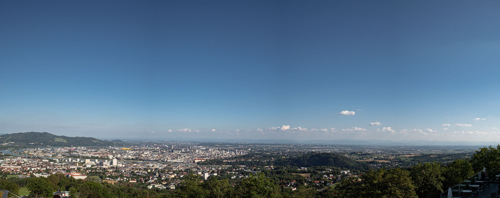
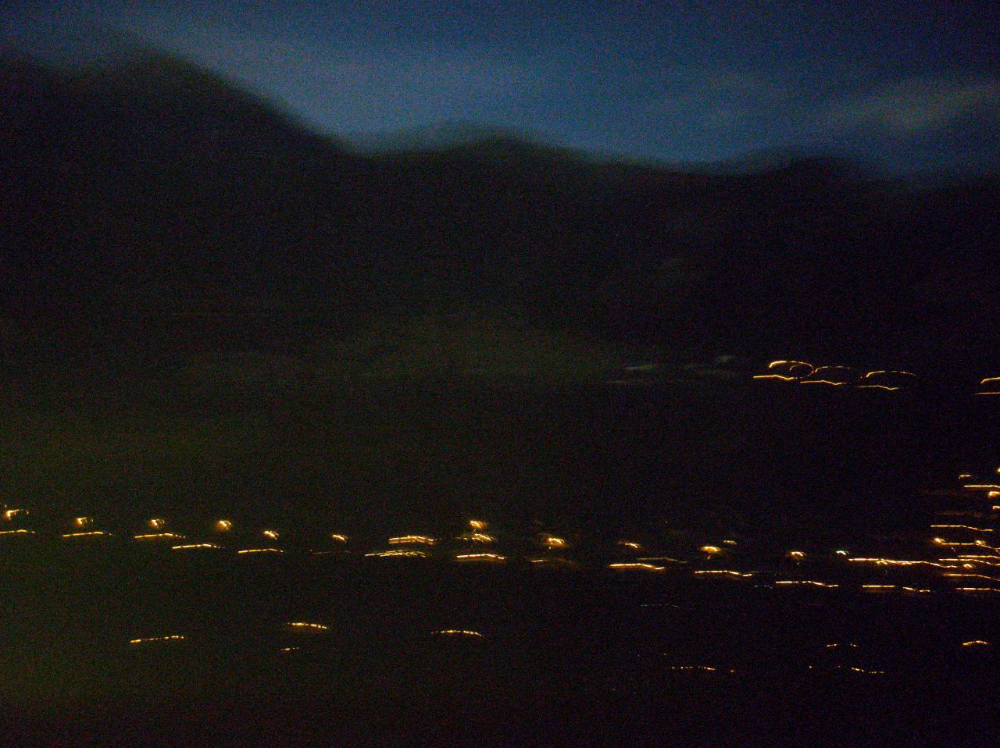

Från Prag åkte vi vidare med tåg ner mot Österrike, denna gången med platsbokning. Vilket vi troligtvis inte hade behövt med tanke på hur få det var på tåget men det var skönt att veta att vi inte behövde resa oss från platserna.

<figure class="kg-card kg-image-card"></figure>

Resan gick utan några större problem fram till Linz. Landskapet vi passerade blev mindre och mindre likt Tjeckien och mer likt Österrike ju närmre vi kom.

I Linz skulle vi sen spendera drygt åtta timmar till vårt nattåg vidare mot Venedig avgick.

<figure class="kg-card kg-image-card"></figure>

Vi började med att gå ner mot centrum i värmen. Väl framme såg vi att det var smidigt att åka Pöstlingbergbahn upp till Pöstlingberg med fantastisk utsikt över staden, så det gjorde vi.

<figure class="kg-card kg-image-card kg-width-full">
</figure>
<figure class="kg-card kg-gallery-card kg-width-wide">
    

        

            

            

        

        

            

            

        

    

</figure>

Efter 40 minuter på toppen kände vi oss nöjda och åkte ner igen. Med tomma magar bestämde vi oss för att leta upp ett matställe. Det blev en liten restaurang med namnet Wirtshaus Keintzel på en innergård som gjorde Wienerschnitzel.

<figure class="kg-card kg-image-card"></figure>

Resten av kvällen spenderades med så mycket avslappning som det var möjligt på stationen.

Nattåget rullade in på utsatt tid och vi letade upp vår vagn 404 och steg ombord. I vår kupé satt ett gäng tjejer från London som halvsov, de hade troligtvis redan åkt flera timmar och hade mer än nio kvar.

<figure class="kg-card kg-image-card kg-card-hascaption"> <figcaption>Bad Gastein</figcaption>
</figure>

Sedan följde den jobbigaste natten på denna resan. Nattåg utan liggvagn är inget att rekommendera men vi fick några timmars sömn iallafall, och vi fick se lite av alperna, även om det var mörkt.

<figure class="kg-card kg-image-card"></figure>

Tidig morgon rullade vi in i Venedig. 

