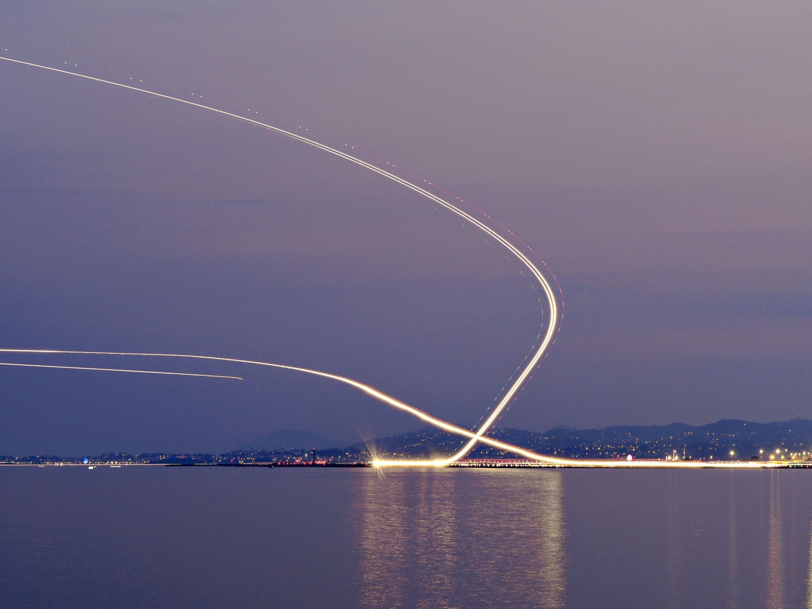
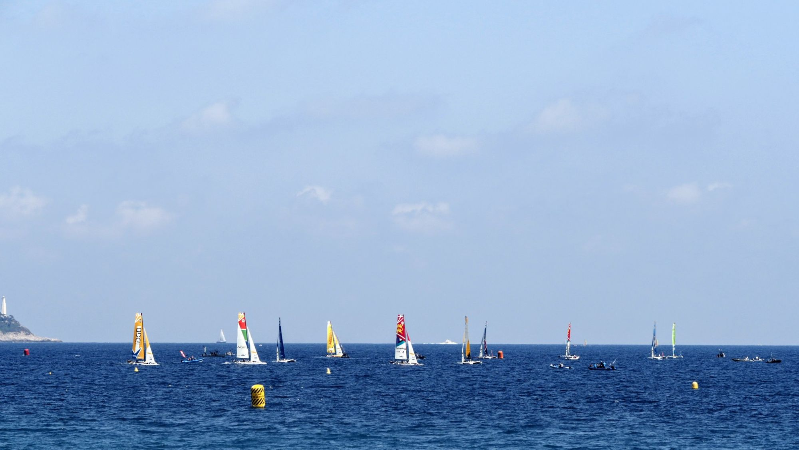

Vädret var fint och varmt när vi landade i Nice. Det första vi möttes av efter att vi fått tag på våra väskor var hur smidig kollektivtrafiken är. Enkelt att köpa biljett (trots att allt var på franska, inga engelska menyer på någon automat i Frankrike inte) och trevliga spårvagnar.

<figure class="kg-card kg-gallery-card kg-width-wide">
    

        

            

            

        

    

</figure>

Väl inne i stan tog vi oss bort till boendet där vi lämnade våra väskor och tvättade kläder.

Vi hade inget direkt planerat denna dagen så det blev en promenad genom staden, först ner mot Place Massena och stranden och sedan bort till hamnen där det eventuellt kunde finnas en Archambault Grand Surprise (segelbåt) som vi skulle inspektera. Vi såg tyvärr ingen sådan.

<figure class="kg-card kg-image-card"></figure>

I närheten av hamnen såg vi att det fanns en Decathlon-butik som vi gav oss bort mot för att införskaffa lite snorklingsutrustning.

Sedan åkte vi tåget bort till centrum igen för att få en bit mat i oss. Vi hittade en trevlig restaurang med trevlig och snabb personal som hette Casa Nissa. Josefine åt en god entrecote och jag åt grillad kyckling.

Nästa dag började vi med att försöka oss på en fransk frukost med nybakad baguette med smör, det var väldigt gott men jag föredrar nog vanlig frukost med mer tillbehör! :)

Resten av dagen tillägnades bad, chill och bokläsning och spenderades på en privatstrand/restaurang. Jag lyckades ta mig igenom Lars Wilderängs Midvintermörker. En ganska dålig bok (väldigt MÖP:ig) men ändå tillräckligt bra för att läsa färdigt.

<figure class="kg-card kg-image-card"></figure>

Efter stranden gick vi tillbaka och hämtade våra kameror och gick ut och fotograferade kvällen.

<figure class="kg-card kg-image-card"></figure>

Uppe vid "I Love Nice" skylten var det en fantastisk vy över bukten och staden.

<figure class="kg-card kg-gallery-card kg-width-wide">
    

        

            

            

        

    

</figure>
<figure class="kg-card kg-image-card kg-card-hascaption"> <figcaption>Flygplan som landar och startar från Nice flygplats&nbsp;</figcaption>
</figure>

Sedan gick vi hemåt och såg att de förberedde en seglingstävling för morgondagen.

<figure class="kg-card kg-image-card"></figure>

Tredje och sista dagen i Nice åkte vi bort till Villefranche sur Mer, en publik badstrand 5min bort med tåg där vi började dagen med snorkling. Efter ungefär 4 timmar på stranden hade vi fått ihop 2.5 timmars snorklande och vi kände oss nöjda (kanske inte riktigt Josefine) och begav oss tillbaka till stan för en dusch och eftermiddagens och kvällens äventyr.

<figure class="kg-card kg-gallery-card kg-width-wide">
    

        

            

            

        

    

</figure>

Först gick vi ner för att kolla på seglingstävlingen med trimaraner av modellen Diam 24.

<figure class="kg-card kg-image-card kg-width-full"></figure>

Det blåste friskt och flera av båtarna kom upp i rejäl fart. På grund av banans uppbyggnad och flera starter paralellt på motsatta håll var det lite svårt att förstå vem som ledde. Men det är alltid kul att kolla på segling.

<figure class="kg-card kg-image-card"></figure>

Sedan kände vi oss hungriga och bestämde oss för ytterligare ett besök på Casa Nissa. Denna gången beställde vi deras pasta som var väldigt god och med lite för stora portioner.

Sedan avslutade vi dagen med att gå tillbaka till boendet för att packa för resan till Paris.

<figure class="kg-card kg-gallery-card kg-width-wide">
    

        

            

            

        

    

</figure>

