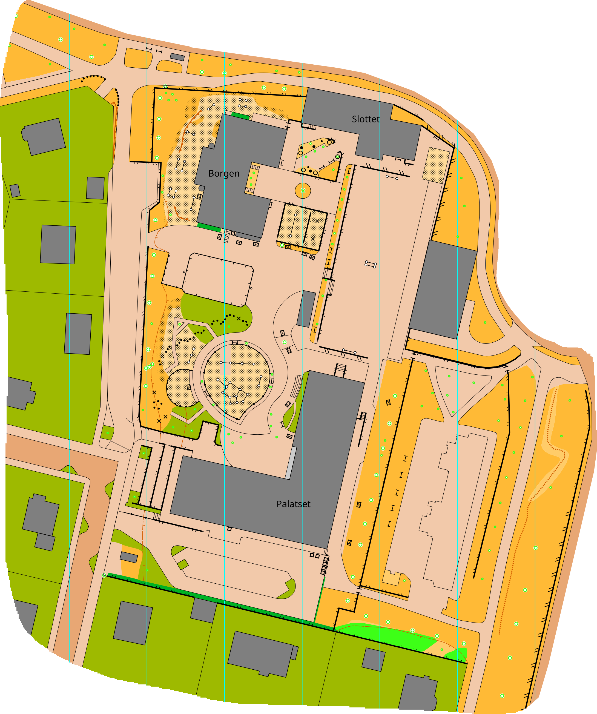

Orienteringsklubben (Hallby SOK) fick en förfrågan från gymnastiklärarna på Talavidskolan om att rita en ny orienteringskarta för deras skolgård. Nyligen byggdes en helt ny skolbyggnad där och runt halva skolgården var helt omgjord, så det behövdes verkligen en ny karta.

Den gamla kartan ritades av Jönköpings orienteringsklubb, och tanken var nog att de skulle rita den nya också; men på grund av O-ringen som kommer till stan nästa år har de fullt upp med att rita kartor för det och frågan gick vidare till vår klubb som inte är lika involverad där.

Jag har redigerat och uppdaterat kartor tidigare men aldrig ritat en från grunden. Jag tänkte att detta skulle vara ett perfekt tillfälle att träna lite på kartritningsprogrammet för orienteringskartor och samtidigt sätta mina GIS-kunskaper på prov.

Ritprogram för orienteringskartor skiljer sig lite från andra kartprogram i att man inte främst jobbar i geografiska mått där allt har en exakt representation i verkligen (GIS) utan man jobbar direkt i slutmodellen som är gjord för tryck på papper och är i millimeter. När man ritar ut ett staket till exempel så mäts det i millimeter på pappret snarare än hur långt det är i verkligheten. Sen har programmet en inbyggd modell för att också mappa positioner och mått på kartan mot hur de skulle vara i verkligheten, en intressant mix!

## Data, data, data

Steg 1 för att börja rita en karta är att samla in data. Med utgångspunkt från en av våra tidigare kartor på området gjorde jag en snabb karta med tillräckligt mycket landmärken (som byggnader, staket m.m.) för att kunna göra vettiga anteckningar på plats.

På plats gick jag sedan runt och gjorde en nekel skisskarta ovanpå min initiala karta samtidigt som jag dokumenterade med kamera från marken (lärdom till nästa gång: _ta alltid fler bilder och med vidvinkel_).

Därefter var det dags för en grej jag experimenterat med på sistone: fotogrammetri.

Med min drönare flyger jag i ett mönster från en specifik höjd med kameran i vinkel rakt ned (nadir) och tar många bilder. Drönaren har inget programmerbart läge (vilket både tidigare och nyare modeller av samma drönare har) utan jag använder mig bara av sekvensbildtagning, oftast 2 eller 3 sekunder och flyger så jämnt jag kan.

Med [OpenDroneMap] kan jag sedan använda mig av fotogrammetri[^1] för att sy ihop bilderna i en mosaik till ett ortofoto[^2] som med lite finjustering ^(georeferering)^ går att göra till ett perfekt bakgrundslager att kartlägga efter. Ofta går det bra att använda sig av Lantmäteriets flygfoton som är av samma typ. Skillnaden är att de tar sina bilder på 2 500–7 400 meters höjd och jag tog mina bilder på 40 meters höjd. Kvalitetsskillnaden på grund av det är betydande.

")

I vanliga fall när man fotograferar med drönare behöver man få ett [spridningstillstånd från Lantmäteriet] för att få publicera bilderna ^(i\ skrivande\ stund\ är\ det\ en\ handläggningstid\ på\ nästan\ 3\ månader!)^, men det finns vissa undantag, till exempel det för offentliga platser _(skolgårdar utanför skoltid är offentliga platser i Jönköping)_ där man inte behöver detta tillstånd.

## Framställning av kartan

{.-wide}

Orienteringskartor frångår ibland verkligheten om det underlättar för läsbarheten på kartan,

## Finjustering och kvalitetskontroll

\*[GIS]: Geografiska informationssystem

[^1]: Fotogrammetri är en process som tar flera bilder från olika perspektiv för att göra en 3d-modell av ett föremål eller en plats (samma process som gör att vi kan ha djupseende med två ögon).

[^2]: Ortofoto är en bild med ortografisk projektion där alla objekt projiceras utifrån en tänkt mittpunkt, rakt uppifrån varje enskilt objekt, liknande hur man skulle rita en karta.

[OpenDroneMap]: https://www.opendronemap.org/
[spridningstillstånd från Lantmäteriet]: https://www.lantmateriet.se/sv/spridningstillstand/
