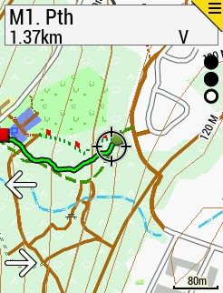
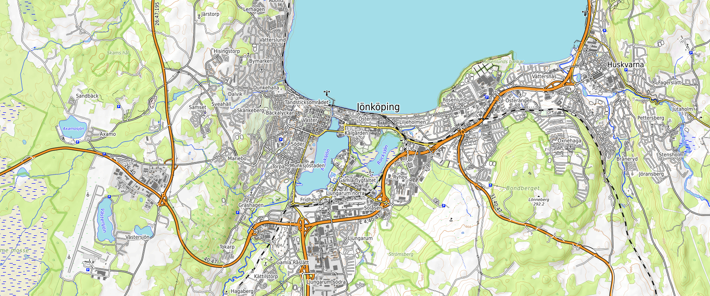
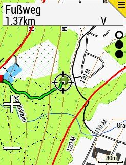
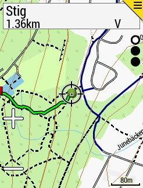

Efter ha fått en Garmin Edge 530 cykeldator i julklapp tänkte jag se om jag kunde få till kartan på ett bra sätt.{.lead}

[Hoppa direkt till nedladdningslänken](#ladda-ner-kartan).

Garmins cykeldatorer kan göra mycket och har en ganska trevlig skärm för att visa kartor, men kartorna som kommer förinstallerade på enheten lämnar en del i övrigt att önska.

* Data är väldigt utdaterad, min enhet kom med tidsstämpel från 2019
* Kartdesignen känns inte helt genomtänkt, det är mycket kontrast på saker som inte är något man bryr sig om (skog/vatten) samtidigt som vissa vägar är lite svåra att se.
* Färgerna är lite för mörka som i kombination med att Garmins färger för att visa rutter också är mörka skapar problem (navigeringslinjen är alltid lila t ex)

## OpenMTBMap

Första alternativet jag testade var [OpenMTBMap](https://openmtbmap.org/) som var flera steg framåt. Kartdatan uppdateras regelbundet (veckovis om jag förstod det rätt) och kartan är också betydligt bättre

Samtidigt var det ganska många saker jag störde mig på vid användning, framförallt att det är på tok för mycket detaljer. Jag känner inget behov av att se varenda kiosk, fotbollsplan eller livsmedelsbutik.

Visst, det går att ställa ner detaljnivån på enheten vilket löser detta problem, men då renderas också kartan med lägre upplösning, runda svängar blir kantiga och rätvinkliga hus blir romber.

## OpenTopoMap

Nästa kandidat var OpenTopoMap, en rendering av OpenStreetMap gjord av en tysk utvecklare. Finns även som en app på webben på [OpenTopoMap].

{.-full}

Denna kartan är betydligt bättre. Bättre ljusare färger som ger bättre kontrast mot Garmin-färgerna och kartan uppdateras regelbundet.

Samtidigt var det andra problem, för stigcykling är den ganska värdelös, stigar har bara en pixel i tjocklek och syns knappt. Byggnader är också lite för mörka och syns ofta mer än vad vägarna gör.

Kartan är gjord på tyska översatt till engelska. Detta gör att när enheten är inställd på något annat språk än engelska så blir det tyska som visas (se bild ovan).

## DIY

Ni som känner mig ser säkert åt vilket håll detta oundvikligen är på väg. Jag bestämde mig för att bygga min egen karta.

Jag får då några fördelar:

* Jag kan styra exakt hur kartan ser ut och vad som ska visas
* Jag kan uppdatera kartan hur ofta jag vill
* Jag får en massa extra arbete

Första frågan är då vilket utseende jag vill ha på kartan. Jag gillar designen och valen som tagits med kartrenderingen [CyclOSM], så jag tänkte att det kan vara en bra utgångspunkt.

"){.-full}

Verktyget som används för att skapa en rendering för Garminenheter heter [mkgmap] och man designar kartan via `typfiles`, jag använde först redigeringsprogrammet [TYPWiz 6] men gick sen över till att redigera textfilerna direkt, det var snabbare när man väl vant sig vid strukturen.

Så blev mitt första utkast, redan en tydlig förbättring. Jag valde att göra landområden som skogar, fält, hus med mera ljusa för att ge en ordentlig kontrast till stigar och rutter på enheten. Stigar blev svarta och dedikerade cykelvägar/stigar i mörkblått. I praktiken fungerar det bra då det räcker att kasta ett öga på enheten för att orientera sig.

[Ladda ner kartfilen (~430MB)](https://onedrive.live.com/download?cid=2858546231E48839&resid=2858546231E48839%21269806&authkey=AM-fQ79ti5J_zMw){download #ladda-ner-kartan .button}

Vet du inte hur du installerar kartan? [DC Rainmaker har skrivit en guide för hur du installerar kartor på din Garmin-enhet](https://www.dcrainmaker.com/2013/05/download-garmin-705800810.html#part-ii-installing-the-maps).

*[DIY]: Do it yourself

[CyclOSM]: https://cyclosm.org
[mkgmap]: https://www.mkgmap.org.uk
[TYPWiz 6]: http://www.pinns.co.uk/osm/ostyp.html
[OpenTopoMap]: https://opentopomap.org
