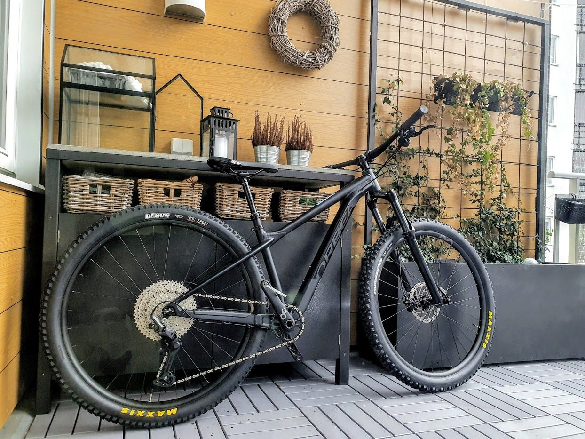
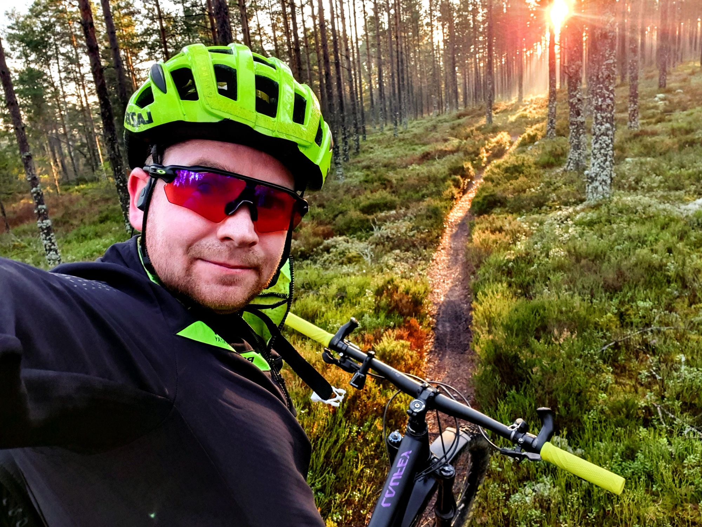
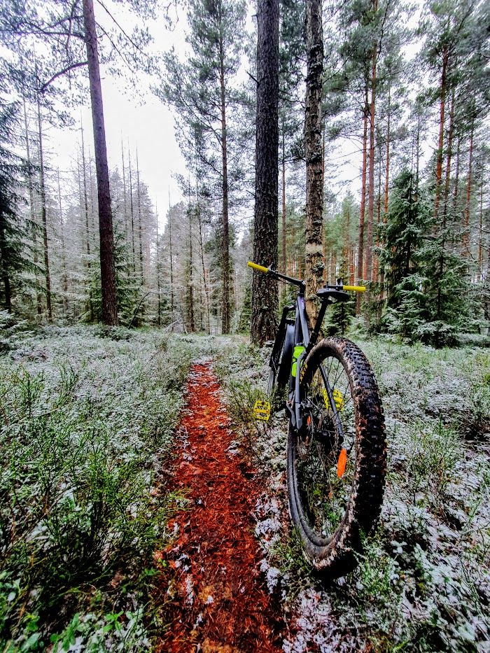
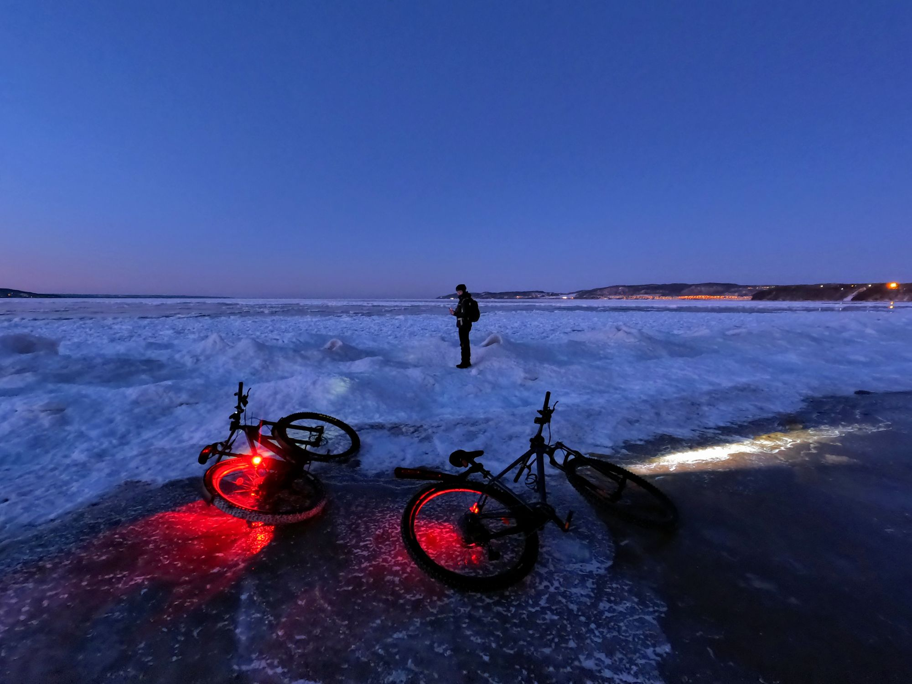
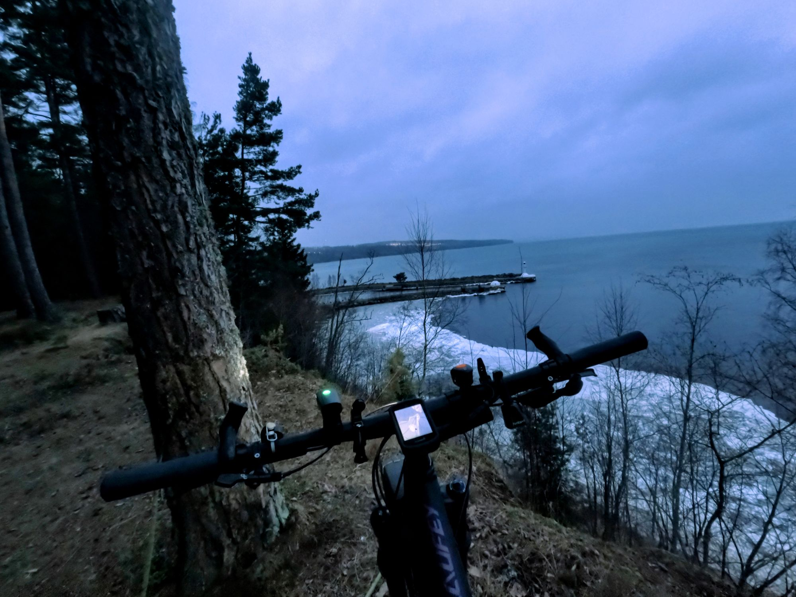
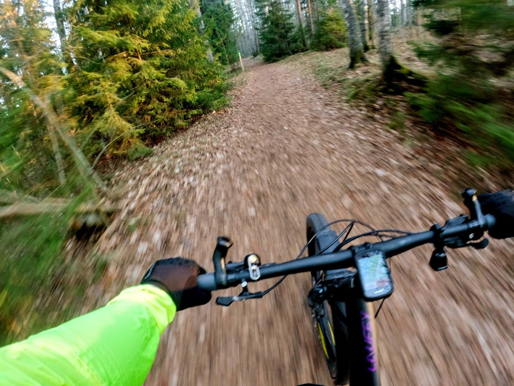
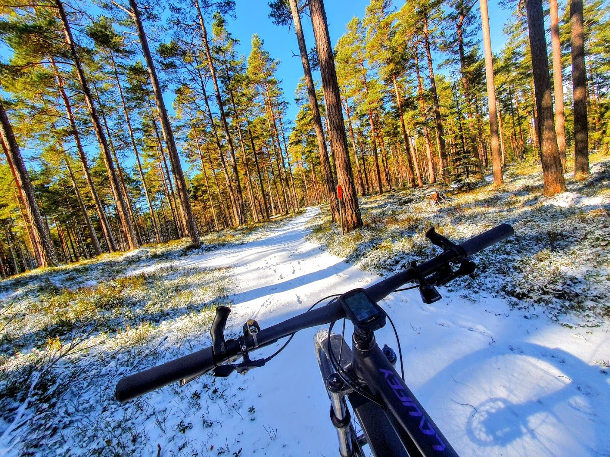
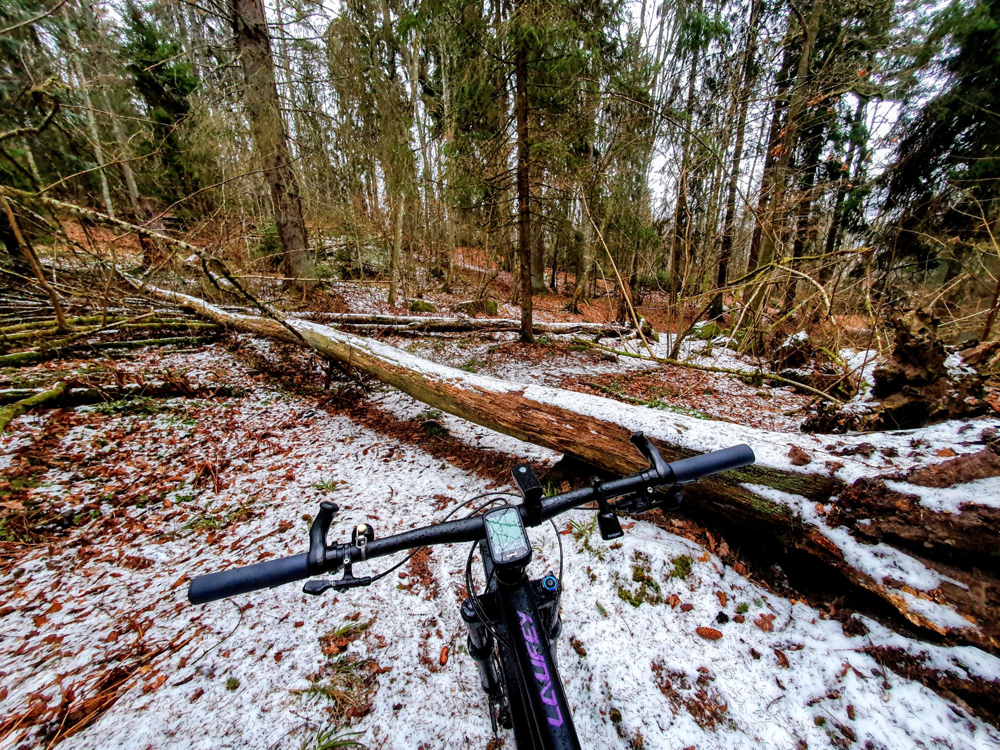

Nu när våren äntligen är här med varma temperaturer och cykelturer i kortbyxor och t-shirt tänkte jag det kunde vara läge att dumpa alla bilder från den fina säsong med vintercykling jag haft sen oktober när jag köpte min MTB.{.lead}

{.-wide}

:::: gallery {.-wide}
::: row {.-no-wrap}
{.-inline}
{.-inline}
{.-inline}
:::
::: row {.-no-wrap}
{.-inline}
{.-inline}
:::
::: row {.-no-wrap}
{.-inline}
{.-inline}
:::
::: row
{.-inline}
{.-inline}
:::
::::

{.-wide}

{.-wide}

:::: gallery {.-wide}
::: row
{.-inline}
{.-inline}
:::
::::

{.-full}

{.-wide}

:::: gallery {.-wide}
::: row {.-no-wrap}
{.-inline}
{.-inline}
:::
::::

{.-full}

:::: gallery {.-wide}
::: row
{.-inline}
{.-inline}
:::
::: row
{.-inline}
{.-inline}
:::
::::
