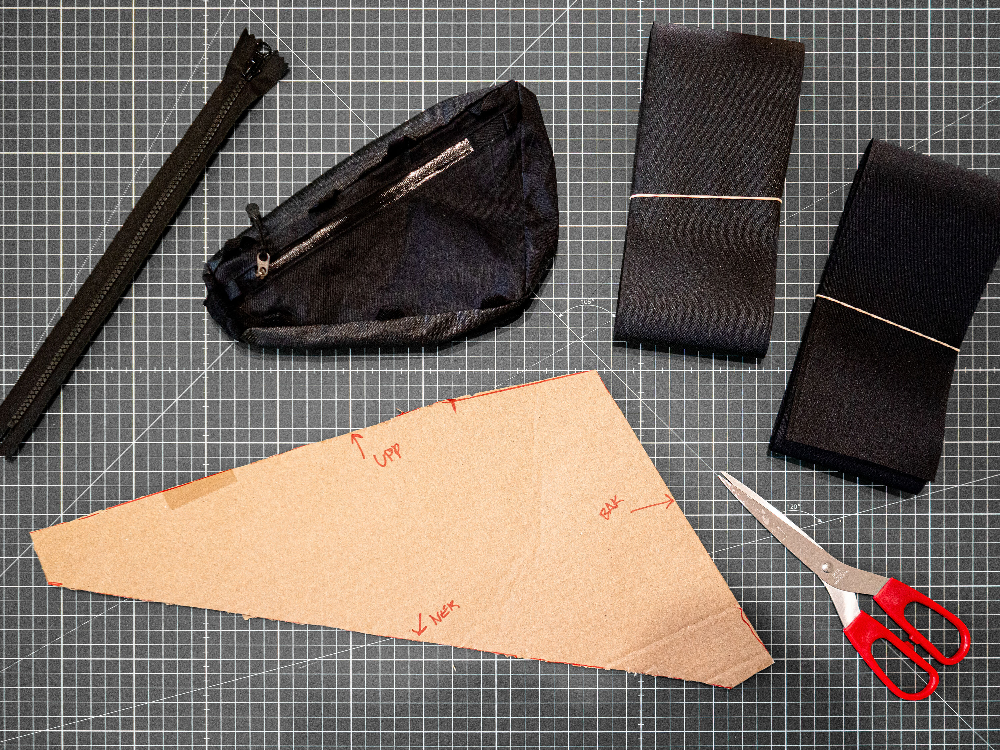
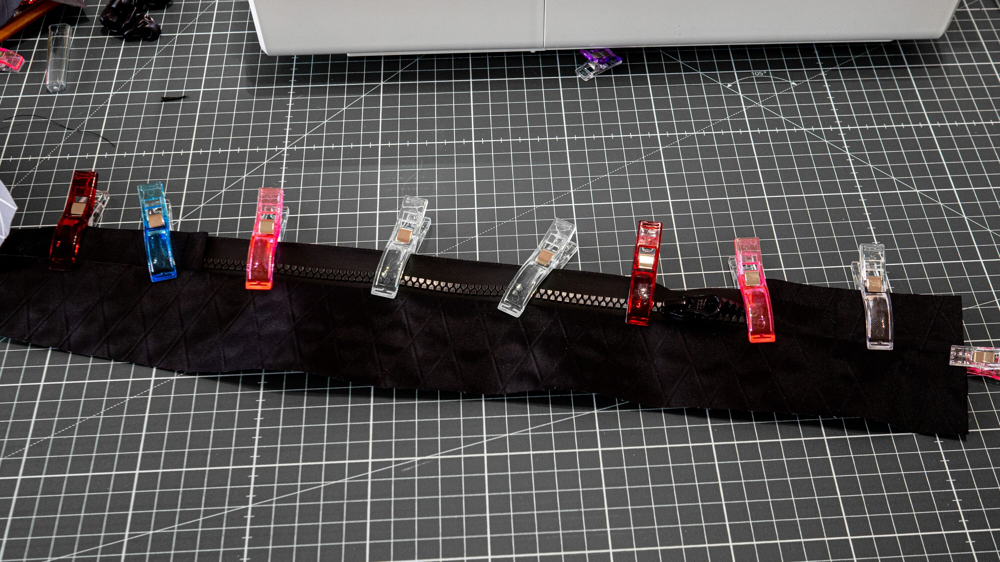
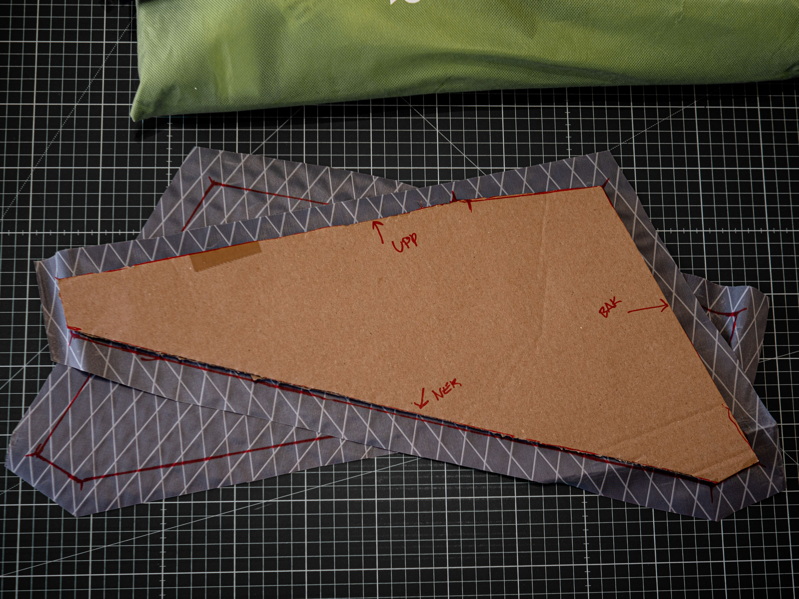
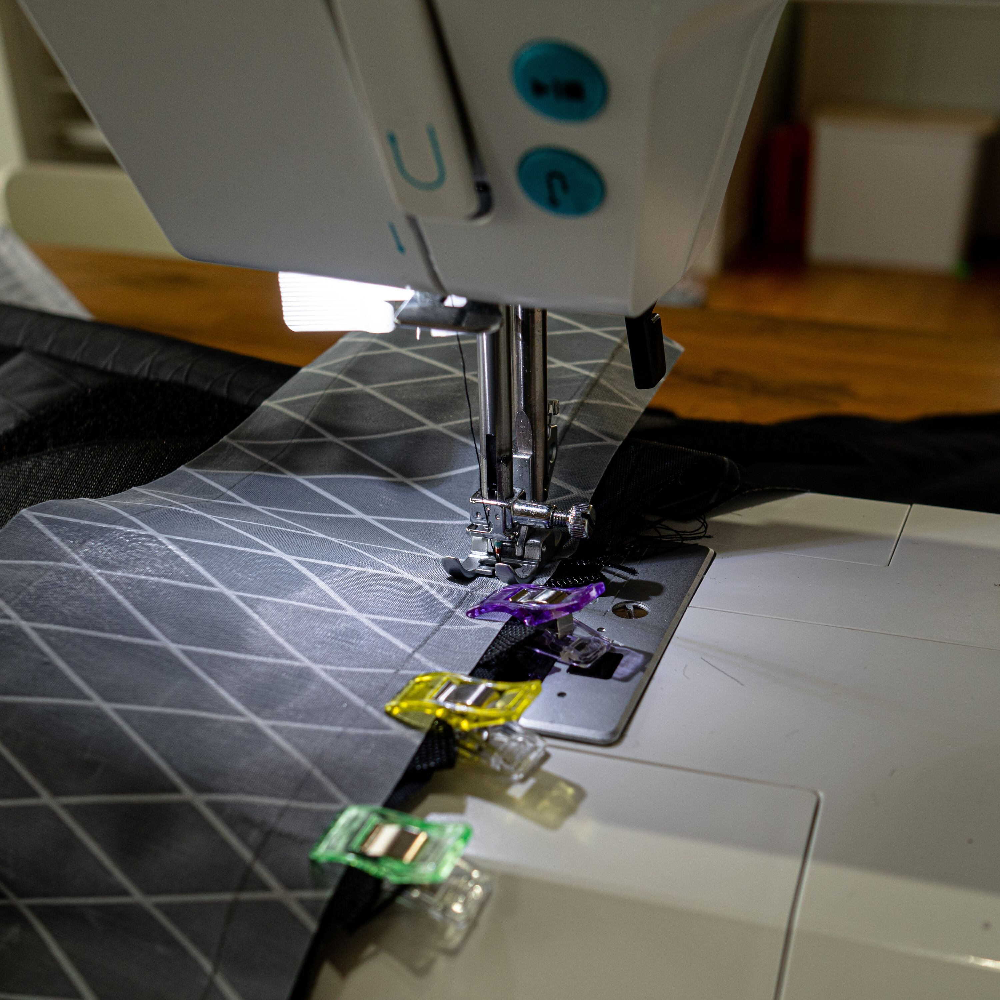
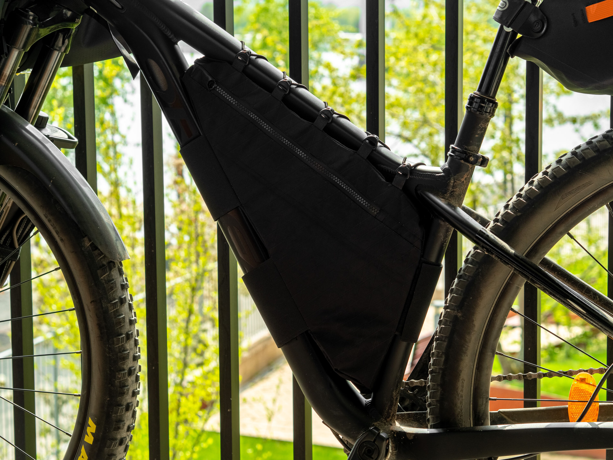

De flesta väskor för cyklarna är one-size-fits-most. Där inkluderas styrväskor, sadelväskor med mera. Det gäller dock inte för ramväskan eftersom den ska in i ramen. Många cyklar har en ganska liknande ram som racer och gruscyklar, men inte MTB.{.lead}

jag valde därför att sy min egen. Jag har sedan tidigare sytt en mindre sådan väska som jag använt då och då när jag inte vill ha ryggsäck. Nu var det dags för en modell större.

{.-full}

## Material

Här är en lista på det material jag använde för väskan.

-   [X-PAC 220g/m²][Friluftstyger - X-PAC220]
-   [YKK Aquaguard Vislon 5VT 30cm][Extremtextil - YKK Aquaguard 5VT]
-   [100mm kardborrband][Friluftstyger - Kardborrband]
-   [Krokar för gummiband][Extremtextil - Pack hook for 3mm cord]

När jag sydde planerade jag inte allt från början, jag började med sidorna som jag gjorde en mall av i kartong och sen sydde jag efter en bild jag hade i huvudet.

:::: gallery {.-wide}
::: row {.-no-wrap}
{.-inline}
{.-inline}
:::
::: row {.-no-wrap}
{.-inline}
{.-inline}
:::
::::

Alla infästningar fick förstärkta sömmar. Runt sadelstolpen och diagonalröret satte jag kardborrband som fäste men på överröret gjorde jag ett snyggt sicksackmönster med ett gummiband så att det skulle se snyggt ut uppåt.

Det blev många omtagningar där jag fick sprätta upp en söm men slutresultatet blev jag väldigt nöjd med.

{.-full}

*[MTB]: Mountainbike

[Friluftstyger - X-PAC220]: https://www.friluftstyger.se/sv/material/tyger/x-pac/tyg-tpac220.html
[Friluftstyger - Kardborrband]: https://www.friluftstyger.se/sv/material/rep-och-snoren/kardborreband/kardborreband-kb-3.html
[Extremtextil - YKK Aquaguard 5VT]: https://www.extremtextil.de/en/aquaguard-vislon-5vt-one-way-non-separating-30cm.html
[Extremtextil - Pack hook for 3mm cord]: https://www.extremtextil.de/en/pack-hook-for-3mm-cord-with-webbing-attachment.html
