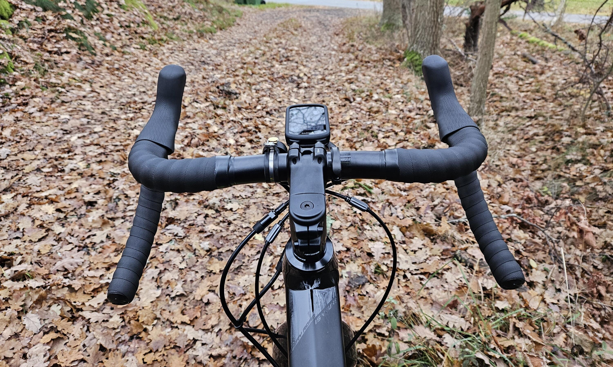
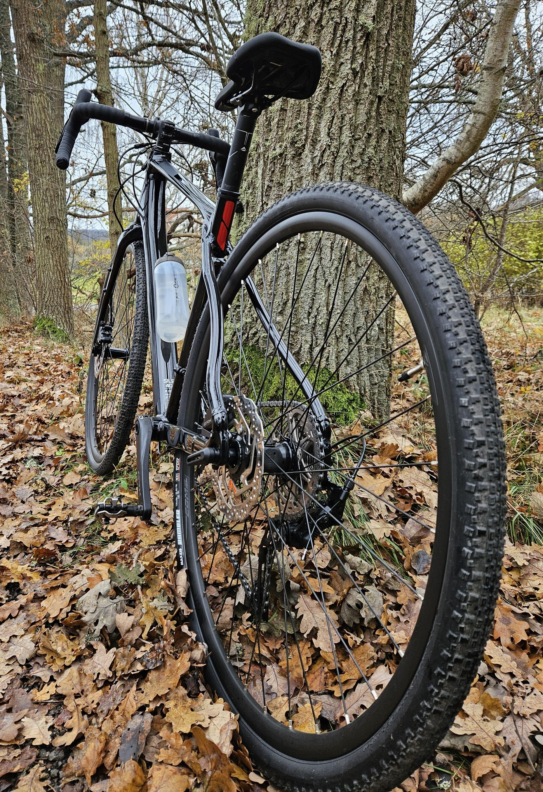

Jag har länge bara haft två cyklar, min gamla Crescent stadscykel och min Orbea [stigcykel][Orbea Laufey - Vintercykling]. Stadscykeln har jag använt främst för ärenden i stan, typ handling och transportsträckor i närområdet. Stigcykeln har fått fylla alla andra roller, skoj i skogen, långrundor, bikepacking, transportsträckor m.m.{.lead}

Eftersom min stadscykel är lite av en skrothög nuförtiden (den har 16 år på nacken och jag ger den inte så mycket kärlek som den skulle behöva) så har stigcykeln fått fylla alla roller som stadscykeln inte klarar av. Det har lett till att den har hamlat lite i riskzonen att bli en [frankenbike][/r/frankenbike] med modifieringar för att göra den mer bekväm på framförallt långa distanser och inte det den är gjord för: **skoj i skogen**!

Istället blev det `n+1`[^1] med en svart [Merida Silex 400] i storlek S, en gruscykel konstruerad med inspiration av geometrin från stigcyklar och perfekt för bikepacking.

Så nu kan stigcykeln få vara det den vill vara.

{.-full}

Det första jag gjorde var att [lackskydda cykeln med samma metod som Krister Isaksson skrev om i sin blogg][Kristers blogg - Lackskydd]. Resultatet blev fantastiskt och vatten bara rinner av ramen. Enkelt och bra resultat.

Just långa distanser är något jag är sugen på att testa, [mina längsta rundor på stigcykeln har varit på runt 3 timmar][Strava - 6985802857] och var ganska obekväma mot slutet (säkert delvis för att jag är dåligt tränad). Förhoppningsvis ska gruscykeln funka bra för detta, även för ännu längre rundor!

{.-wide}

Med en ny cykel blir det också dags att öppna [pysselverkstaden](/diy/) för att tillverka lite nya cykelväskor, först ut är en liten kompakt styrväska för att kunna ha lite verktyg, telefonen och lite snacks i.

:::: gallery {.-wide}
::: row
{.-inline}
{.-inline}
:::
::::

[^1]: [Regel #12 i Velominati][The Rules] säger att det optimala antalet cyklar är `n+1` där `n` är det nuvarande antalet cyklar.

[The Rules]: https://www.velominati.com/#the-rules
[Merida Silex 400]: https://www.merida-bikes.com/sv-se/bike/3119-4115/silex-400
[/r/frankenbike]: https://old.reddit.com/r/Frankenbike/
[Orbea Laufey - Vintercykling]: /2021/05/17/en-vinter-pa-cykel/
[Kristers blogg - Lackskydd]: https://cykelmagasinet.se/lackskyddar-cykeln/
[Strava - 6985802857]: https://www.strava.com/activities/6985802857
