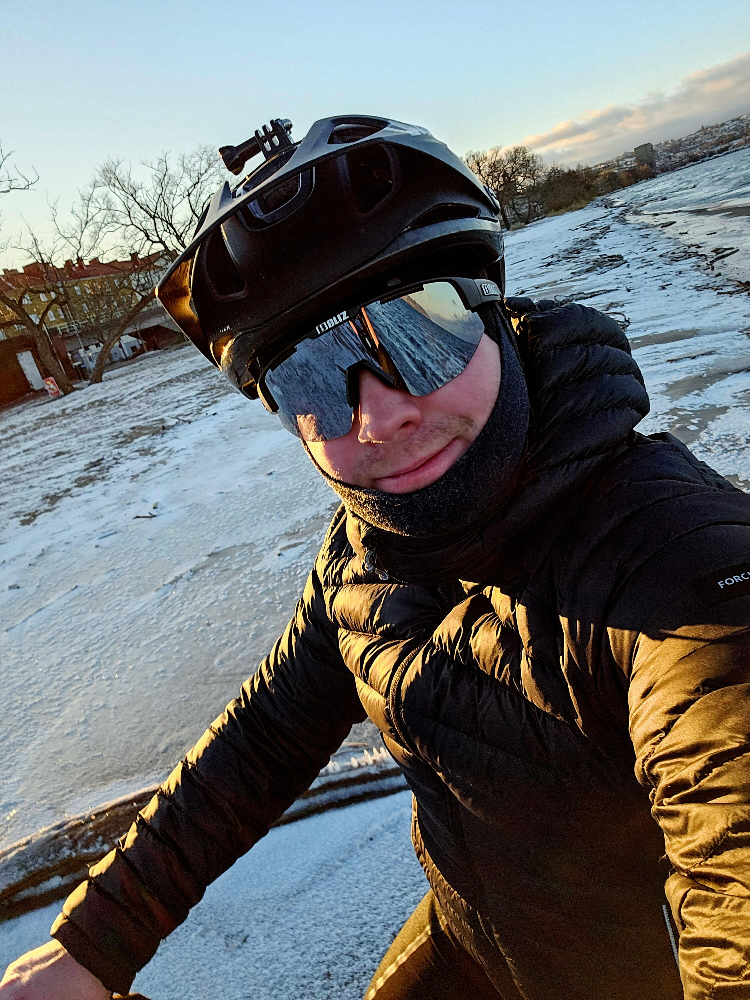
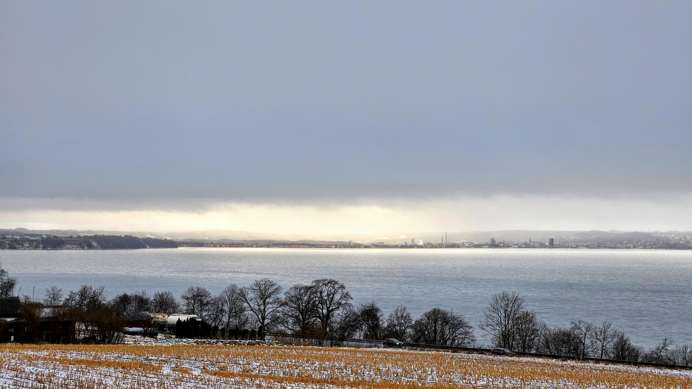
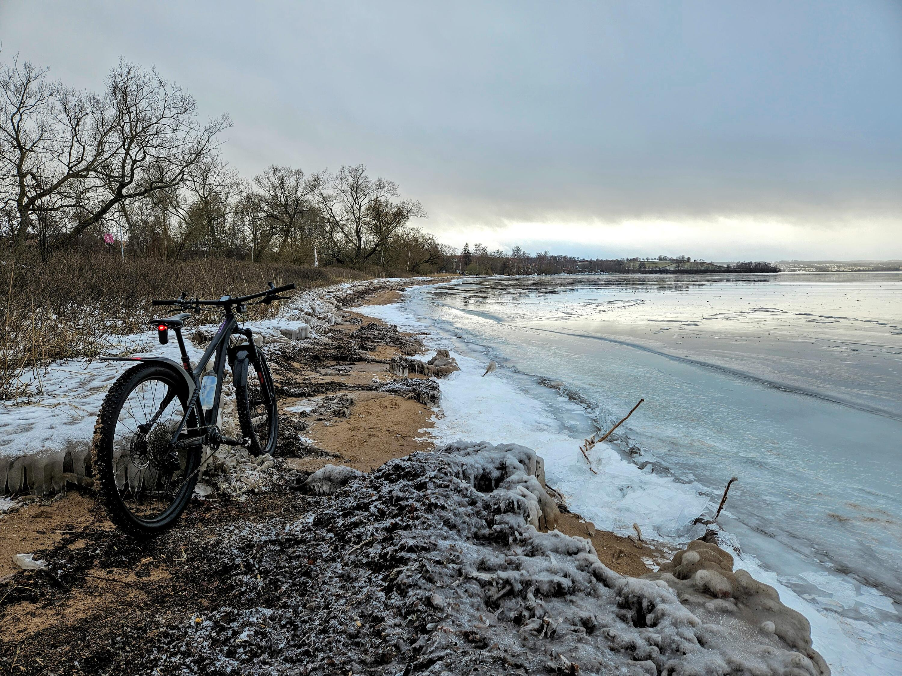
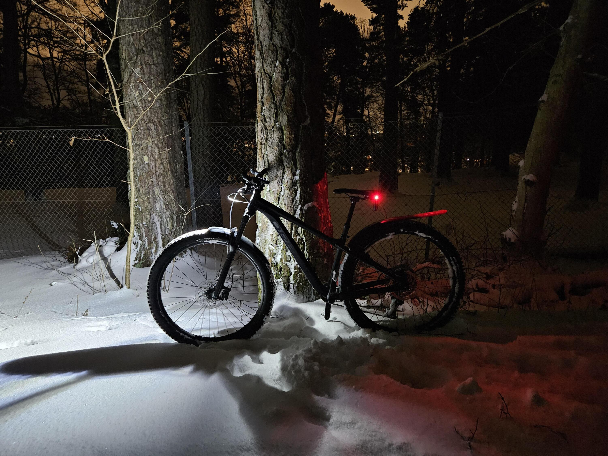

Tyvärr har jag inte kommit ut med [nya cykeln](/2023/11/18/ny-cykel/) på ett tag på grund av vädret, planen är inte att sätta på vinterdäck på den utan den får vara en tresäsongscykel.

Stigcykeln däremot fick på sig mina två och ett halv kilos dubbdäck har är fullt redo för alla äventyr. Jag har försökt undvika att cykla när det varit allt för kallt men när temperaturen närmar sig nollan så har jag passat på. Jämfört med den varma delen av året så blir turerna betydligt kortare, delvis för att jag tycker det känns lite riskabelt med längre turer ifall man skadar sig eller cykeln och sen är det mycket jobbigare att cykla både på grund av snö och is men också för att man har så mycket mer kläder på sig.

:::: gallery {.-wide}
::: row
{.-inline}
{.-inline}
:::
::: row
{.-inline}
:::
::::

De flesta turerna var nära, men förra helgen gjorde jag ett undantag och cyklade upp till den fantastiska utsikten uppe vid Gestra, en tur jag planerar att ta ofta till sommaren.

{.-full}

Ett tag var jag orolig att molnen som jag cyklade i var för låga, men strax innan jag kom ned till utsiktsplatsen skingrade de sig.

På vägen tillbaka tog jag en sväng förbi Oset där isen delvis smält och gjort vattnet till en nästan perfekt spegel.

:::: gallery {.-wide}
::: row
{.-inline}
{.-inline}
:::
::::

För ett riktigt intensivt träningspass så rekommenderar jag att köra cykling i djupsnö i Stadsparken, roligt och det kommer med garanterad puls!

:::: gallery {.-wide}
::: row
{.-inline}
{.-inline}
:::
::::
