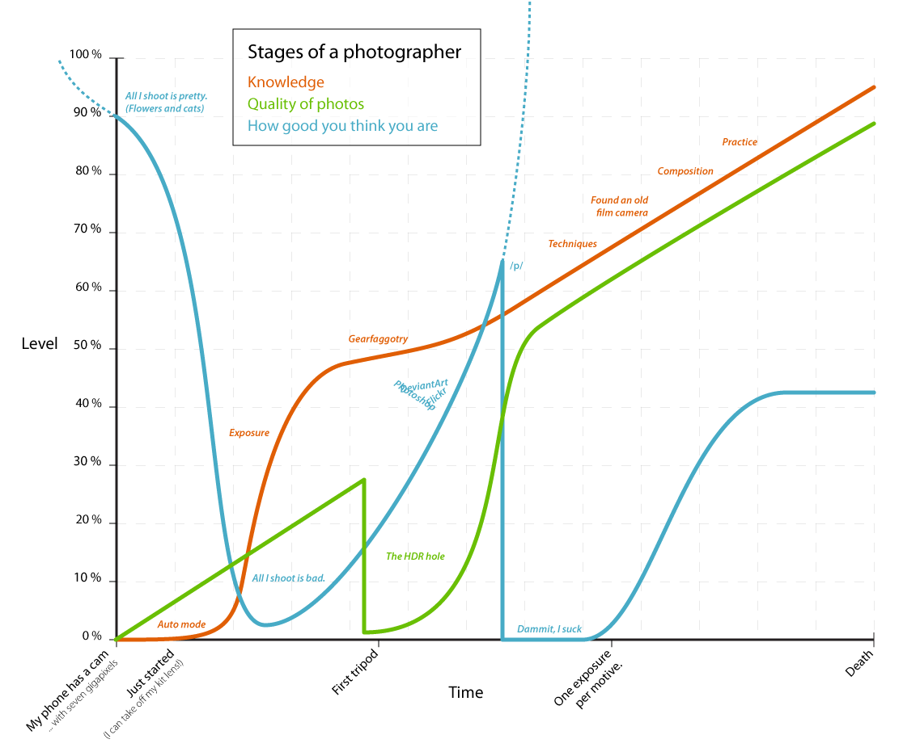

_Följande paragrafer är högst subjektiva, you have been warned 😄_

Ett problem inom formgivnings och designbranschen idag är ett stort fokus på estetik och mindre på ren problemlösning. Det läggs mycket fokus på hur det ser ut, väldigt lite på varför och därför blir det svårt att hitta en motivering för det arbete man utför, i vissa fall blir det till och med ett kontraproduktivt resultat av just denna anledningen.

En anledning till varför det har blivit så här tror jag är att vi helt enkelt vill skapa snygga saker. Att bygga webbplatser och andra produkter kan vara en konstform som vilken annan sak som helst. Jag har själv gjort och gör mig skyldig till detta regelbundet.

Ett av de tillfällen då detta framkommer som tydligast är när det kommer ny teknik. När [jQuery](http://jquery.com/) kom med en uppsjö av plugins ledde det till att skapa en överanvändning av plugins för parallax-effekter, tonövergångar och annat, oftast inte med större anledning än att _"det ser coolt/snyggt ut"_.

Det är en trend som återupprepar sig kontinuerligt och kommer förmodligen att fortsätta att göra det. Personligen tror jag inte att det är ett enormt problem. Jag ser det som en övergångsfas i varje utvecklares liv, väldigt liknande "HDR-Gropen" för fotografer från ["Stages of a Photographer"](http://dataviz.tumblr.com/post/350692786) (se bild nedan).

Oavsett om det är ett stort problem eller inte så leder det till att vi har webbplatser som kan vara nästan obrukbara i vissa fall. Vilket inte gör det så konstigt att det finns en motståndsrörelse mot just detta, ofta ledd av de utvecklare som har kommit förbi detta stadie, som till exempel [Motherfucking Website](http://motherfuckingwebsite.com/)eller [KISS](http://en.wikipedia.org/wiki/KISS_principle).

Det är värt att nämnas att för tillfället har vi en trend som uppmuntrar till just motsatsen, nämligen platt-design eller flat-design. Jag säger att det är en uppmuntran just för att det ena hindrar inte det andra. Man kan använda platt-design för att få det stilrent och så att det fungerar rent estetiskt, man uppfyller målet med en fokuserad design, men det hindrar inte att lägga på en massa flashiga plugins och annat.

### Vad är då design?

Definitionen av design kommer ursprungligen från latin: **designo** _(peka ut, avbilda, framställa)_, men idag råder ganska stor [oenighet om definitionen](http://sv.wikipedia.org/wiki/Design#Oenighet_om_definitionen).

För mig är design att lösa problem, om det är att göra en produkt mer attraktiv eller att underlätta för läsaren av en blogg spelar ingen roll. **En design ska lösa problem, annars har den misslyckats och är då per denna definition** _**dålig design**_.

Ett extremt exempel diskuteras i tråden ["Let's discuss intentionally ugly design" på /r/graphic\_design](http://www.reddit.com/r/graphic_design/comments/1y3o7x/lets_discuss_intentionally_ugly_design/). Produkter som designas för att medvetet vara fula för att vara mer attraktiva för sin målgrupp. [EatMoreCheese](http://www.reddit.com/user/EatMoreCheese) som startade tråden sammanfattar det bäst med: "They presume that nice design incurs an expense that is passed on to the diner."

**Bra design behöver inte vara snygg design** _(Även om det är något man bör eftersträva)_
