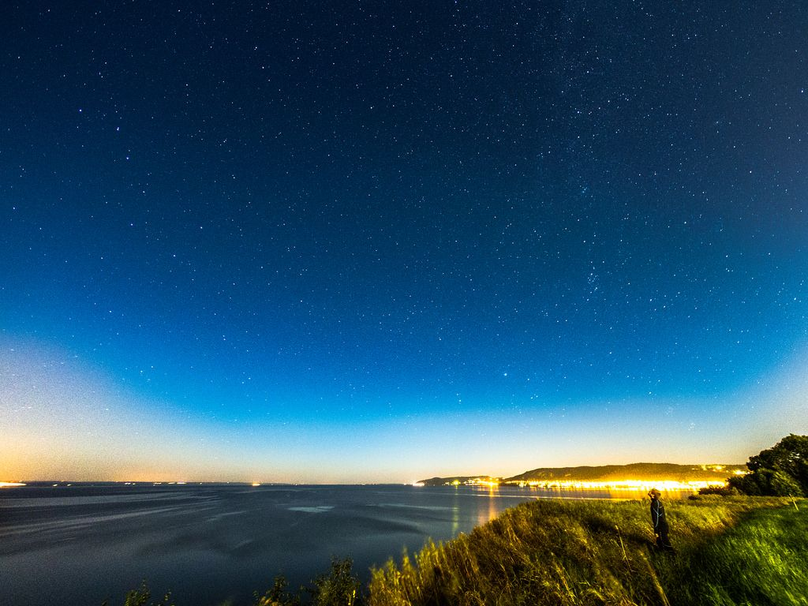
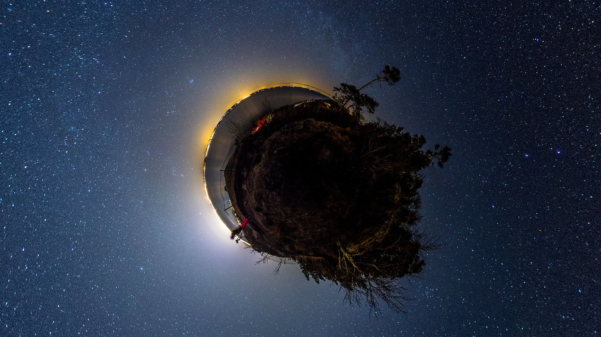
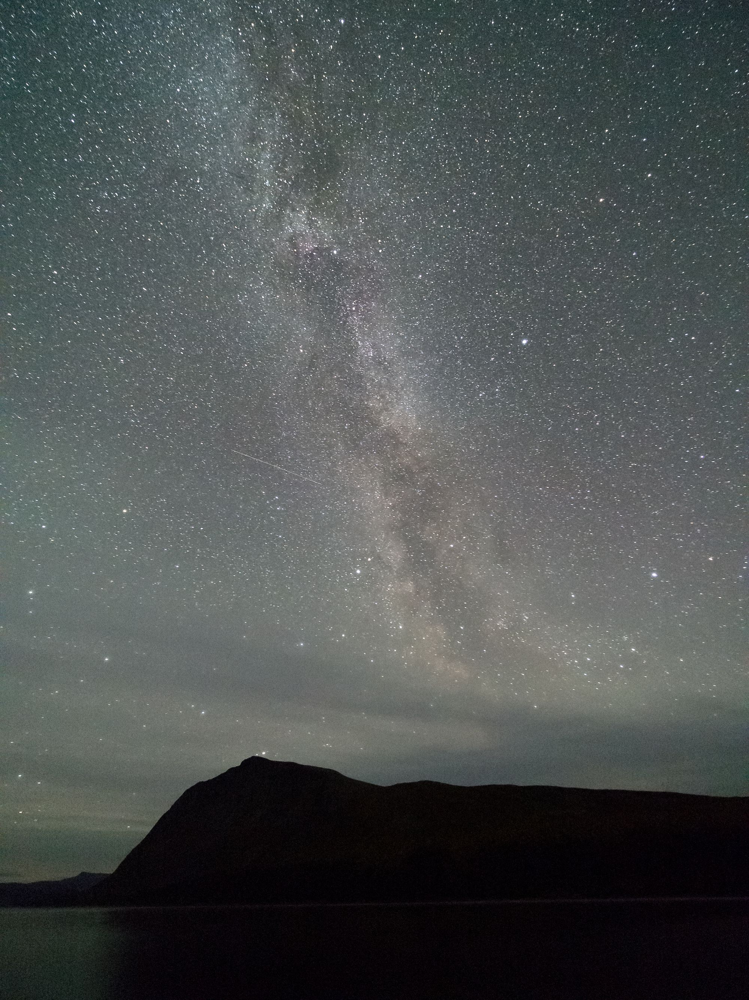
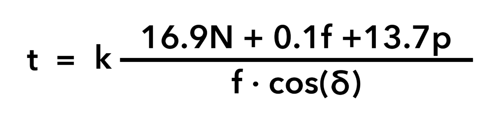

**Filmen nedan är en [time-lapse gjord av Alessandro Della Bella](http://helvetiabynight.com/2012/12/20/one-day-on-earth-cold-engadin-time-lapse-night/) under One Day on Earth, 2012-12-12.**

<figure class="embed video -wide">
    <iframe src="https://player.vimeo.com/video/55899485?app_id=122963" width="480" height="270" frameborder="0" allow="autoplay; fullscreen" allowfullscreen title="One Day on Earth: Cold Engadin Time Lapse Night"></iframe>
</figure>

Vinterns kalla väder lämpar sig väldigt väldigt till natt-fotografering, i synnerhet till att fotografera stjärnor. Är man riktigt duktig kan man få till fantastiska bilder, till exempel de man ser i time-lapse filmen ovan.

En annan bra inspiration och resurs är [Ben Canales video-guide för stjärnfotografering](http://vimeo.com/16833554) som annars tar [spektakulära bilder](http://www.flickr.com/photos/bencanales/)

## Star Trails

Att fotografera just stjärnor är lite mer krävande än andra typer av lång-exponeringsfotografering av primärt en anledning; Jordens rotation. Eftersom jorden snurrar kommer stjärnorna efter redan relativt korta perioder bilda streck över himlen, så kallade Star Trails.

I vissa fall är detta något man vill åt och isåfall är det inte särskilt komplicerat, bara att sätta en lång exponering och fotografera på; men för att få till en stjärnhimmel med stjärnor som punkter och ändå få in tillräckligt med ljus för en ordentlig natt-himmel krävs lite mer.

## Ljusföroreningar

Ljusföroreningar är ett av de första och största problemen. Våra städer är så pass upplysta att de lyser upp natt-himmelen enormt mycket och gör att vi inte kan se stjärnorna ordentligt. Du kan glömma att få till riktigt bra bild på till exempel Vintergatan nära en större stad.

{.-full}

_Det enda man egentligen kan göra för att motverka ljusföroreningar är att ta sig bort ifrån staden, om inte det är möjligt att försöka hitta "blind-spots" där det är mindre artificiellt ljus._

Bara en kort bilfärd ut från en stad går det att få betydligt bättre bilder; Som denna bilden från Vista kulle en bit utanför Jönköping.

{.-full}

Helt utan ljusföroreningar går det att få en helt annan detaljnivå, som denna bilden tagen vid Borgafjäll.

## Star Trails

Att fotografera just stjärnor är lite mer krävande än andra typer av lång-exponeringsfotografering av primärt en anledning; Jordens rotation. Eftersom jorden snurrar kommer stjärnorna efter redan relativt korta perioder bilda streck över himlen, så kallade Star Trails.

I vissa fall är detta något man vill åt och isåfall är det inte särskilt komplicerat, bara att sätta en lång exponering och fotografera på; men för att få till en stjärnhimmel med stjärnor som punkter och ändå få in tillräckligt med ljus för en ordentlig natt-himmel krävs lite mer.

## Utrustning och 500 regeln

Fotografering på natten kan bli dyrt eftersom man är begränsad till en viss slutartid på grund av Star Trails. Detta gör att man får ta till de andra möjligheter för att få in mer ljus än en längre slutartid.

Dessa är:

*   Använd största möjliga bländare, dvs så lågt tal på bländaren som möjligt för maximalt ljusinsläpp
*   Öka ISO. Stjärnfotografering kräver mycket ljus, man ska inte vara rädd för att pumpa upp ISOn långt högre än man är van vid; Det finns bra brusreduceringsprogram man kan utnyttja efteråt.
*   Använd bredaste brännvidden. Ett extrem-vidvinkelobjektiv är att rekommendera.

_För att veta vilken bländare och ISO man ska använda är det bra att först veta vilken slutartid man ska använda. Detta är direkt beroende av brännvidden man använder; Desto mer utzoomat man har det desto mindre ser stjärnorna ut och man kan ha en längre slutartid, Därför är extrem-vidvinkelobjektiv som Tokina 11-16 f/2.8 optimala för detta._

Vilken slutartid man ska ha kan man räkna ut med NPF-formeln.

Ingen rimlig person sitter och räknar med denna, istället rekommenderar jag att man använder en app. Personligen använder jag appen [PhotoPills](https://www.photopills.com).

Till exempel, ett 7,5mm Fish-eye på en Olympus EM-5 (Micro Four Thirds) ger en effektiv brännvidd på 15mm _(Motsvarande småbildsformat)_ ger med den formeln 21 sekunders exponering. Däremot ett 24mm på en Canon 6D (småbildsformatskamera) ger 10 sekunders exponering.

Vid nattfotografering med stjärnor påverkar alltså brännvidden resultatet enormt.

