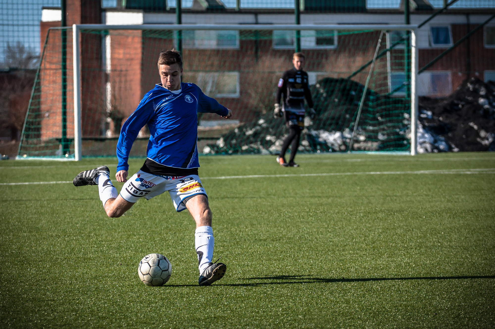

Egentligen är jag inte speciellt intresserad av fotboll och egentligen inte att titta på sport i allmänhet (segling är ett undantag). Men när jag fick chansen att testa mitt 70-200mm på en fotbollsmatch där min kusin spelade och min morbror var tränare kunde jag inte låta bli =)

:::: gallery {.-wide}
::: row {.-no-wrap}
{.-inline}
{.-inline}
:::
::: row
{.-inline}
:::
::::

Jag spenderade drygt 30 minuters läsande över vad man ska tänka på när man ska fotografera fotboll och sedan skred jag till verket. För att vara mitt första försök är jag väldigt nöjd, dock har jag ljuset att tacka, solen stod lågt och det var tidigt på förmiddagen utan moln, så ljuset var konstant. Jag hade möjlighet att hålla slutartiden under 1/2000s för det mesta.

{.-wide}

Jag fotograferade med solen i ryggen mestadels och höll mig antingen vid kortsidorna eller vid strafflinjen (som jag blivit rekommenderad). Jag gjorde även en liten planering så jag höll mig vid kortsidan den halvlek då TFF (min kusins lag) anföll mot mig; Vilket gav mig möjlighet att fotografera anfallsspelet.
