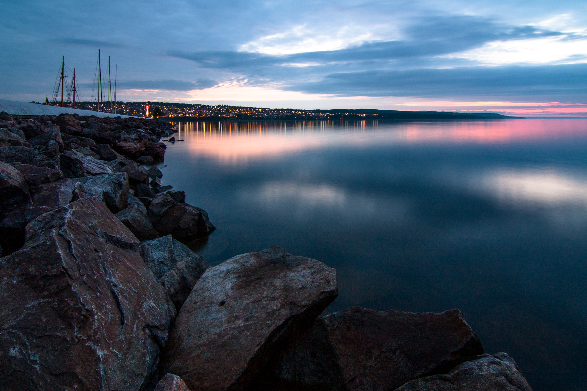

Min första timelapsesekvens på natten (eller sen kväll). Overhead börjar bli ett problem då mot slutet hann kameran knappt spara bilderna till minneskortet (fotograferar i RAW); Det får bli till att antingen fotografera JPG eller öka overhead till nästa gång =)

<figure class="embed video -wide">
	<iframe width="560" height="315" src="https://www.youtube-nocookie.com/embed/R8JWr9nCz9I" title="YouTube video player" frameborder="0" allow="accelerometer; autoplay; clipboard-write; encrypted-media; gyroscope; picture-in-picture; web-share" allowfullscreen></iframe>
</figure>

Mest är jag glad över att jag har fått tillbaka fotointresset trots vår fruktansvärt tråkiga fototeknik-kurs på högskolan. Min bästa bild under kvällen kan man se nedan, blev en mycket intressant blandning av artificiellt ljus från gatlamporna och staden i förgrunden och på molnen till höger (orange) och blått kvällsljus :)

{.-full}
