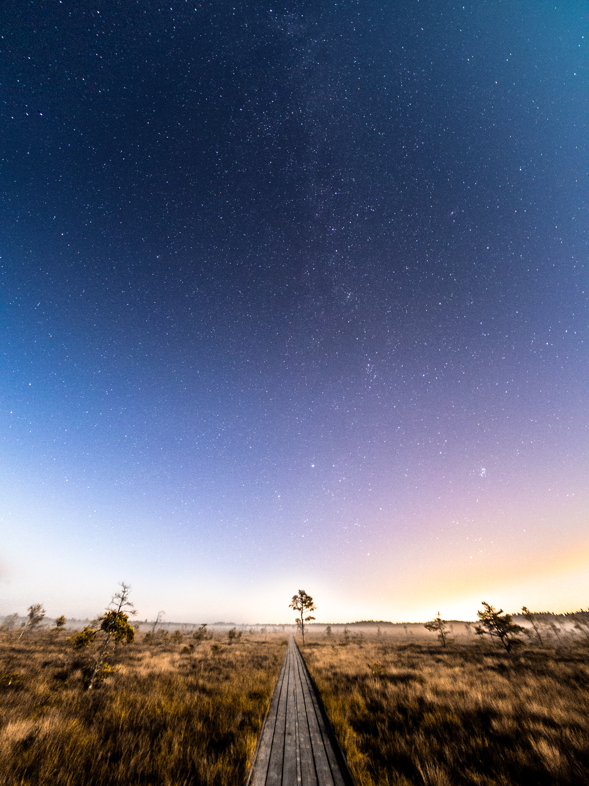
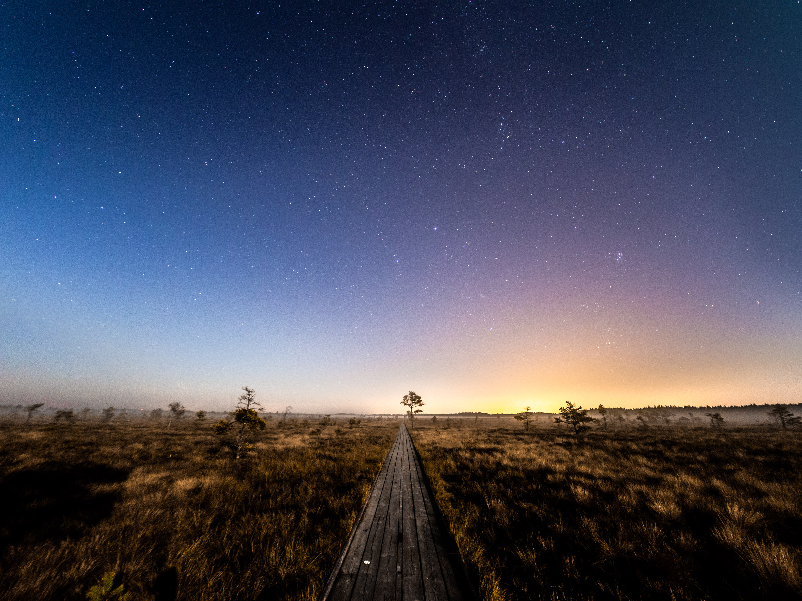

Jag var ute och fotograferade vid Dumme mosse igår natt/kväll. Målet var att komma ut från ljusföroreningarna i Jönköping och få lite fina stjärnbilder. Vid bilfärden dit möttes en av stora dimbankar; Ett tag var en lite orolig att det inte skulle gå att fotografera alls.

Väl ute på mossen (typ 1 km promenad från parkeringen) var det nästan helt dimmfritt där vi ställde upp utrustningen. Dock var månen framme och gjorde det omöjligt att fotografera den södra delen av Vintergatan.

Som jag brukar tog jag också en i liggande format, inte säker på vilken jag gillar mest. Är oftast förtjust i liggande men Vintergatan är så mycket coolare desto mer en får med 😄

{.-full}

Båda bilderna använder en [ETTR-teknik](http://en.wikipedia.org/wiki/Exposing_to_the_right) där man överexponerar till kamerans gräns för att sedan sänka exponeringen i efterbehandling och på så vis minska brus. Detta gör det möjligt att fotografera med hög ljuskänslighet (I detta fall ISO 6400).

Jag gjorde dock en liten miss. Kameran var inställd på att beskära bilderna till 16:9 (Normalt tar den bilder i 4:3). DOck ska det inte göra någon skillnad på råbilderna.

Det jag inte visste var att Lightroom och Adobe Camera Raw har en bugg för just min kamera där även råbilder blir hårdcroppade vid importering. Jag hittade ett litet hack där en ändrar kameramodellen (I detta fall till E-PL5) och så vips kan man komma åt all rådata. I fortsättningen ska jag aldrig ändra beskärning i kameran 😄

{.-wide}

Trots månens närvaro fotograferade jag lite söderut, fick en häftig reflektion i vattenpölarna på myren. Det gav dock en väldigt svårredigerad bild så det blir några dagar/veckors extra jobb på att få den bra 😄

*[ETTR]: Exposing to the right