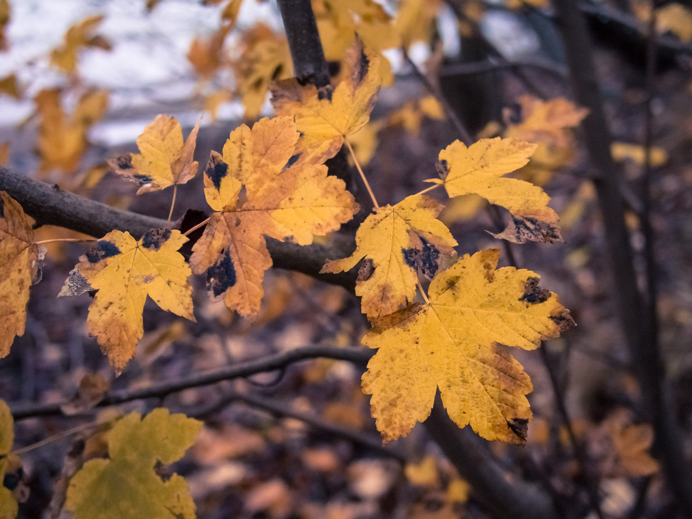
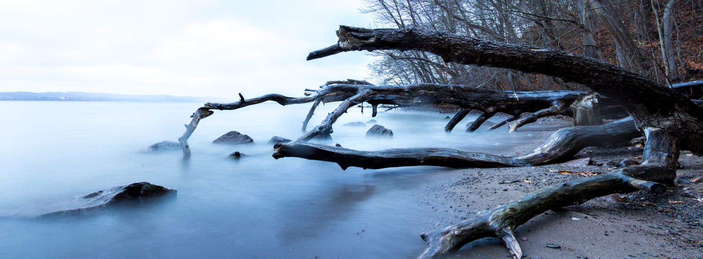

Nu är det över en månad sedan jag var ute och fotograferade så det var på tiden :) Jag passade på att gå en runda timmen innan solen gick ner.

{.-wide}

Det är något lugnande att bara sitta och titta på när vågorna kraftigt slår mot stenarna och upp på stranden; En känsla som jag tycker man fångar riktigt bra på bild genom långa exponeringar som ger ett suddigt silkeslent vattenlandskap.

{.-full}