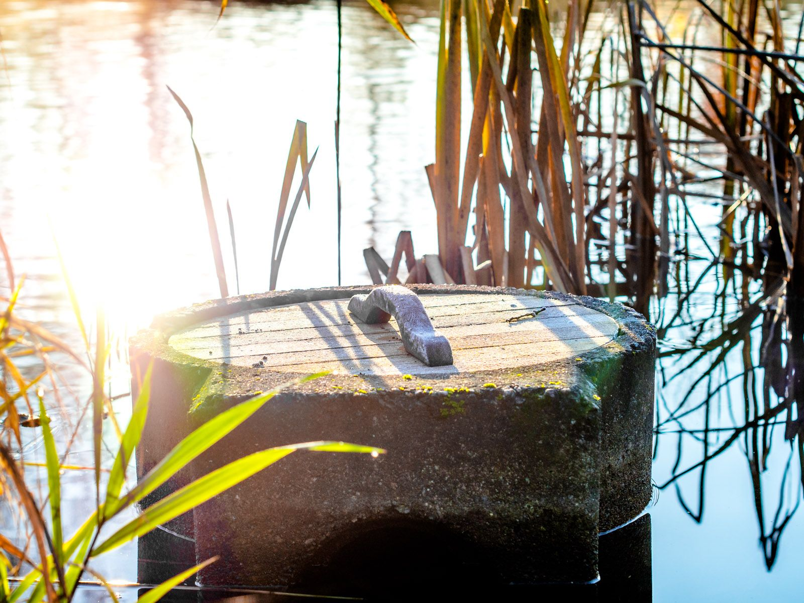

Hösten vill verkligen inte ge upp här i Jönköping. Men nu känns det att vintern är på väg när vi äntligen börjar få lägre temperaturer, någon ordentlig snö har inte setts röken av än dock ☹

:::: gallery {.-wide}
::: row
{.-inline}
{.-inline}
:::
::: row
{.-inline}
{.-inline}
:::
::::

 skulle nästan kunnat vara en vårdag med vårens första blommor.

:::: gallery {.-wide}
::: row
{.-inline}
{.-inline}
:::
::: row
{.-inline}
{.-inline}
:::
::::