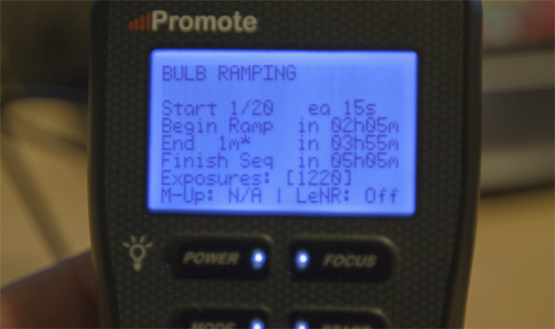
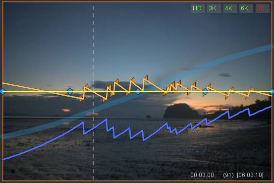

Det som anses av de flesta inom timelapsefotografering som är bland det svåraste att få till och häftigast resultat är s.k. "Holy Grail" vilket kort och enkelt är fotografering (filming?) av dag-till-natt samt natt-till-dag övergångar.

Av ganska uppenbara skäl är det tekniskt svårt att utföra, exponeringsskillnaderna mellan dag och natt kan skilja sig på flera magnituder. För att hantera denna förändring i ljus finns några olika tekniker.

## Bulb-ramping

Bulbramping är en av de svårare sätten att fotografera på men desto enklare att hantera i efterbehandling. Den görs genom att antingen ha en extern enhet som en smartphone eller en dedikerad enhet som mäter ljuset och sätter en exponering utifrån det; Alternativt genom att uppskatta ljusets förändring på förhand och förprogrammera utlösaren.

Bulbramping ger en jämn förändring av exponeringen vilket gör det mycket enkelt att hantera i efterhand.

## Manuell ramping

Ett alternativ till bulbramp är att hantera kameran manuellt genom att korrigera exponering lite då och då. Detta ger den stora fördelen att kunna möta oförutsedda förändringar i ljuset, det är också väldigt enkelt att hantera i efterbehandling eftersom förändring i exponering sker kontrollerat (se bild nedan)

Den stora nackdelen med denna tekniken är att den kräver att fotografen har full uppmärksamhet under hela processen, som kan pågå under flera timmar.

## Aperture priority (Bländarprioritet)

Det sista alternativet jag tänkte nämna är aperture priority, vilket är den överlägset enklaste av teknikerna för att utföra själva fotograferingen eftersom det bara är att ställa in kameran på bländarprioritering och sätta på utlösaren och sen får den sköta sig själv.

Nackdelen med denna teknik är flera. Bland annat blir kameran begränsad till enbart slutartid och ISO när det kommer till exponering vilket gör att vissa övergångar blir svåra att få till.

Men den största nackdelen är resultatet. Det är mycket besvärligt att hantera under efterbehandling eftersom det blir oerhört mycket flimmer. Till exempel kan en så vanlig händelse som att solen går i moln ändra exponeringen kraftigt. Om det finns objekt som rör sig nära kameran kan de också störa kraftigt när de rör sig in och ut ur bilden.

_Personligen har jag främst använt mig av manuell ramping fram tills nu, men jag planerar att gå över så mycket jag kan mot bländarprioritet på grund av en del nya funktioner i LRTimelapse 4_

## LRTimelapse 4

LRTimelapse är ett program som tillsammans med Lightroom ger en mycket kraftfull process för att skapa timelapse. Fram tills nyligen har programmet använt sig av en process med manuell ramping för att hantera ljusförändringar. Programmet har även haft en inbyggd funktion som kallas _"Visual Deflicker"_ som ska ta bort flimmer som uppstått av t ex bländarprioriterad fotografering eller flimmer som uppstått av att bländaren ej ställt sig i 100% samma läge vid varje exponering.

Jag har alltid tyckt att denna funktion har varit lite av en besvikelse, oftast har den tagit bort flimmer i en del av bilden men skapat i en annan vilket gjort att jag främst försökt undvika flimmer med hjälp av metoder som [Lens twist](https://vimeo.com/30974031) och att fotografera med manuell ramping.

I samband med att jag uppgraderade till version 4 av LRTimelapse som är gjord för de senare versionerna av Lightroom samt Lightroom CC, har det ändrats. Tidigare renderades filmerna genom att litet hack för Lightrooms Slideshow export. Nu renderas filmen direkt i LRTimelapse vilket har gett ett flertal fördelar. Bland annat går det oerhört mycket snabbare att rendera, men det ger även flera olika alternativ för rendering som till exempel olika format och codecs.

Den största fördelen är dock introduceringen av motion blur. Det som jag tyckte saknades av funktionen Visual Deflicker tar motion blur hand om. Eftersom motion blur smälter ihop föregående och efterföljande bilder i renderingen elimineras allt flimmer som blev kvar efter Visual Deflicker, vilket gör att dessa två i kombination ger ett perfekt resultat även vid en ganska dåligt fotograferad timelapse.

Ett exempel nedan kan visa hur resultatet kan se ut.

Det bästa med denna förflyttning av komplexiteten från själva fotograferingen mot efterbehandling bör göra timelapse mycket mer tillgängligt för fler. Istället för att lägga flera tusentals kronor på bulbramping eller annan utrustning så räcker det att lägga en bråkdel av de summorna på mjukvaran som sen tar hand om allt. Det gör också det mycket enklare att fotografera timelapse vid fler tillfällen eftersom det räcker att snabbt ställa upp kameran, sätta igång och sen är det klart. Ingen direkt översikt på kameran krävs.
