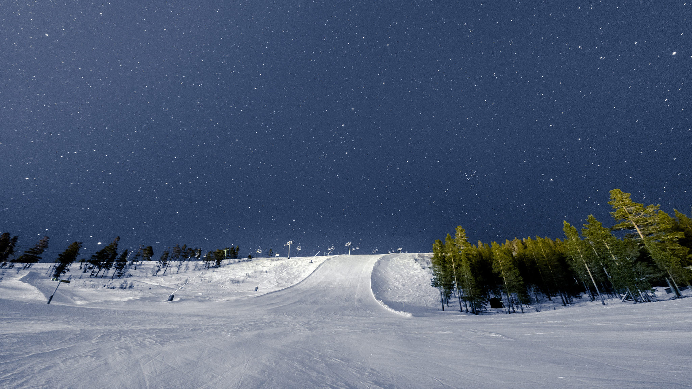
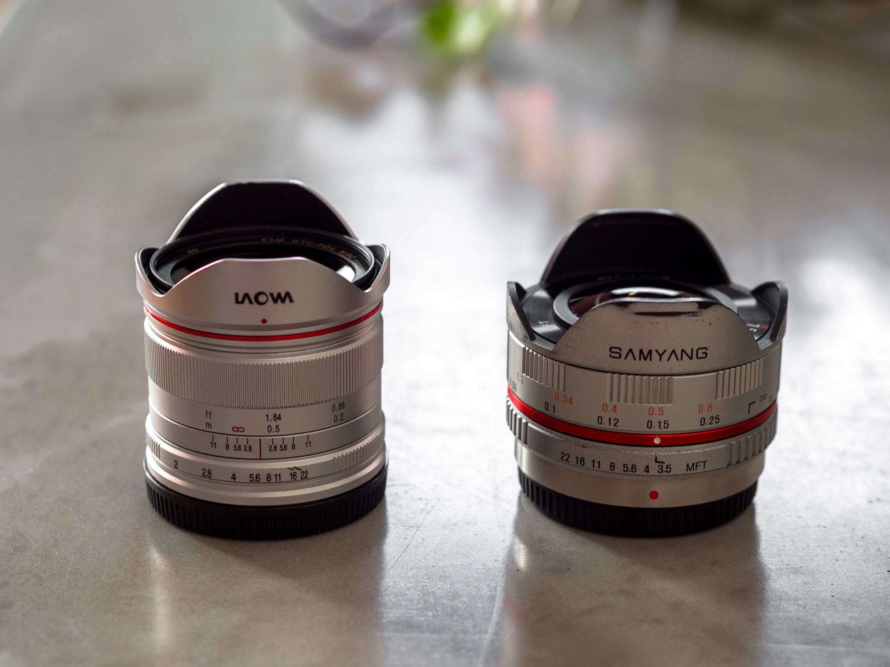

En av de största uppoffringarna jag gjorde när jag gick från mitt *Canon 450D*-system till min spegellösa *Olympus OM-D E-M5* var mitt *Tokina 11-16 f/2.8*.

Det var ett fantastiskt objektiv med extremt bred bildvinkel motsvarande 17,6mm på ett fullformat och samtidigt var det rektalinjärt och väldigt ljusstarkt på f/2.8.

Extremvidvinkelobjektiv är fantastiska när man vill få med motiv i förgrunden och få med hela bakgrunden också, som bilden ovan.

---

När jag bytte system fanns det flertalet extremvidvinkelobjektiv, som till exempel Panasonics 7-14mm f/4. Det är dock inte särskilt ljusstarkt och det var stort (för M4/3) och framförallt dyrt. Sen var det en zoom. Min Tokina använde jag uteslutande vid 11mm, så om det hade varit ett fast objektiv hade det varit mycket trevligare.

Mitt bästa alternativ då var Samyangs 8mm f/3.5 Fisheye som jag använt till de flesta av mina vidvinkelfoton de senaste 4 åren. Det är ett väldigt kompakt objektiv vars enda egentliga nackdelar är ljusstyrkan och att det är fisheye.

{.-wide}

En bild som den ovan fungerar den alldeles utmärkt för eftersom man inte bryr sig så mycket om förvrängningen bland träden. Men vid bilder på arkitektur och andra motiv där det är mycket raka linjer blir det direkt problem.

Det går att använda sig av en metod som man brukar kalla för "defish" för att ta bort förvrängningen, men då uppstår ett annat problem: Komponering i kameran blir väldigt svår eftersom det man ser där inte är det som blir slutbilden.

För mig innebar det mycket chansningar och att en hel del kreativitet försvann.

Så när den kinesiska tillverkaren Laowa sa att de skulle släppa ett fast, lättviktsobjektiv (Egentligen gjort för drönare), med hög ljusstyrka, med en extremt bred rektalinjär bildvinkel och som tog filter var det total jackpot.

Det var ytterligare en sak som jag gett upp från mina Canon-dagar, att använda filter. Det är väldigt få extremvidvinkelobjektiv och ännu färre fisheye som har filtergängor. Och samtidigt är filter, särskilt polariseringsfilter, en av de viktigaste verktygen för landskapsfotografering.

---

I mångt och mycket är Laowa:n samma som Samyang:en, de fokuserar lika bra, båda har stegvis bländarjustering på objektivet och båda är skarpa.

Skillnaden är den stora kontroll Laowa:n ger vid fotograferingstillfället, att se bilden i samma utskärning som den kommer ha i slutändan och med möjlighet att använda filter så ger den ett helt annat utlopp för kreativitet.

{.-full}

Än så länge har jag bara använt mig av polariseringsfilter, men har både ett IR-filter och ett mörkerfilter som jag snart ska få användning av. Att filtergängan är på 46mm gör också att det inte är en stor kostnad att köpa på sig en massa filter.

Tokina:n till exempel hade filtergänga på 77mm och filtren kostade mer än det dubbla till den. Vilket gjorde att jag inte köpte särskilt många filter, och de jag köpte var jag extremt försiktig med att använda.
