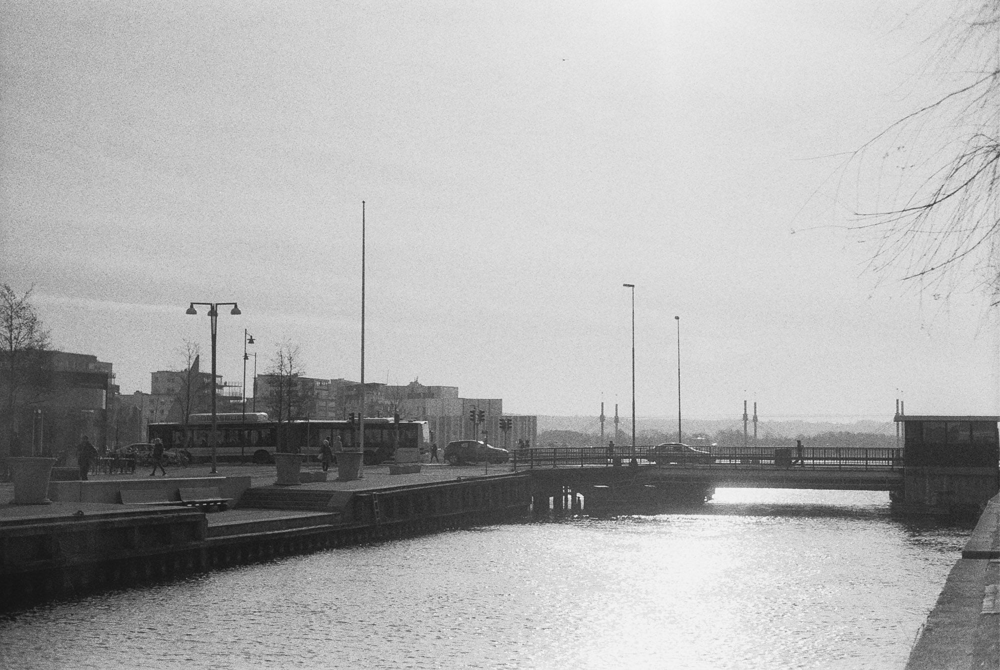
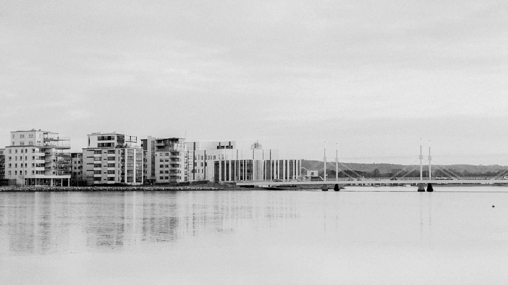
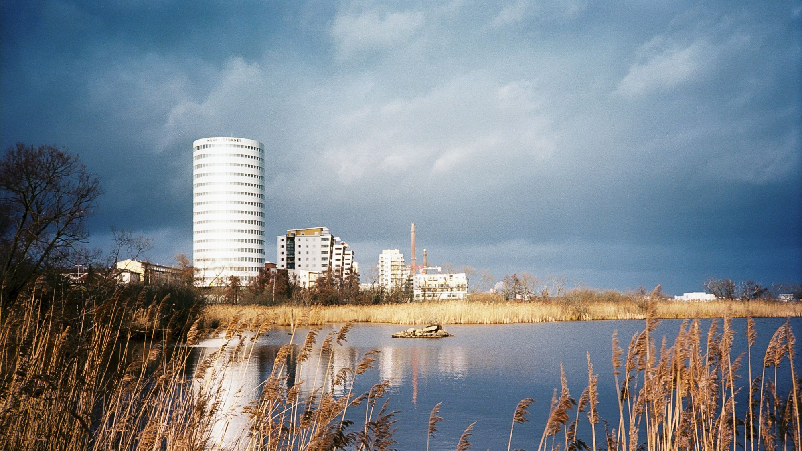
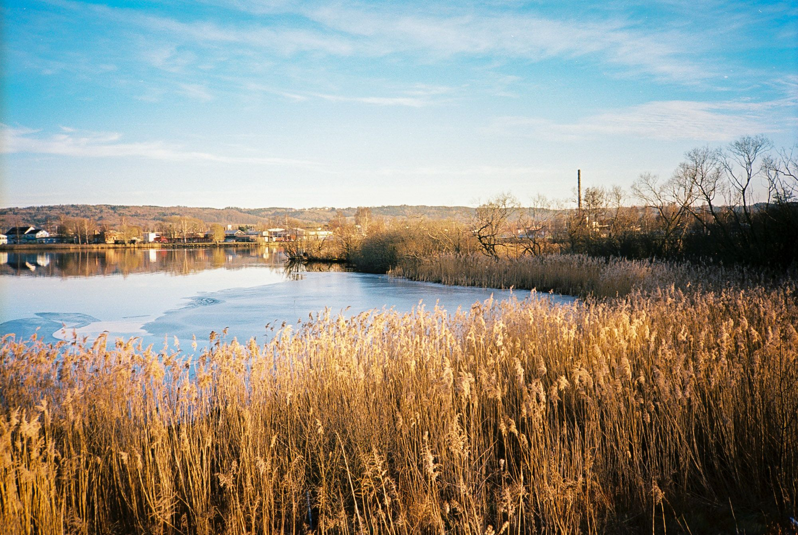
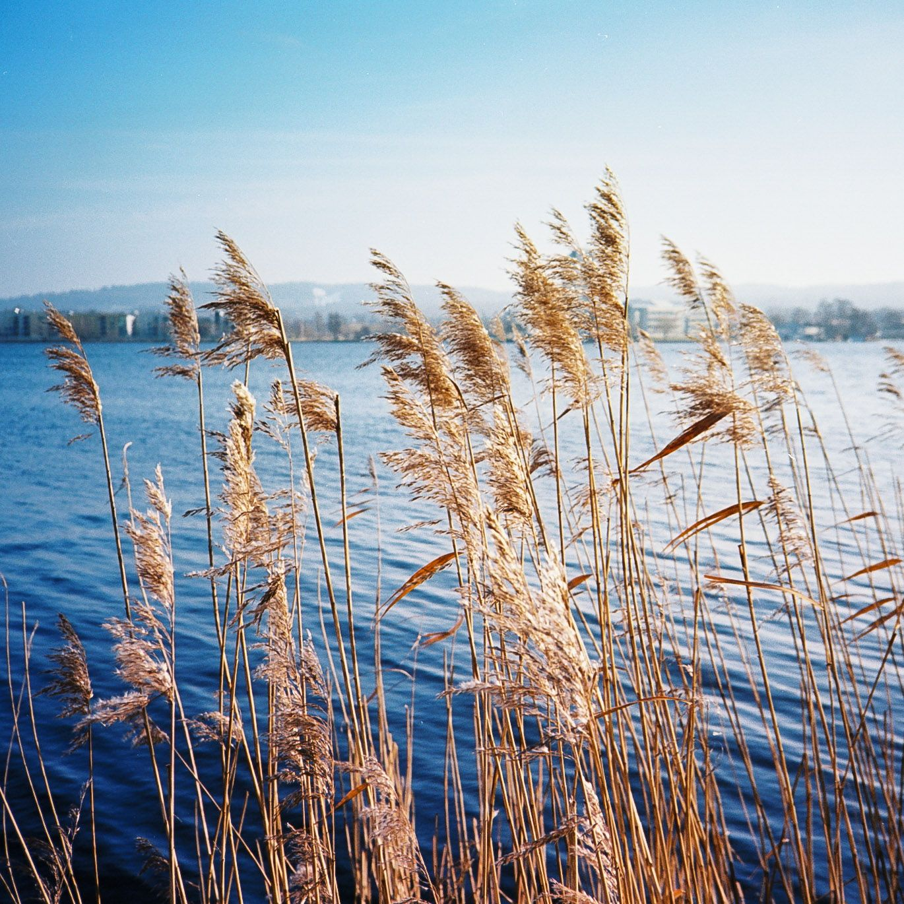
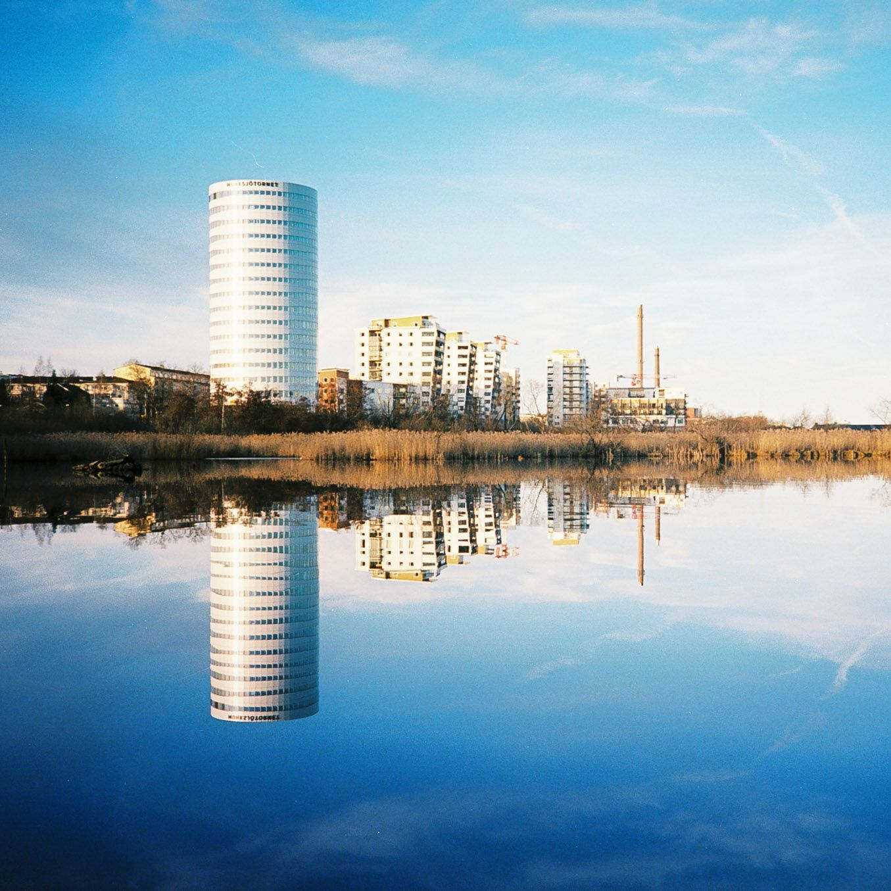
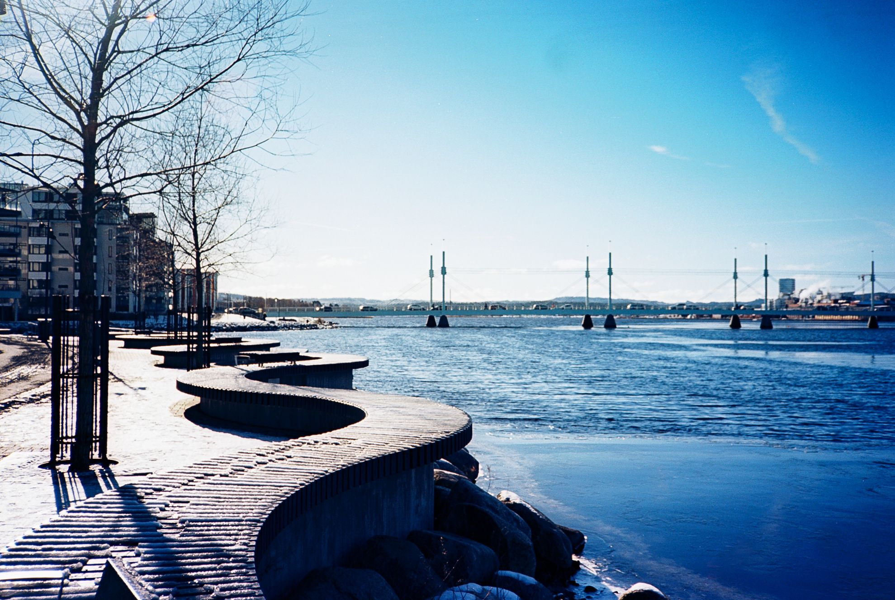
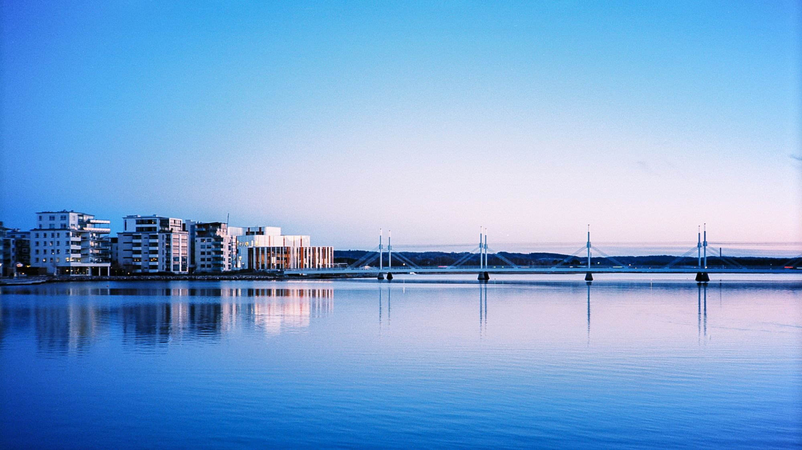

Länge var jag ganska negativt inställd till analog fotografering. Det var besvärligt, bakåtsträvande och dyrt. Sida vid sida med en digital kamera ser en analog kamera inte särskilt attraktiv ut.

Över tid mjuknade min inställning och det kom så långt att jag var lite sugen på att testa. Främsta anledningen är hur de analoga kamerorna vänder upp och ner på den kreativa processen. Med en digital kamera går det att göra misstag på plats och modifiera sin process och ta om en bild som inte blev bra; Detta är en av tjusningarna och största nackdelarna som jag ser med analogt.

Och visst, det går att tvinga sig själv att ändra sitt beteende med en digital kamera. Jag är själv inte en person som håller ned avtryckaren och jag försöker oftast "se" en bild innan jag ens tar upp kameran. Men frestelsen att "fuska" och titta på resultatet för att se om det blev fel finns alltid där.

Den största skillnaden jag ser är främsta i denna kreativa processen. Kontrollen slits ifrån en och det gör det möjligt att göra lyckade misstag som annars skulle kasseras vid fotograferingstillfället.

Det finns dock andra fördelar som jag ignorerat med analog fotografering som är definitiva fördelar över det digitala.

Den största av dessa fördelar för mig är bruset. Den digitala världen är en ständig kamp mot bruset (som jag tycker är väldigt fult). Analogt brus behöver inte alls vara samma nackdel.

{.-wide}

Bilden ovan är tagen med Kodak Tri-X 400 som är en särskilt brusig film, och det stör inte på något sätt.

Det finns vissa undantag. Jag fotade nyligen med Ilford HP5 Plus och var inte alls nöjd med bruset. Se bilden nedan där bruset tar bort något från bilden istället för tillför som i den föregående (min åsikt).

{.-wide}

## Pris och tillgänglighet

En annan fördel är priset på utrustningen och begagnatmarknaden.

På senare tid har tillgängligheten på utrustning blivit något svårare eftersom det har blivit lite trendigt med analogt som har drivit upp priserna, men det går fortfarande att få tag på gammal fin utrustning för en billig peng jämfört med en motsvarande digital kamera.

Själva fotoprocessen är fortfarande väldigt med ett pris på runt 10kr för en bild, men för mig där det analoga är ett komplement till det digitala så är detta inte ett särskilt stort problem: Jag tar helt enkelt inte särskilt många bilder.

## Design

Den sista fördelen jag tänkte ta upp i detta inlägget är design på gamla kameror. Jag har personligen alltid gillat designen på kameror från 60 och 70-talen. De var nätta genomtänkta och oerhört snygga. Produkter vars design uppmuntrar till att man ska vilja använda dem.

Så det var inte direkt någon slump att min digitalkamera blev en Olympus OM-D vars design är tagen rakt från 70-talets OM-serie.

Analoga kameror undantaget moderna kompaktkameror är oftast betydligt mer kompakta, speciellt om hänsyn tas till filmstorlek/sensorstorlek.

{.-full}

Jag började fotografera för ungefär två månader sedan och har fotograferat tre filmrullar. En svartvit Kodak Tri-X 400 och en Ilford HP5 Plus i en Pentax MX och en Kodak Ektar 100 i en Olympus XA.

Jag blev väldigt förtjust i resultatet från Tri-X och Ektar. Särskilt Ektar som gav helt fantastiska färgtoner. Ilford var jag inte alls förtjust i, så den blir det inte fler rullar med.

{.-full}

<figure class="gallery -wide">
	<figure class="gallery-row -no-wrap">
		{.-inline}
		{.-inline}
	</figure>
	<figure class="gallery-row">
		{.-inline}
		{.-inline}
	</figure>
	<figcaption>
Olympus XA, 35mm, Kodak Ektar 100
</figcaption>
</figure>

{.-full}
