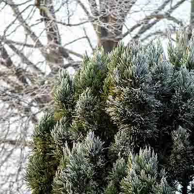
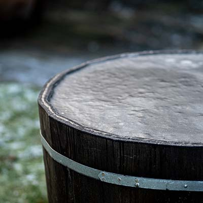
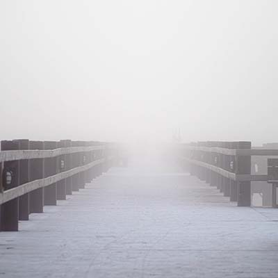
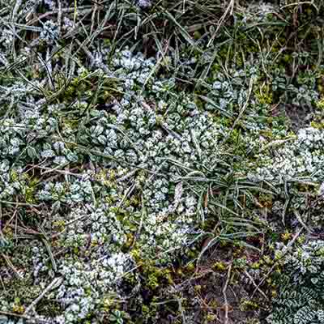
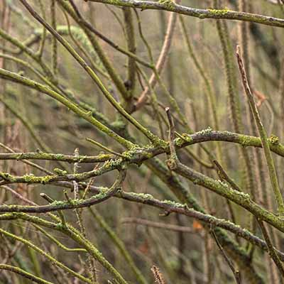
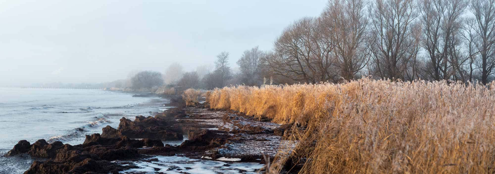
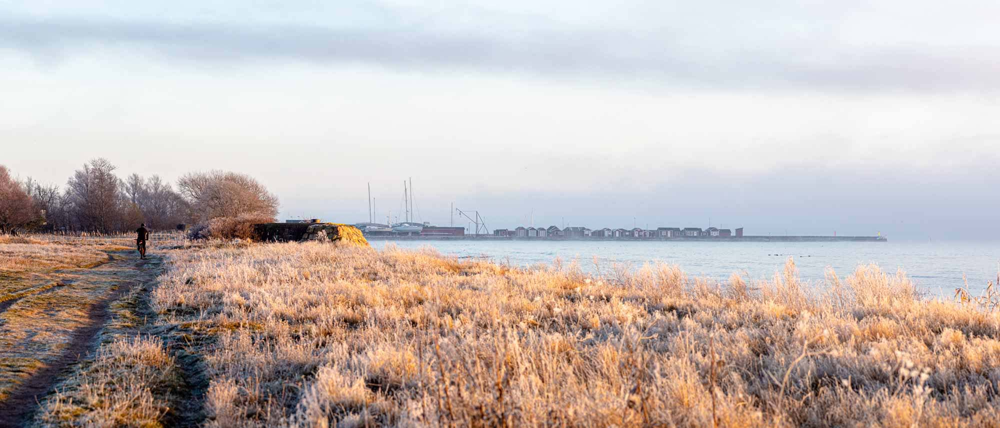

När det är omväxlande väder är det ofta intressant att vara ute och fotografera, samma plats kan skifta utseende fullständigt. Detta hände flera gånger under 26 och 27 december.

## Morgonljus

Det var tunn dimma som solen lyste igenom och gav ett varmt ljus på den annars kalla krispiga morgonen.

<figure class="image-gallery">
    
    
    
    
</figure>

## Dimma

Senare tjocknade dimman till ordentligt och bitvis gick det inte att se mer än 50 meter fram. Solen gick knappt att urskilja.

<figure class="image-gallery -three-columns">
    
    
    
</figure>

## Solljus

En timme senare lyckades solen till sist bränna bort den sista dimman.

{.-full}

När dimman försvann var det även fler som gav sig ut (eller om de varit där hela tiden?).

{.-full}

## Vindar & vågor

Dagen efter var all dimma som bortlåst, bokstavligen. Det var kraftiga vindar och häftiga vågor.

{.-full}

{.-wide}

{.-full}
