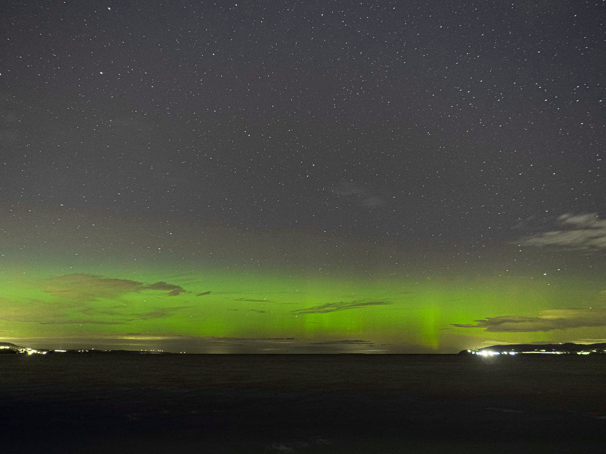

Det är inte ofta som det är norrsken i Jönköping och när det väl är det så är det ofta molnigt, men ibland blir det tillfälle. Ikväll var ett sådant och var definitivt det häftigaste jag sett i Jönköping.

{.-full}

I oktober förra året var det också bra förhållanden men då var norrskenet längre ned mot horisonten och det blev inte alls samma effekt.

Men inget slår ändå norrskenet i Fäboliden från 2018, men den största skillnaden där var nog hur nära det var och att det var betydligt mindre ljusföroreningar. Är betydligt mer nöjd med den bilden eftersom det är mer intressant i förgrunden.

