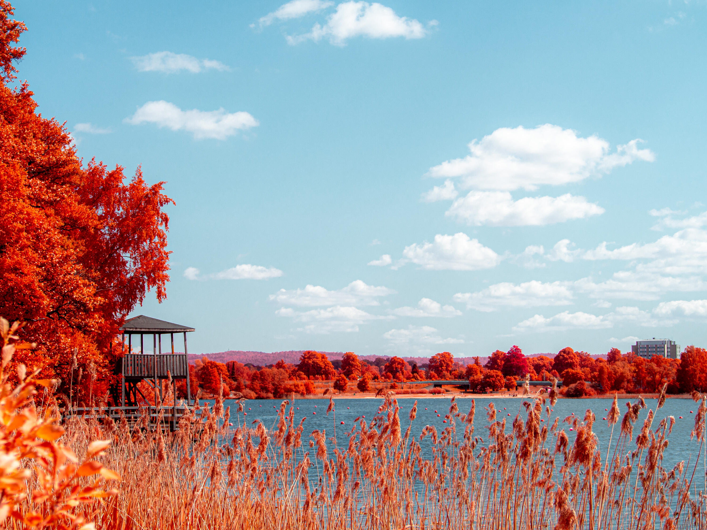
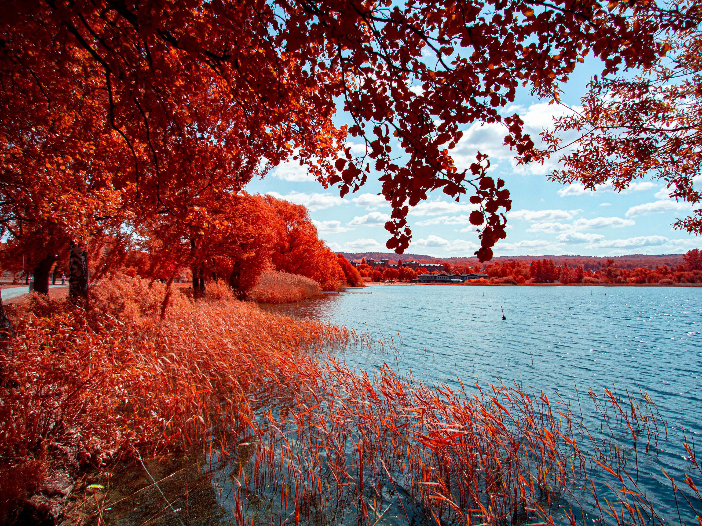
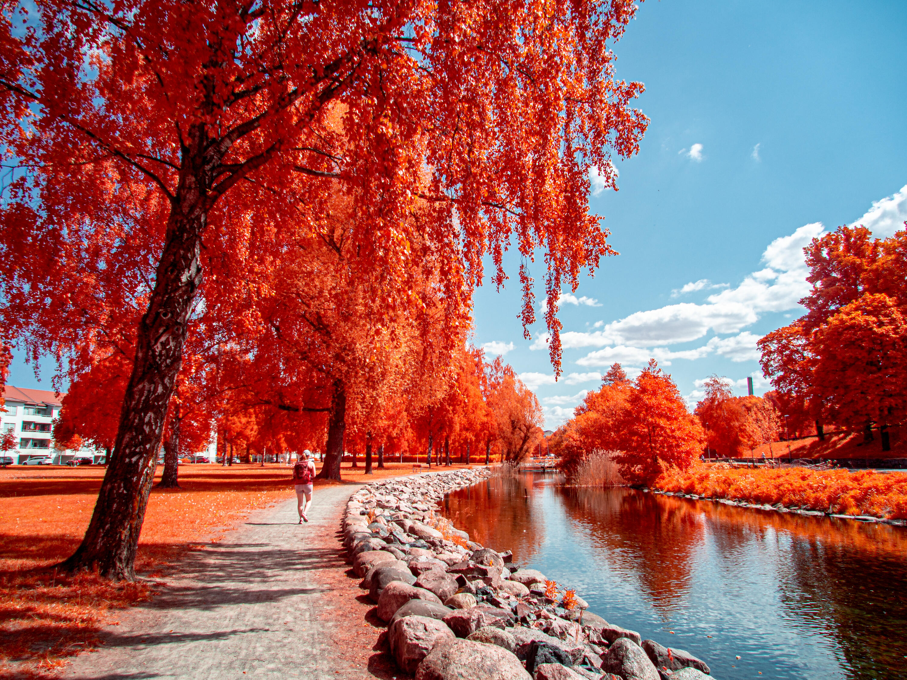

För några år sedan bytte jag ut min gamla *Olympus OM-D E-M5*. Sedan dess har den suttit oanvänd i en hylla. Jag har länge tänkt att jag borde [skicka iväg den på konvertering till fullspektrum][IRreCams].

Vid en sådan konvertering tas filtret på sensorn som blockerar infrarött och ultraviolett ljus (så att den bara ser synligt ljus) bort och då kan den se allt som sensorn kan se. Jag valde att ersätta detta filtret med ett 280nm filter som bara tar bort ultraviolett ljus vilket ger en kamera som kan se synligt ljus och infrarött ljus.

Med en sådan kamera kan man med lite olika filter få väldigt häftiga effekter. Allt från den typiska infraröda stilen i svart och vitt (där himlen blir nästan svart och träd vita) till det som brukar kallas nära infrarött som har vissa färger från det synliga ljuset blandat med infrarött.

## IRChrome

Mitt enda filter jag har för tillfället är ett sådant, det är ett speciellt filter från Kolari Vision som heter IRChrome och som är gjort för att efterlikna en gammal filmrulle som brukar kallas aerochrome. För den som är mer intresserad kan jag rekommendera [Todd Domineys film om historien bakom aerochrome på YouTube][YouTube - Story of Kodak Aerochrome Part 1]

")

Till skillnad från det synliga ljuset som oftast ser bäst ut när solen står lågt eller det är lite halvmulet så vill det infraröda ha så mycket solljus som möjligt, helst mitt på dagen. Idag var det just sånt här väder så på vår nationaldagspromenad tog jag med min konverterade kamera och filter.

{.-full}

{.-wide}

:::: gallery {.-wide}
::: row
{.-inline}
{.-inline}
:::
::::

[IRreCams]: https://irrecams.de/en/
[Kolari Vision - IRCHROME filter]: https://kolarivision.com/the-irchrome-infrared-photography-filter-our-digital-version-of-kodak-aerochrome/
[YouTube - Story of Kodak Aerochrome Part 1]: https://www.youtube.com/watch?v=NWl1HINQUao
[YouTube - Story of Kodak Aerochrome Part 2]: https://www.youtube.com/watch?v=AUgogt515Jk
