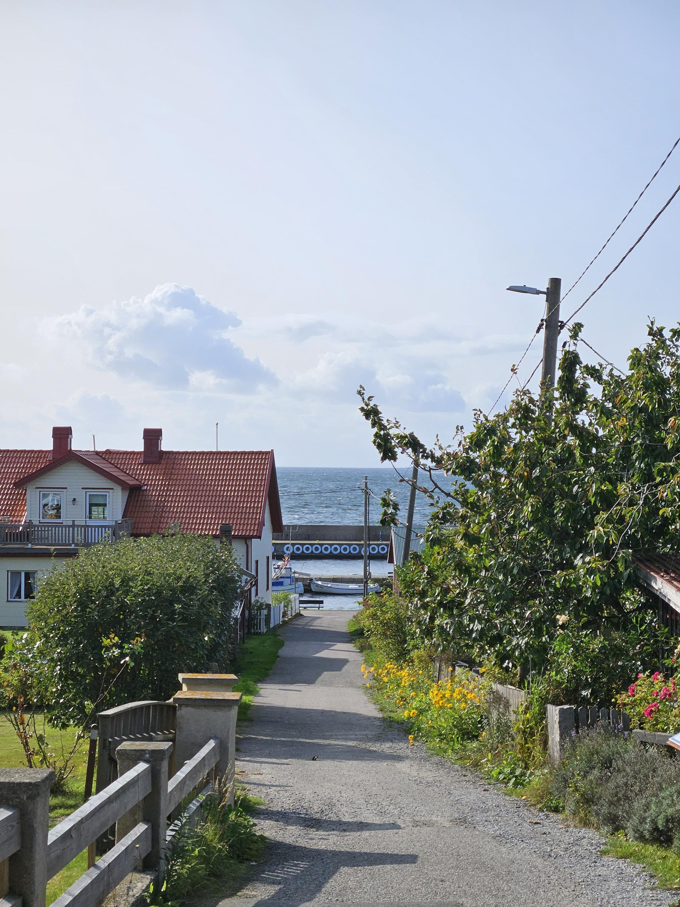
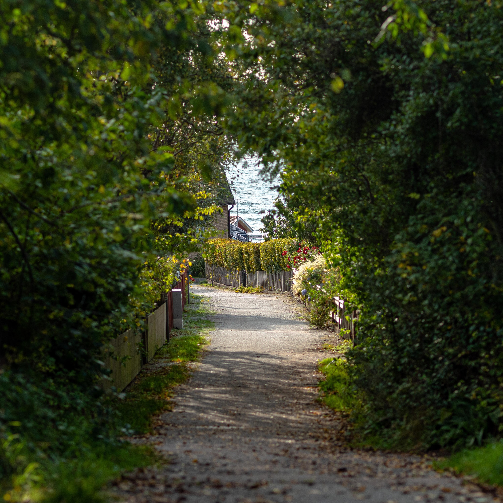
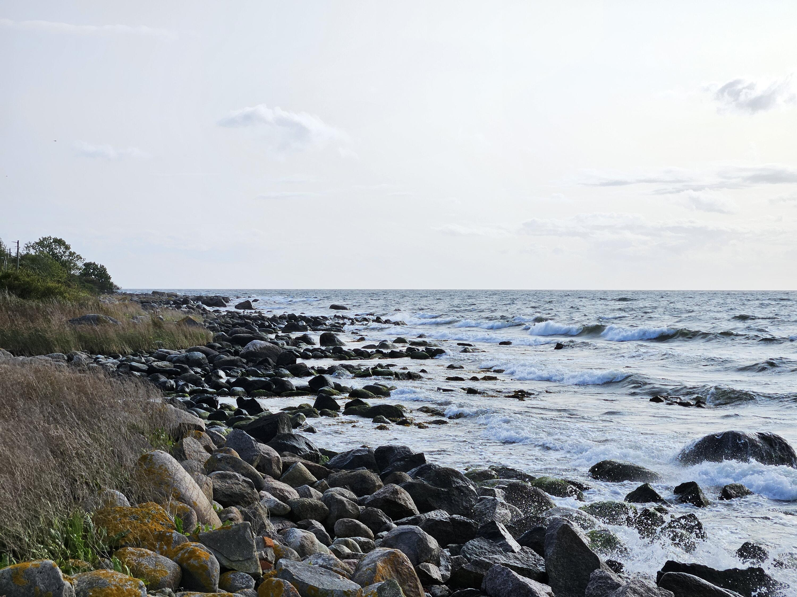
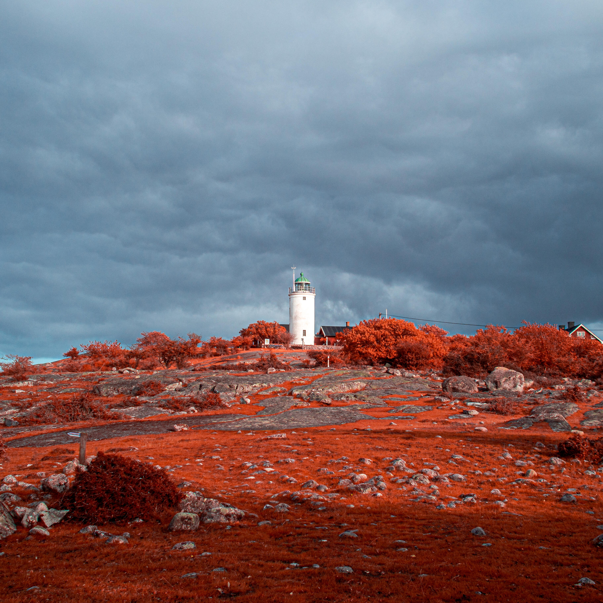
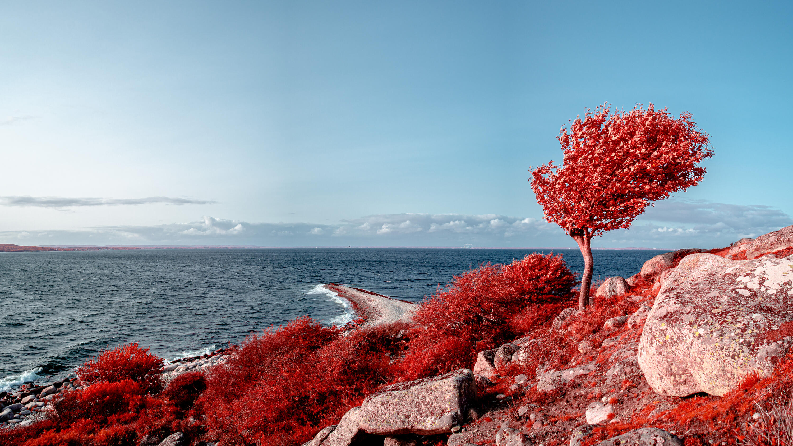

Helgen vid månadsskiftet september–oktober spenderade vi på Hanö strax söder om Karlshamn i Blekinge, vi hade hyrt stugor på vandrarhemmet och hade med oss katterna.

:::: gallery {.-wide}
::: row {.-no-wrap}
{.-inline}
{.-inline}
:::
::: row {.-no-wrap}
{.-inline}
{.-inline}
:::
::::

Efter en längre promenad med katterna i blåsten insåg vi att de nog hade det bättre tillbaka i stugan. De var inte förtjusta i vinden och en helt ny miljö. När vi i stället gick egna rundor helt på deras villkor var de betydligt lugnare och tillfreds. Då fick vi också fördelen att vi kunde fokusera helt på njutning och att ta fina bilder.

{.-wide}

{.-wide}

Det bästa motivet på ön är fyren. Det är erhört tacksamt att fotografera både natt och dag.

{.-wide}

{.-full}

{.-full}

{.-full}
