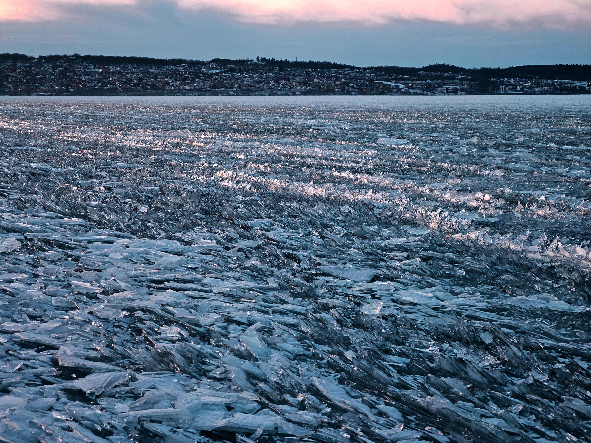

I skrivande stund är våren verkligen på väg (typ bara en eller två dagar bort innan SMHI klassar det som meteorologisk vår) men för bara några veckor sedan var Vättern så pass frusen att det gick att gå flera hundra meter ut.

{.-wide}

Jossan och jag gick ut en bit och tog även med oss drönaren. Isen som frusits periodvis hade bildat många olika sorters mönster.

{.-wide}

{.-full}