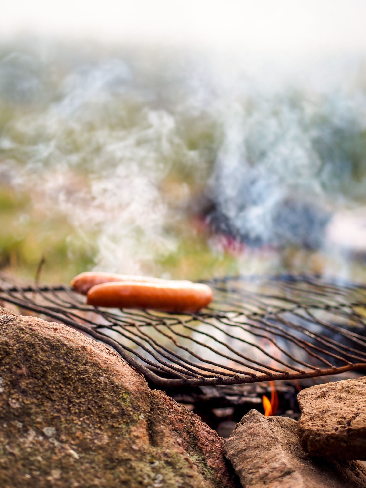
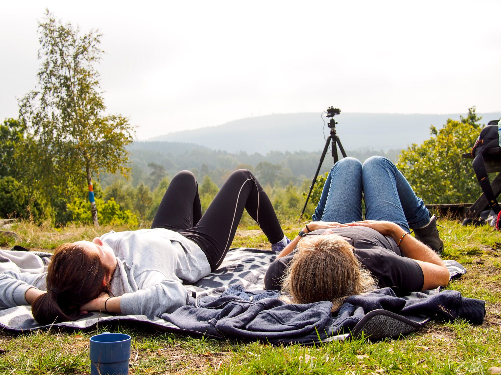
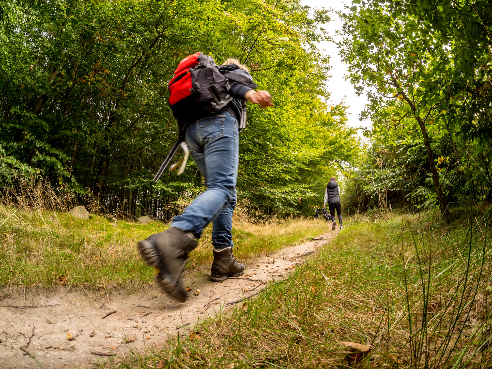
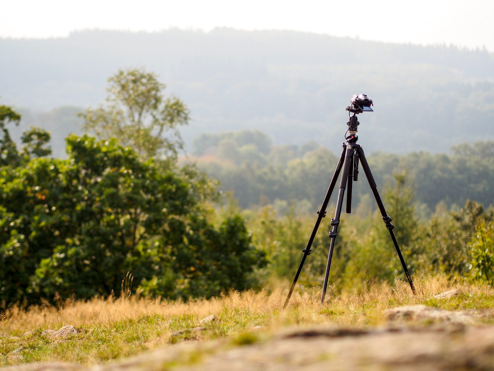

Så här på förhösten ([ja det är tydligen ett ord](http://www.smhi.se/bloggar/vaderleken/2012/08/25/sensommar-eller-forhost/4)) är det väldigt trevligt på alla vandringsleder runtom i landet. Jag och familjen tog tillfället i akt och åkte till Skåneleden vid Romeleåsen och vandrade och grillade lite under dagen.

:::: gallery {.-wide}
::: row
{.-inline}
{.-inline}
:::
::: row
{.-inline}
{.-inline}
:::
::::

Löven har börjat gulna men har kvar det mesta av sin gröna färg. Skogen lyser med en kraftig grön färg. Att det var lite halvmulet gjorde det inte sämre för fotograferande heller :D

{.-full}

Jag tog tillfället i akt och timelapsade lite också. Sekvensen nedan är tagen med ett fish-eye. Ska prova olika tekniker för redigering med den sen.

<figure class="embed video">
    <iframe width="480" height="270" src="https://www.youtube-nocookie.com/embed/xSlO4Wq3fmE?feature=oembed" frameborder="0"
            allow="accelerometer; autoplay; encrypted-media; gyroscope; picture-in-picture" allowfullscreen></iframe>
</figure>