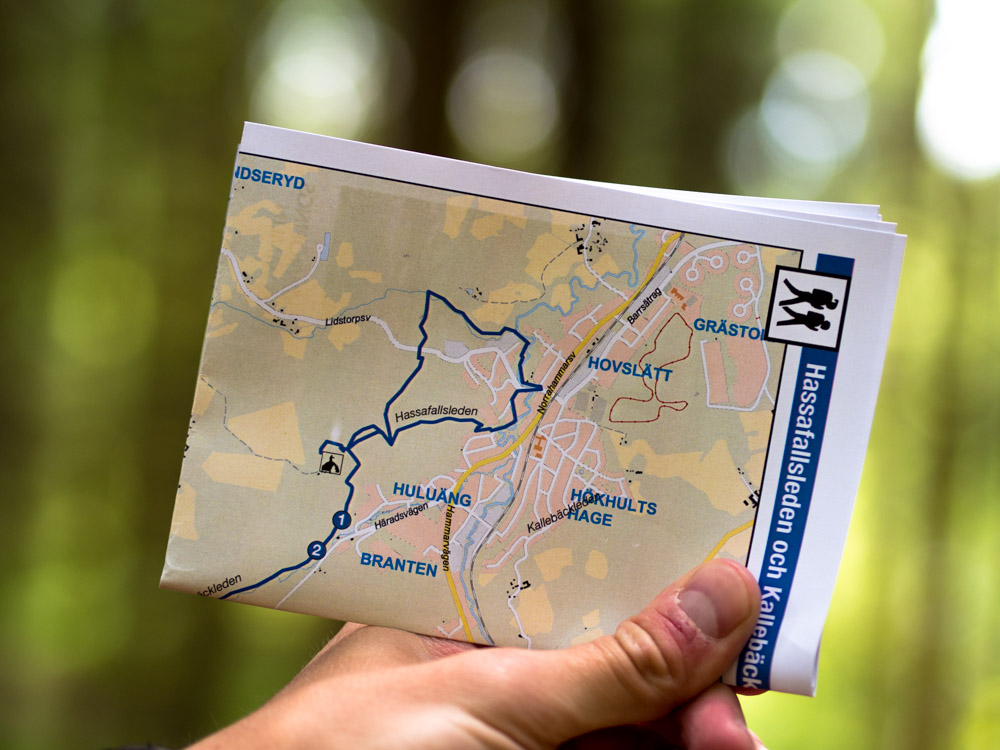

Det fina vädret till ära tog jag och Marcus en runda på Hassafallsleden och som vanligt blev det ingen besvikelse :)

:::: gallery {.-wide}
::: row {.-no-wrap}
{.-inline}
{.-inline}
:::
::: row {.-no-wrap}
{.-inline}
{.-inline}
:::
::::

Trots väldigt lugnt vandringstempo var det väldigt svettigt i solen, så vi tog en paus och njöt lite av utsikten från Varkullen

{.-full}

Får se vilken vandringsled det blir härnäst...
