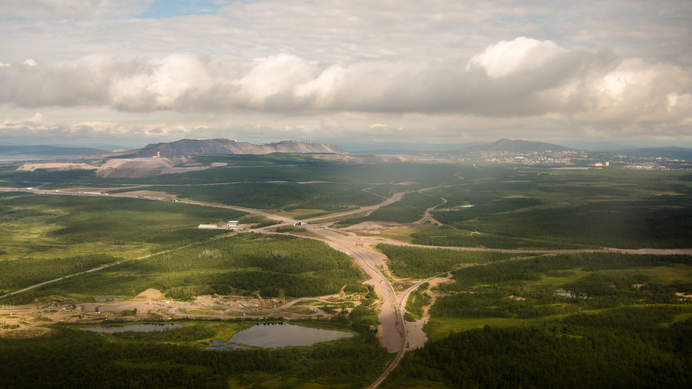
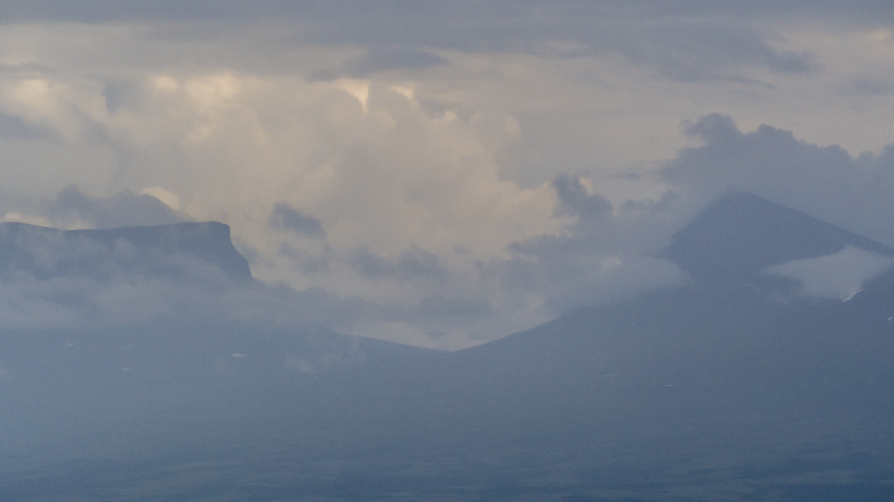
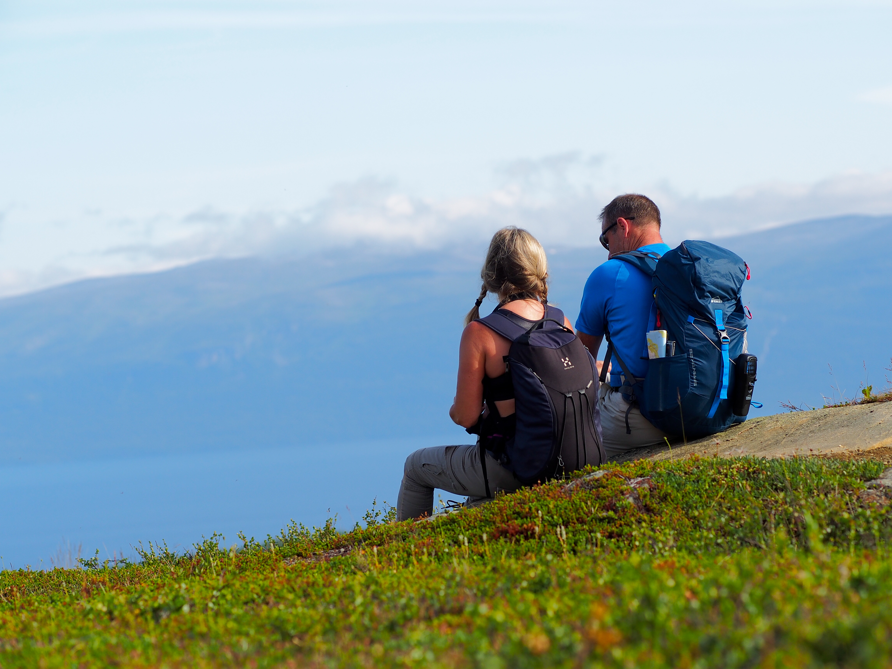
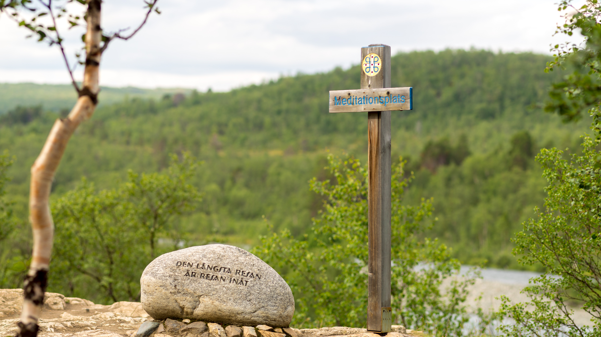

Det är inte varje dag som en får möjlighet att besöka en av våra mest kända nationalparker: Abisko med starten på vår utan tvekan mest kända vandringsled: Kungsleden.{.lead}

{.-full}

Med diverse transportslag tog vi oss upp till Kiruna för att sen ta tåget den sista biten. På väg till tåget som var en bit bort fick vi vårt första bemötande av en lokalbo när busschauffören bestämde sig för att frångå sin vanliga rutt och körde oss hela vägen till tågstationen. En stund senare rullade tåget in och vi hoppade på.

## Linbana upp till Nuolja (Dag 1)

Första dagen som också var en resdag hade vi inte tid för så mycket så vi bestämde oss för att ta den mindre turen upp till Nuolja och Aurora Sky Station dit det gick en linbana.

:::: gallery {.-wide}
::: row {.-no-wrap}
{.-inline}
{.-inline}
:::

<figcaption>
Vandring och linbana upp till Nuolja och Aurora Sky Station
</figcaption>
::::

Uppe på toppen var den fantastisk vy över hela dalen i Abisko och i fjärran skymtade vi Lapporten dit vi skulle dagen efter.

{.-wide}

Vädret över landskapet skiftade mellan sol och regn på det sätt som endast fjällvädret kan göra.

{.-full}

När vi tittat färdigt och skulle bege oss ner igen hade linbanan slutat gå så vi gick ner på den smala steniga stigen.

:::: gallery {.-wide}
::: row
{.-inline}
{.-inline}
:::
::::

## Vandring upp till Lapporten (Dag 2)

Andra dagen var det dags för den tuffaste vandringen för denna turen när vi skulle gå upp till Lapporten. En sträcka på lite mer än 2 mil och ~600 höjdmeter.

{.-wide}

Början av turen gick genom skog fullt med mygg och annat men efter en liten stund gick vi fria från träden och slapp alla jobbiga insekter samtidigt som vi fick en fin belöning i form av utsikten över Abisko och Torneträsk varje gång vi vände oss om.

{.-full}

Väl uppe vid sjön Čuonjájávri och med en fin vy över Lapporten stannade vi och vilade en stund och åt den lilla proviant vi hade med oss. Pappa kokade lite pilsnerkorv som några av oss åt.

Sen var det dags för den betydligt lättare vandringen nedför berget igen, nu kunde vi njuta av utsikten varje steg.

## Kungsleden (Dag 3)

Tredje och sista dagen blev lite kort vandring längs Kungsleden med mer fokus på naturen och vyerna än att faktiskt förflytta oss. Den första kilometern gick vi bredvid den dånande forsen.

:::: gallery {.-wide}
::: row {.-no-wrap}
{.-inline}
{.-inline}
:::

<figcaption>
Forsen i Abiskojokk
</figcaption>
::::

Dag Hammarskjöld var en flitig besökare och denna första delen av Kungsleden går parallellt med [Dag Hammarsjöldsleden](https://kiruna.se/konst-och-kulturhistoria/modalpuffar/kulturmiljo/dag-hammarskoldsleden.html), en pilgrimsled med flera meditationsplatser med citat från hans efterlämnade texter inristade på stenar.

{.-full}

Från meditationsplatsen var det fin utsikt åt många håll, bland annat över floden Abiskojokk som här några kilometer ifrån forsen var betydligt lugnare.

:::: gallery {.-wide}
::: row
{.-inline}
{.-inline}
:::
::::
