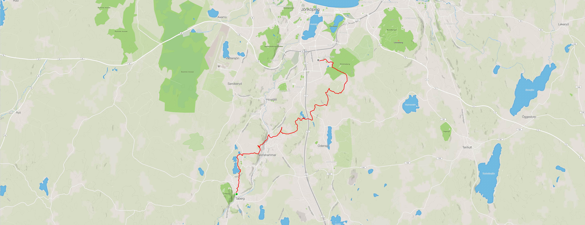
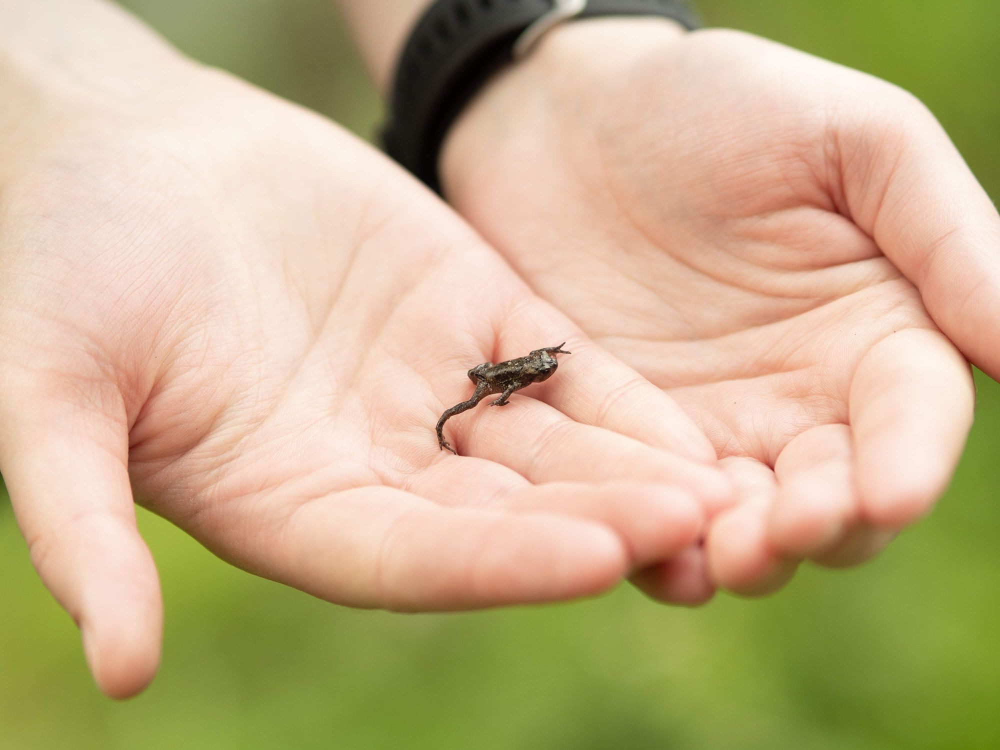
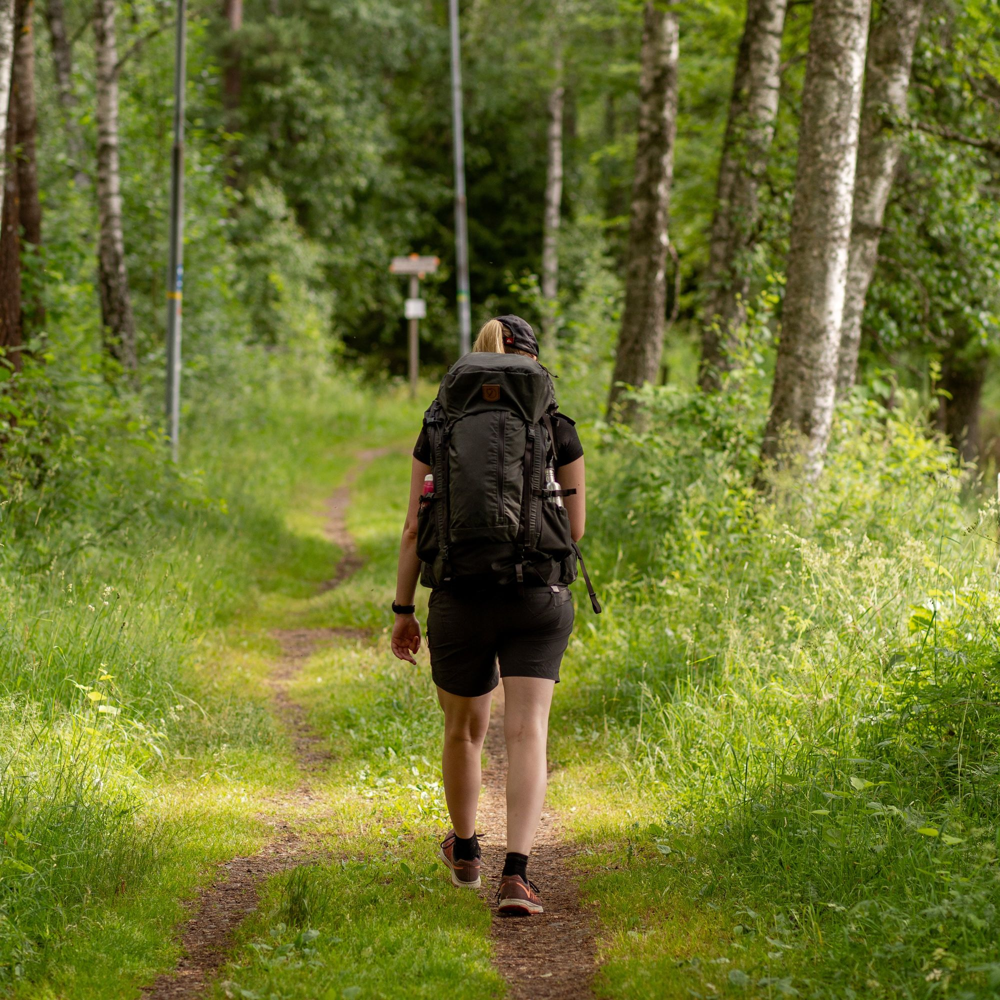

Nu har Jossan och jag äntligen landat i vilka ryggsäckar vi ville ha och vi gav oss ut på en tur för att testa dem. Vi valde varsin Fjällräven 35 liter. Jag valde deras [Abisko Hike 35L](https://www.fjallraven.se/shop/fjallraven-abisko-hike-35-F27124-stone-grey/) som inte har en sån trampolin baksida för luftström, Jossan valde [Abisko Friluft 35L](https://www.fjallraven.se/shop/fjallraven-abisko-friluft-35-w-F27212/) som har en sån.

Första testet blev runt 19km vandring från Taberg till Strömsbergs naturreservat längs tre etapper av Södra Vätterleden.

{.-full}

Det var trevlig och varierande terräng, allt från mysiga villakvarter på asfalt till öppna fält och genom hagar. Självklart även en hel del fin skog

:::: gallery {.-wide}
::: row
{.-inline}
{.-inline}
:::
::: row
{.-inline}
{.-inline}
:::
::::

Bra uppladdning för lite mer vandring när semestern börjar. Jag är även väldigt pepp på att vandra vid Borgafjäll i höst!
