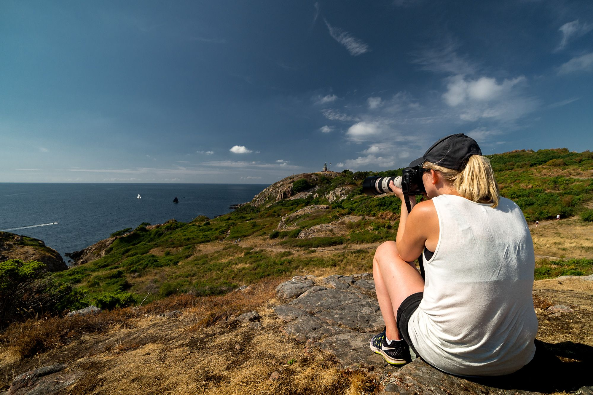
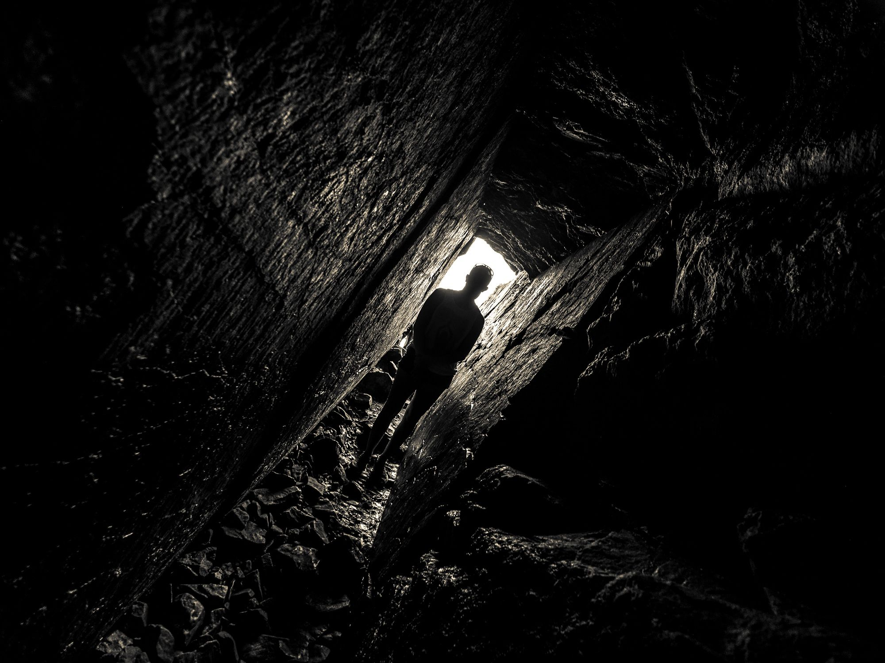
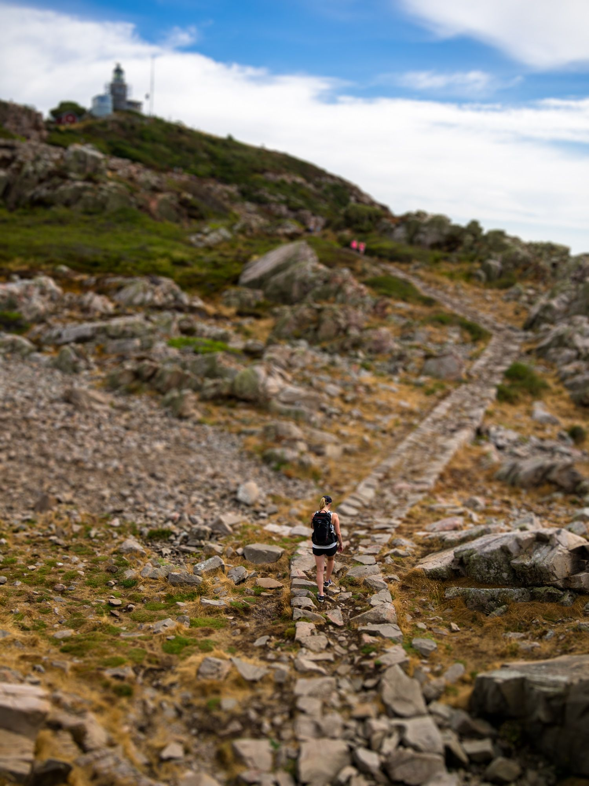

Efter att ha pratat om att åka till Kullaberg ett tag tog vi ett ganska spontant beslut om att åka iväg.

{.-wide}

## Kullaberg

Trots den extrema värmen och att Kullaberg knappt erbjuder något skydd mot den var det väldigt mycket folk. De flesta höll sig dock längst upp på toppen i närheten av parkeringen och undvek den värsta klättringen.

:::: gallery {.-wide}
::: row
{.-inline}
{.-inline}
{.-inline}
:::
::::

Vi hittade en klippa med en mycket fin utsikt, och efter lite väntande fick vi en underbar scen där skuggorna från molnen dansade över landskapet.

{.-full}

På vägen tillbaka till bilen lyckades vi hittade den perfekta genvägen på en liten stig genom skogen som ledde oss rakt tillbaka dit vi ställde bilen.

{.-full}

Sen var det dags att köra till campingen för övernattning. Josefine hade valt ut camping First Camp Torekov där hon varit mycket som liten.

{.-wide}

## Hallands väderö

Dagen därefter traskade vi de långa 1,5km från campingen bort till färjeläget för att ta båten ut till Hallands väderö.

{.-wide}

Denna dagen blev om möjligt ännu varmare så det blev inte så mycket vandring utan vi gick bara någon kilometer över till fyren på norra sidan av ön där vi också åt vår massäck. Sedan sällade vi oss till de andra besökarna vid stranden och svalkade oss i det klara vattnet.

:::: gallery {.-wide}
::: row
{.-inline}
{.-inline}
:::
::: row
{.-inline}
{.-inline}
:::
::::

När vi sen skulle åka därifrån blev kön extremt lång till båten, vi var lite oroliga att vi inte skulle få plats men båten slukade alla passagerare utan problem och vi fick till och med bästa läktarplats för resan tillbaka.

