Precis som alla andra svenskar bestämde vi oss för att vandra lite i närområdet under pandemin.

Vi tog bussen ut till Bottnaryd för att vandra den första etappen av Södra Vätterleden i riktning mot Mullsjö. På papperet precis under 30km långt med ett sovstopp på 17.5km i ett vindskydd.

Just denna leden var vi ett gäng under studietiden som gick, dock avbröt vi tidigare under andra dagen på grund av dåligt väder. Denna gången gick vi hela + lite extra.

## Första dagen

Vandringen började med underbart väder: blå himmel och behaglig temperatur (kanske lite för varmt), vi gick på snabbt med ett snittempo på runt 4.5km/h och stannade bara några gånger för att äta de snacks vi hade med oss.

:::: gallery {.-wide}
::: row
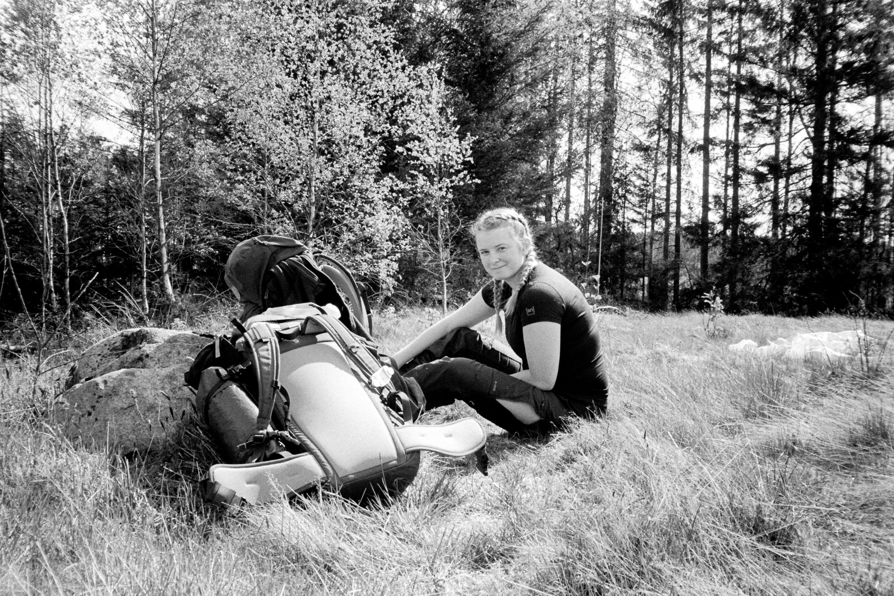{.-inline}{.-inline}
:::
<figcaption>
Lite paus
</figcaption>
::::

Vid 11km gjorde vi ett stopp och lagade lite varm mat. Kycklingsoppa från REAL Turmat som vi båda var ganska missnöjda med. Bra att veta till nästa gång!

Efter 14km var det dags att lämna Småland och fortsätta in i Västergötland.

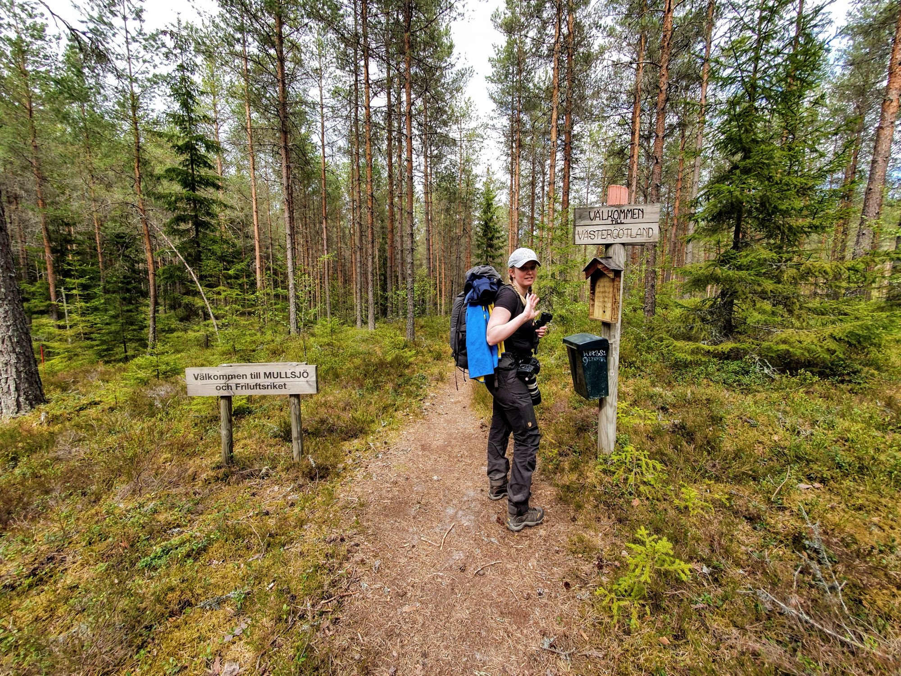{.-wide}

Med mat i magen gick det sedan snabbt, vi stannade bara en gång och det var lättvandrat med bara lite backar. Mestadels var det öppen tallskog med mjuk skön mark.

{.-full}

](https://www.strava.com/activities/3493642297)"){.-full}

Ganska snabbt var vi framme vid Bergs vindskydd (tältet har inte kommit än så vi valde att sova här istället).

:::: gallery {.-wide}
::: row
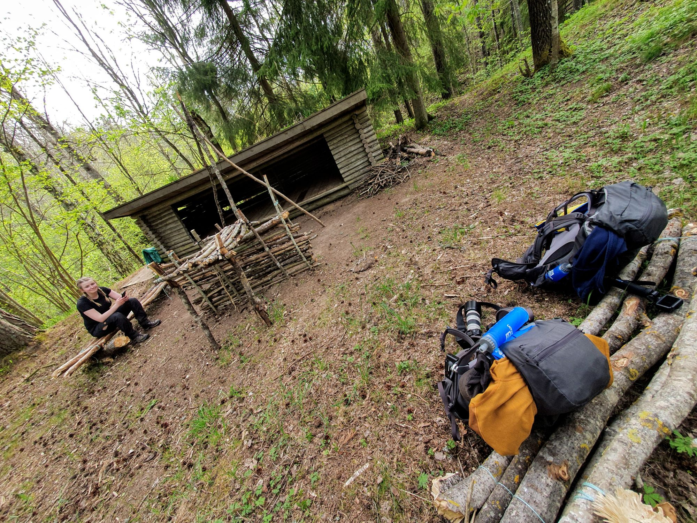{.-inline}
{.-inline}
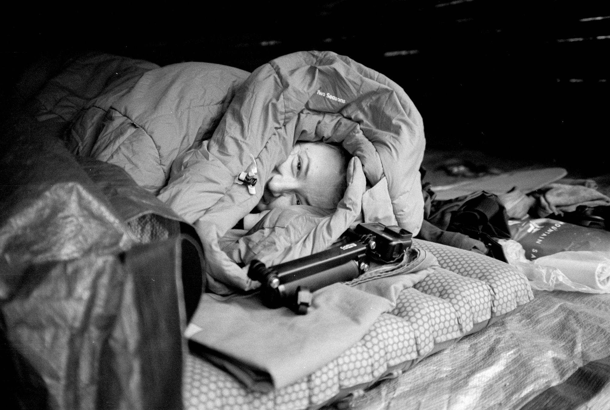{.-inline}
:::
::::

Vi hade med en presenning som vi sov under för att få lite extra skydd.

Så här i efterhand hade vi nog inte behövt ha den över oss utan bara under. Mest bidrog den till att det blev fuktigt på grund av all kondens. Det var dock ganska blåsigt under natten så det kan hända att den hjälpte en del ändå.

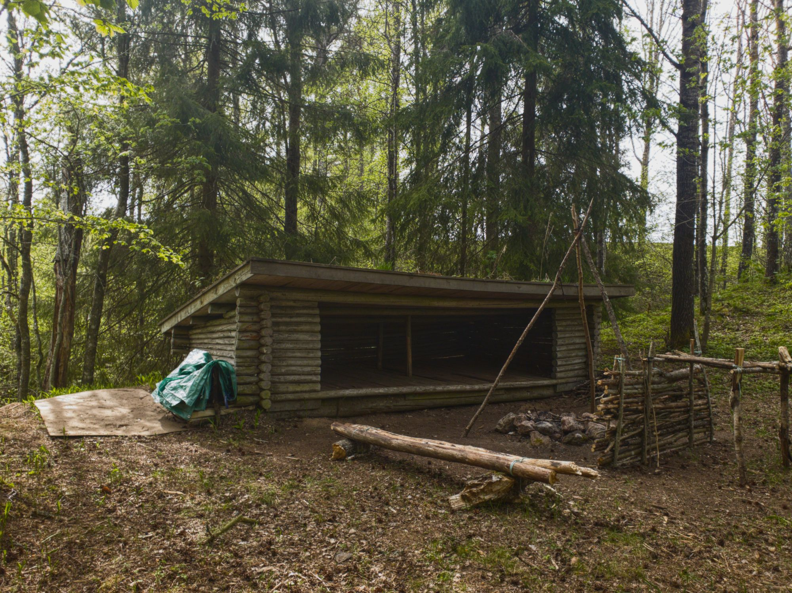{.-full}

## Dag 2

:::: gallery {.-wide}
::: row {.-no-wrap}
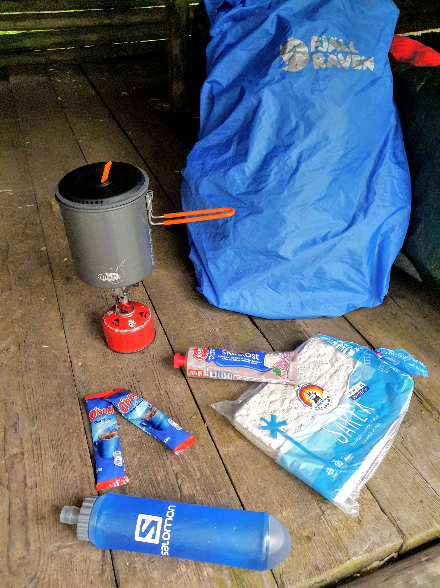{.-inline}
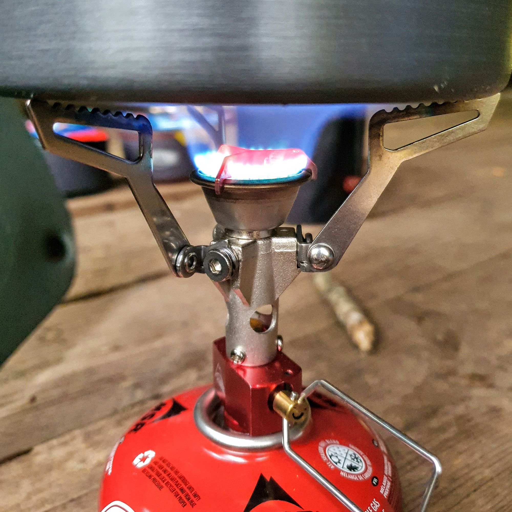{.-inline}
:::
<figcaption>
Lyxfrukost bestående av tunnbröd med mjukost och varm choklad
</figcaption>
::::

Trots att vi var väldigt sega i benen efter en dags vandring så kändes det på något vis lättare dag två på grund av att packningen börjat lätta. Runt 800g mat och 2.5kg vatten hade vi redan förbrukat. Efter en lyxig frukost begav vi oss iväg.

Andra etappen var fortfarande väldigt lättvandrat med fina stigar men nu började det bli rejält mycket mer kuperat. Särskilt när vi närmade oss Ryfors med fina vattenfall.

:::: gallery {.-wide}
::: row
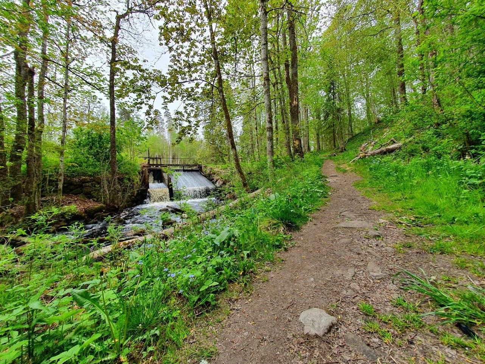{.-inline}
{.-inline}
:::
::: row
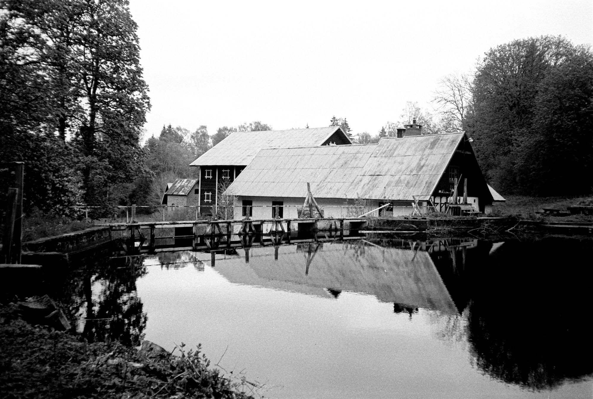{.-inline}
{.-inline}
:::
<figcaption>
Ryfors bruk
</figcaption>
::::

Det bjöds också på mycket finare vyer. Bland annat Stråkensbro som vi använde för att ta oss över Stråken.

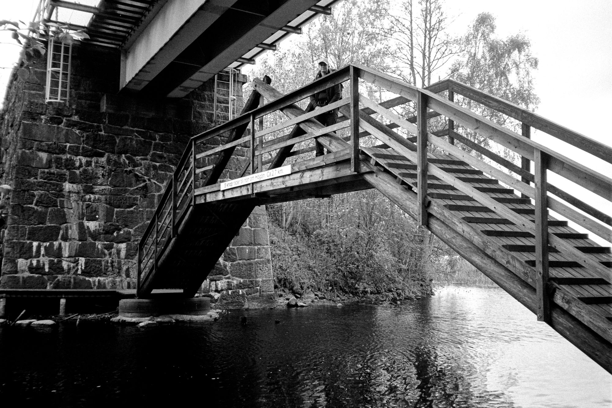{.-wide}

Eller fina Trollsjön som vi stannade till vid i exakt 7 sekunder varpå vi blev attackerade av myggor för många för att räknas.

"){.-full}

Totalt slutade andra dagen på 14.3 km med 1.9km i transportsträcka bort till tågstationen.

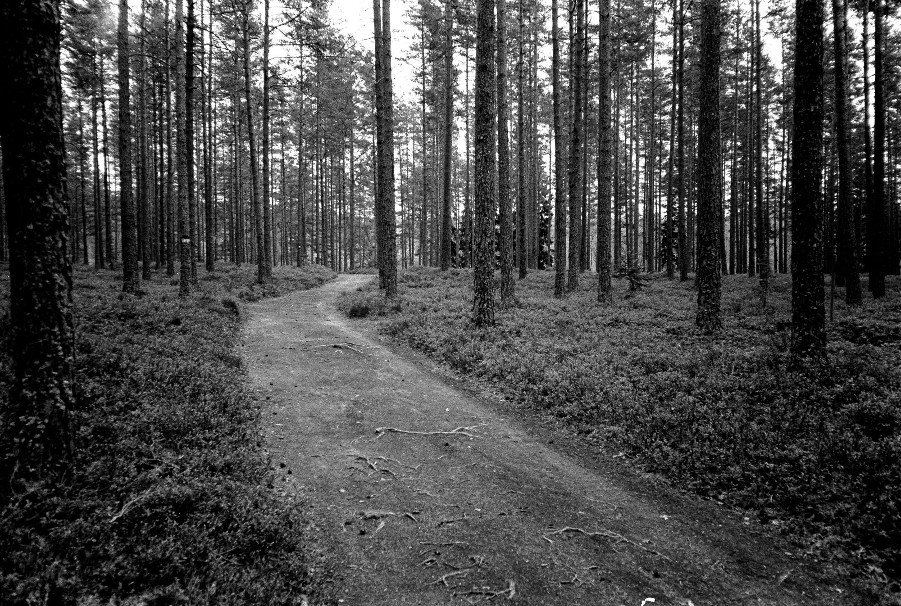{.-wide}

Totalt kom vi upp i 35.44km, en bit mer än de utlovade 30km.

](https://www.strava.com/activities/3497756756)"){.-full}
