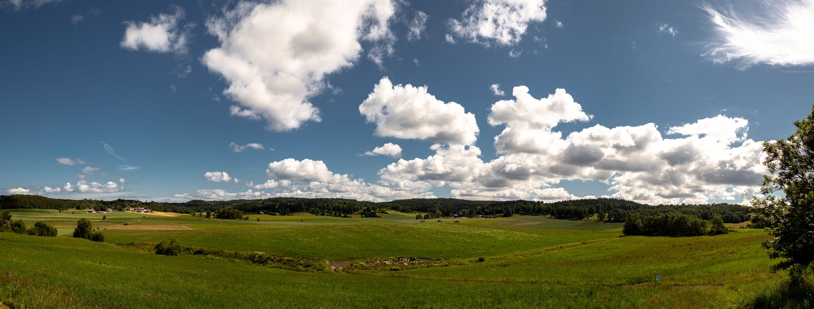
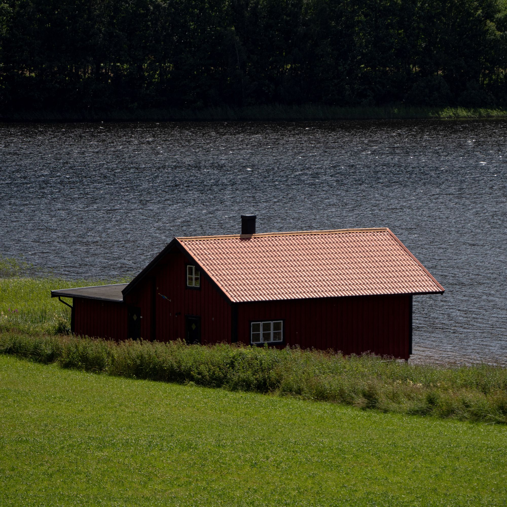
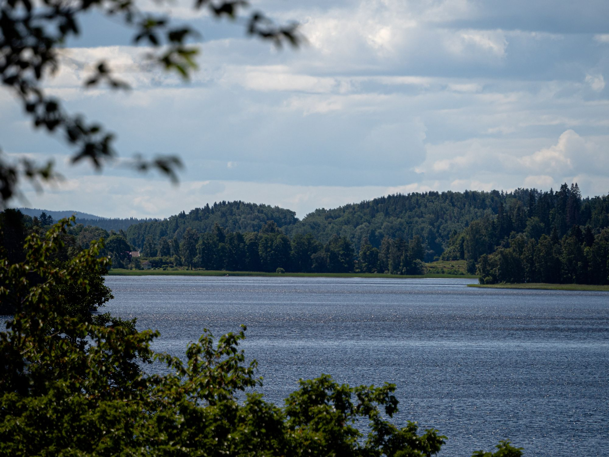
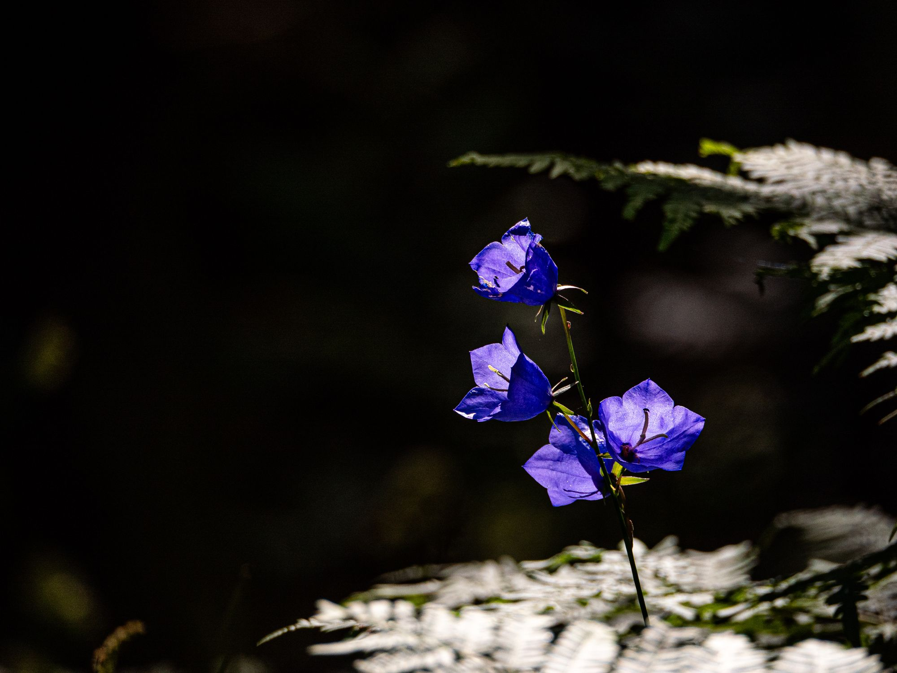
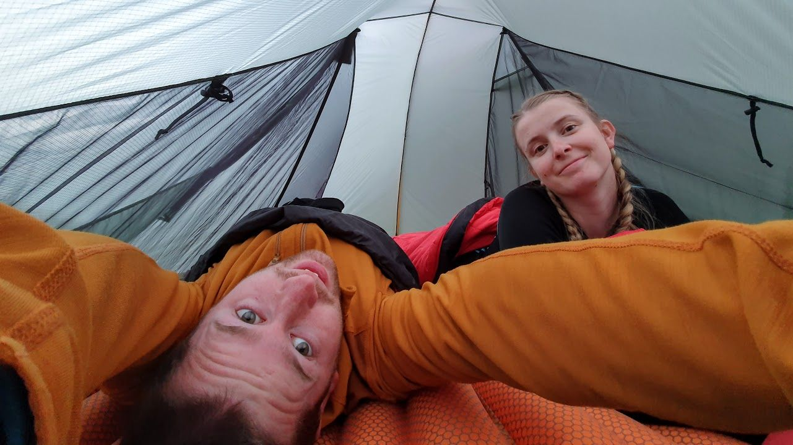
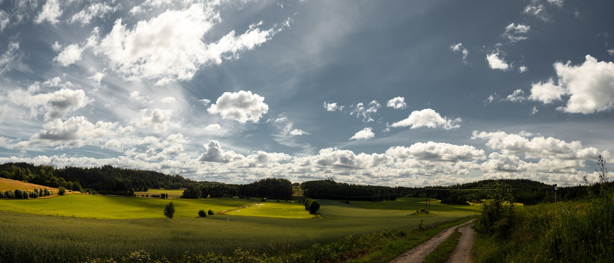

Vi började vandringen i Siringe norr om Skärstad för att därifrån vandra ungefär 4 kilometer genom fina öppna landskap upp mot John Bauerleden.

{.-full}

Leden började med att gå längs landsvägar av asfalt men efter 4 och en halv kilometer kom vi äntligen fram till lite riktiga stigar som började vid Ramsjön.

:::: gallery {.-wide}
::: row
{.-inline}
{.-inline}
{.-inline}
:::
::::

Ramsjön bjöd på underbara vyer över skog och landskap.

{.-full}

Därefter var det dags för lite riktiga stigar i skogen som också bjöd på ett rikt djurliv. Många fjärilar och några ekorrar fick vi se.

:::: gallery {.-wide}
::: row
{.-inline}
{.-inline}
:::
::: row
{.-inline}
{.-inline}
:::
::::

Efter 12 kilometer gjorde vi ett stopp för att laga lunch vid Pukasjön där det byggts ett nytt fint vindskydd med utedass.

{.-full}

{.-wide}

Sedan gick vi vidare mot Fjällstorp som låg ungefär 2 kilometer bort. Vid Fjällstorp fanns en stor fin gräsmatta för att slå upp tält, ett utedass och en fin värmestuga med eldstad där vi gjorde vår kvällsmat: Korv med bröd.

:::: gallery {.-wide}
::: row
{.-inline}
{.-inline}
{.-inline}
:::
::::

Jag hade lite som ett mål att testa min sovsäcks gränser vilket gick alldeles utmärkt. Det är en sovsäck för +13° och det blev +10.4° som kallast i tältet.

Jag som sover varmt visste (eller trodde) att jag kunde tänja lite på den gränsen vilket stämde bra. Jag vaknade inte en enda gång och jag var i en ganska lagom temperatur när jag vaknade.

](https://www.strava.com/activities/3753226670)"){.-full}

## Dag 2

Andra dagen gick vi vidare söderut mot Huskvarna och passerade där flera nya fina vyer. Till exempel utsiktsplatsen Måla kulle där vi hade fin utsikt över Landsjön och landskapet kring Kaxholmen.

{.-full}

Sedan gick stigen omväxlingsvis genom fin granskog och öppet jordsbrukslandskap.

{.-full}

Turen avslutades sedan med vandring på Huskvarnaberget där vi passerade den mycket trevliga utsiktsplatsen Brunstorpsberget.

<figure class="embed video">
	<iframe width="612" height="344" src="https://www.youtube-nocookie.com/embed/lHH8InlHv4A?feature=oembed" frameborder="0" allow="accelerometer; autoplay; encrypted-media; gyroscope; picture-in-picture" allowfullscreen></iframe>
</figure>

{.-full}

Sedan gick vi sista biten bort mot IKHP-stugan där vi blev upphämtade. Lagom vandringstur på ~29km.

](https://www.strava.com/activities/3755966671)"){.-full}
