I helgen bestämde jag mig för att testa det där med ensamvandring och då valde jag etapp 2 på Södra Vätterleden mellan Bottnaryd och Norrahammar.{.lead}

Turen var även första tillfället att testa en stor del av utrustningen, bland annat vattenfiltret Grayl Geopress, ryggsäcken Gossamer Gear Mariposa 60L och nytt kokkärl.

:::: gallery {.-wide}
::: row
{.-inline}
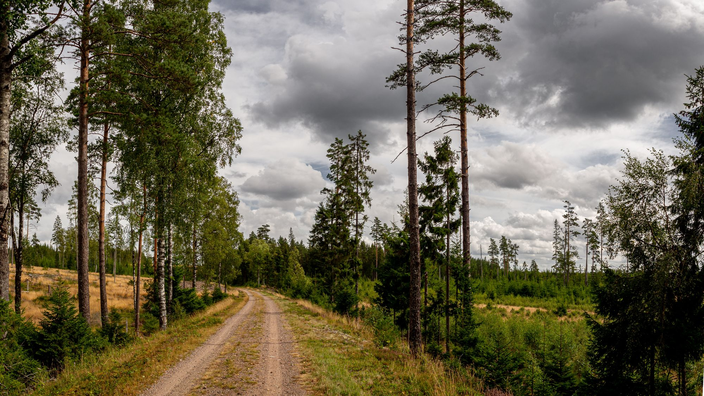{.-inline}
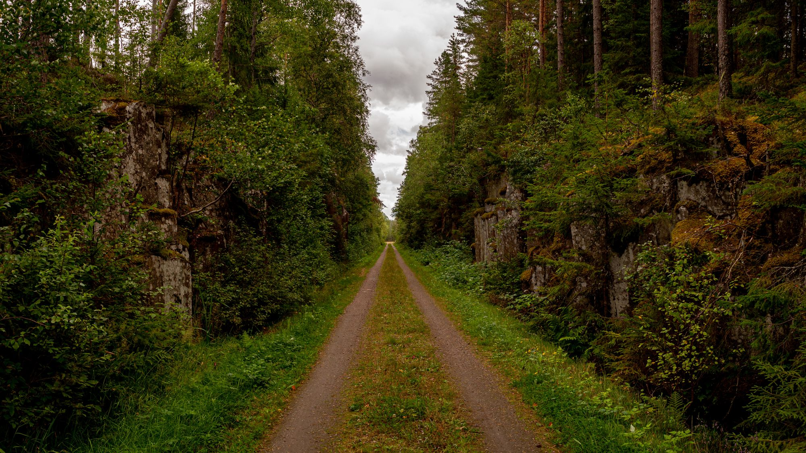{.-inline}
:::
::::

Turen började i högt tempo på lite över 6km i timmen med snabba steg tack vare den lätta packningen. Det gick så snabbt att jag nästan inte hann se snoken som låg mitt på vägen och solade.

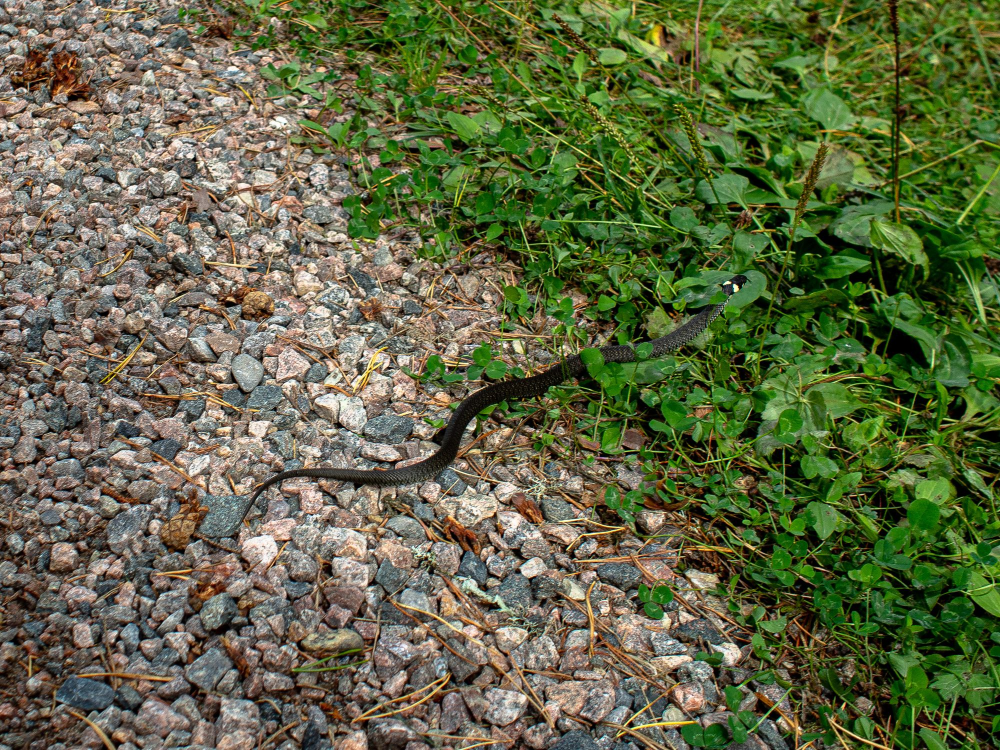

Snoken ringlade sig snabbt åt sidan när jag skrämde den, men inte förrän jag hunnit ta en bild.

Vid 1.2km stötte jag på turens första problem. Den utmärkta leden avvek från leden på kartan. Jag valde då att följa leden på kartan vilket ledde mig in på Rallarleden (Cykelrallarn, inte att förväxla med Rallarleden i Kiruna) som jag gick på ungefär 2 kilometer sedan gick den utmärkta leden och leden på kartan ihop igen.

{.-full}

Efter fem kilometer vek leden av söderut över riksväg 40 och det var här på andra sidan av en rejäl grind som vägarna övergick i mysiga skogsstigar.

De kommande 4-5 kilometrarna var utan tvekan den finaste delen av vandringen i fin skog med mycket blåbär. Jag stannade och plockade flera nävar fulla.

:::: gallery
::: row
{.-inline}
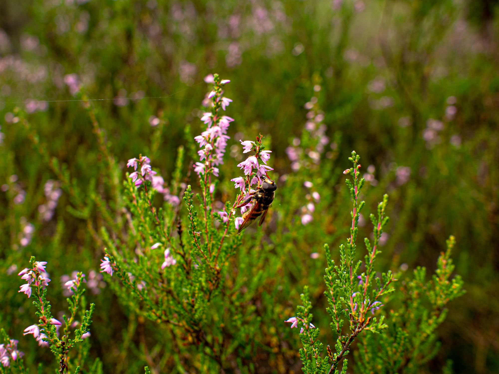{.-inline}
:::
<figcaption>
Mycket blåbär blev det på vägen, hade nog inte behövt ha med något snacks alls
</figcaption>
::::

Här skulle det varit en bild på bron vid Jära by. Men den missade jag helt eftersom jag inte följde med ordentligt på kartan när jag gick. Och när jag insåg att jag gått förbi byn var det för sent.

Men nu har jag något för nästa gång jag vandrar här.

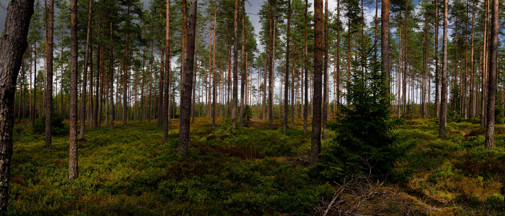{.-full}

Sedan var det nästan helt slut på skogsstigar med några undantag. Leden gick mestadels i väggrenen på bilvägar och skogsvägar. Jag valde då att fortsätta i tempo istället för att stanna och njuta av naturen som jag gjort den föregående sträckan.

:::: gallery {.-wide}
::: row
{.-inline}
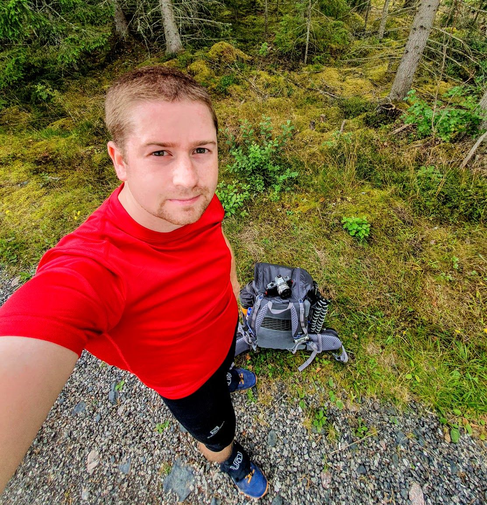{.-inline}
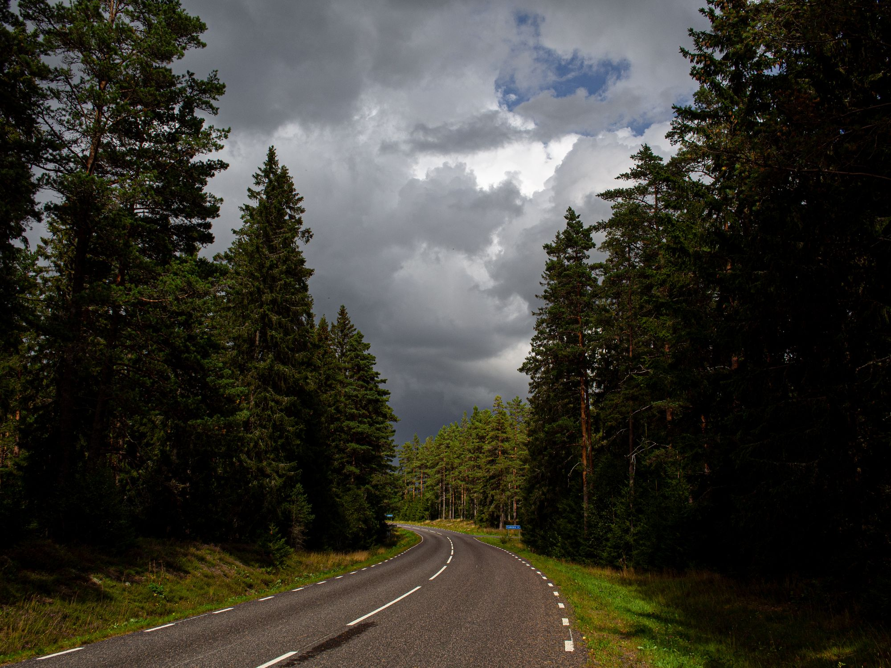{.-inline}
:::
::::

{.-wide}

Den sista kilometern råkade jag gå fel eftersom jag ganska blint följde de oranga markeringarna. Det jag inte uppmärksammat var att det var ett sidospår som också var uppmärkt som jag följt. Så det blev lite extra.

](https://www.strava.com/activities/3950140453)"){.-full}

Vid scoutstugan Bastan i Skinnarebo slog jag upp mitt tält för natten. Här finns faciliteter i form av toalett och brunn med fint vatten som jag fyllde på vattentanken med.

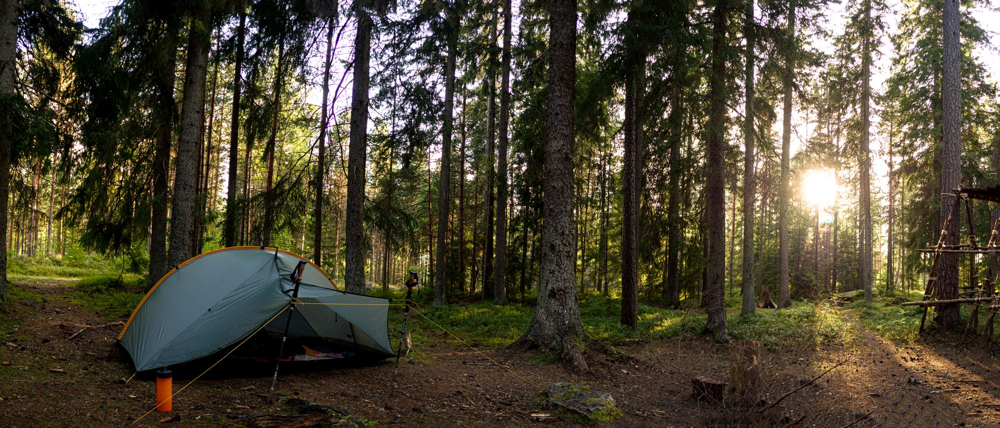{.-full}

Kvällsmaten blev REAL Turmats Lapskojs som är potatismos med köttbitar i. Tidigare erfarenheter av REAL Turmats utbud har varit minst sagt negativt. Denna rätt var däremot väldigt god (med frystorkad mats mått mätt).

:::: gallery
::: row
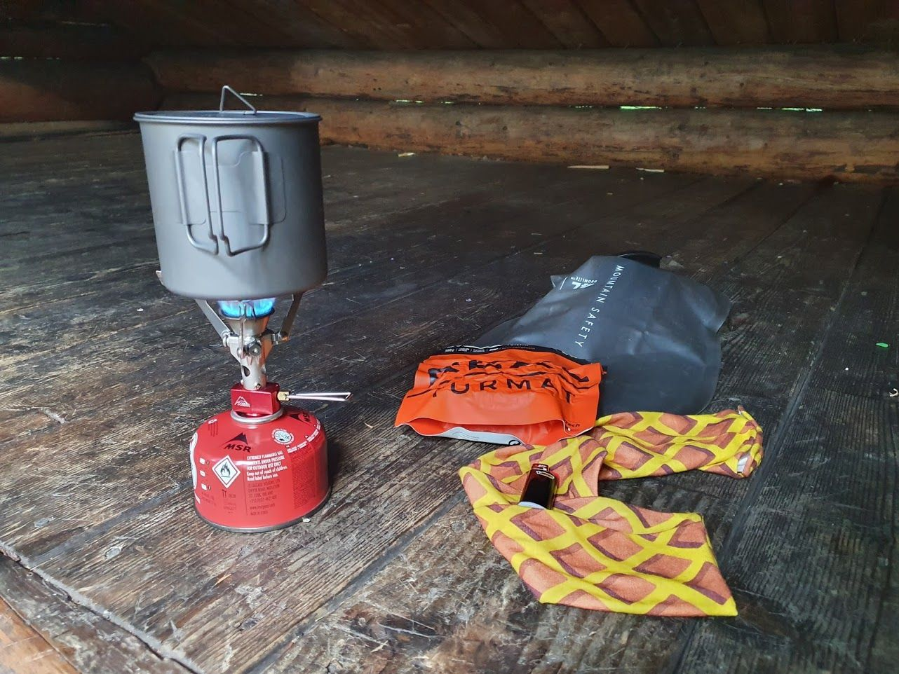{.-inline}
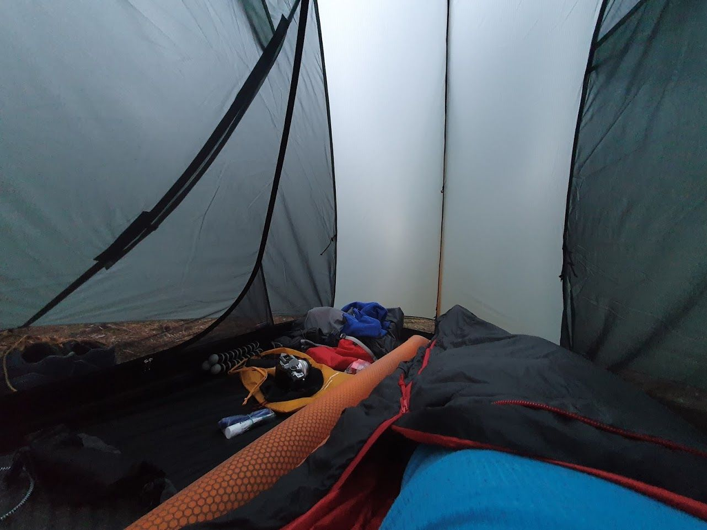{.-inline}
:::
::::

Kvällen spenderades sedan med lite poddlyssnande i det (för en person) väldigt rymliga tvåmanstältet.

## Dag 2

Efter en ganska god natts sömn var det dags för frukost som bestod av varm choklad och tunnsbrödsrullar fyllda med mjukost.

:::: gallery
::: row
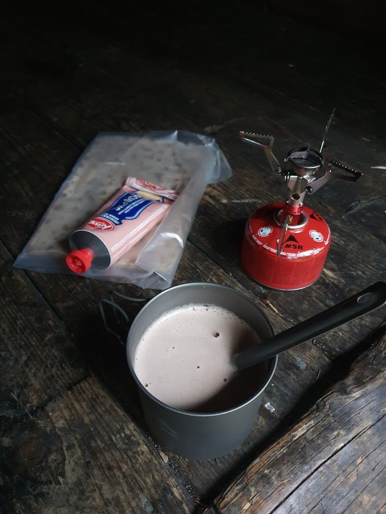{.-inline}
{.-inline}
:::
::::

Efter att ha tagit ner tältet var det dags att gå vidare.

<figure class="embed -wide"><iframe title="Packa ihop tält" src="https://video.gustavlindqvist.se/videos/embed/4687b10f-197b-4463-a299-a7e2405fbbec?title=0&amp;warningTitle=0&amp;peertubeLink=0&amp;p2p=0" allowfullscreen="" sandbox="allow-same-origin allow-scripts allow-popups" width="560" height="315" frameborder="0"></iframe></figure>

Egentligen var planen att gå hela vägen tillbaka till Jönköping men mina fötter tyckte annorlunda. Istället var målet att gå ~5 kilometer bort till Norrahammar och sen ta bussen hem därifrån.

{.-full}

Det var rätt mysigt att gå så tidigt på morgonen, fågelkvitter, skön fuktig luft och behaglig temperatur.

:::: gallery {.-wide}
::: row
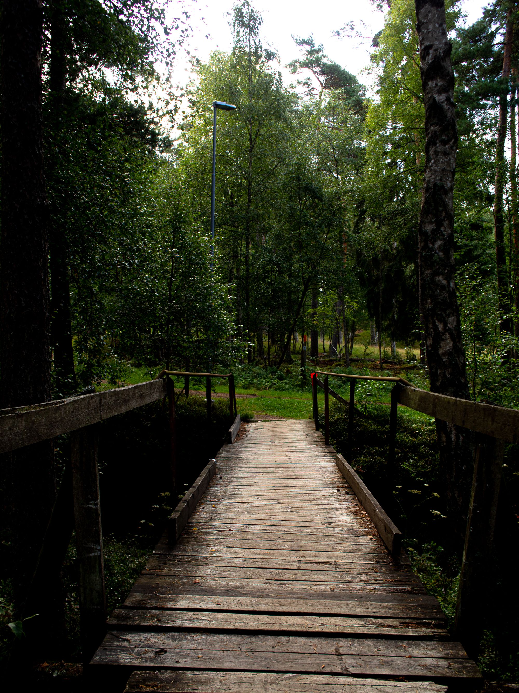{.-inline}
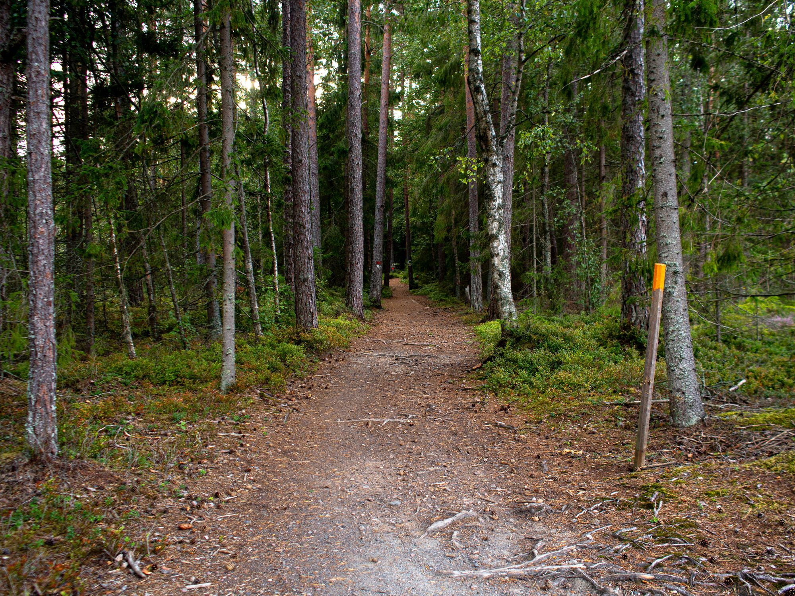{.-inline}
:::
::: row
{.-inline}
:::
::::

Trots det molniga vädret sprack solen igenom lite då och då och skapade fantastiska scener att fånga med kameran.

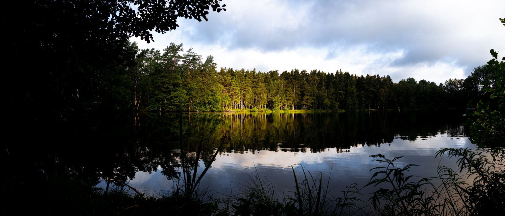{.-full}

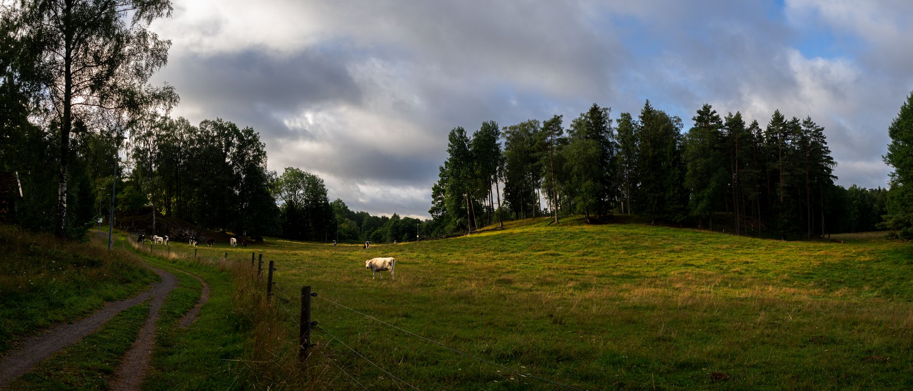{.-full}

För att hinna med en buss joggade jag den sista kilometern ned för backen. Packningen till trots gick det bra i tempot ~8min/km. Jag hann fram till busshållplatsen med 5 minuters marginal ungefär. Ett lagom slut på vandringen.

](https://www.strava.com/activities/3952486509)"){.-full}

