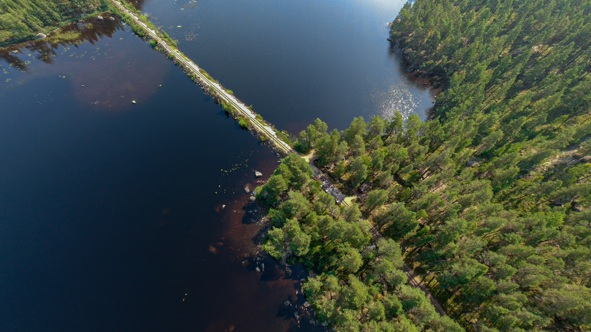

Igår mitt under toppen på värmeböljan åkta jag och Jossan iväg till Hultsfred för att cykla dressin[^\[Wikipedia\]^][Wikipedia: Dressin] på de gamla smalspåren med 891mm spårbredd som går mellan Västervik och Hultsfred och är fint bevarade av [föreningen Smalspåret Växjö-Västervik][Föreningen Smalspåret Växjö-Västervik].{.lead}

Vi utgick från Hultsfred och cyklade söderut mot Målilla strax efter klockan 9 på förmiddagen. Den första sträckan gick smalspåret längs med [Stångådalsbanan][Stångådalsbanan på Wikipedia] där de vanliga tågen går på normalspår (1 435mm). Efter 2,5 kilometer vek vårt spår av och sen uppför en vall för att sen passera över Stångådalsbanan på en bro. på samma vis passerade vi sedan över riksväg 34. Övriga vägar passerade vi genom att hoppa av dressinen för att leda den över. Detta delvis eftersom det kom bilar och vi hade väjningsplikt men även för att asfalten ibland gjorde att det lätt gick att spåra ur.

En bra grej med att cykla på gamla spår (vare sig det är på räls eller på banvall) är att det är väldigt liten lutning, vi hade som mest runt 2% lutning. Trots detta var det bitvis tungt eftersom en dressincykel väger ganska mycket när den ska komma upp i fart. När den väl är uppe i fart går det som bara den och det behövs knappt trampas.

{.-wide}

Första stoppet tog vi strax innan vi cyklat 5km. Där hade de andra cyklisterna (som mestadels kom från Tyskland) redan ockuperat de flesta stolarna under parasollen. Nu slog värmen också till ordentligt, vi hade inte riktigt märkt av den eftersom fartvinden kylde rätt bra så länge vi höll uppe farten. Vi bestämde oss för att snabbt äta upp våra tunnbrödsrullar som fick bli vår frukost och sen cykla vidare mot målet som är Hesjön där vi förhoppningsvis kunde få lite möjlighet att svalka oss.

Efter stoppet bytte vi så att jag fick åka och Josefine fick cykla.

De sista kilometrarna fram till sjön gick i nedförsbacke och eftersom cyklarna har så låg rullfriktion fick vi bromsa konstant för att inte åka för snabbt. Det gjorde inte riktigt de andra så vi fick en kö efter oss på spåret.

Efter drygt 10km cykling var vi framme vid Hesjön där spåret går över en vall som delar sjön i två delar som det var väldigt häftigt att cykla på.

{.-full}

Så här i efterhand var det kanske lite dåligt planerat att cykla dressin till just Målilla som var det varmaste platsen i Sverige under värmeböljan på 37°C ([och som även har värmerekordet i Sverige genom tiderna][SMHI: Svenska temperaturrekord]) men det var faktiskt inte så farligt. Vattnet i sjön var varmt men rejält svalkande (Min gissning är runt 25ºC) och dressinen fläktade.

Den värsta värmen kände vi först när vi cyklat hela vägen tillbaka (som gick oerhört mycket snabbare) och hoppat av på stationen i Hultsfred, där stod luften still. Klockan hade då hunnit passera 12:00 och solen stod som högst. Vi packade snabbt ihop, blötade ner våra huvuden med handdukar och vattnet vi hade med oss och sen hoppade vi in i bilen som lyckligtvis hade fungerande A/C.

[Stångådalsbanan på Wikipedia]: https://sv.wikipedia.org/wiki/Stångådalsbanan
[Föreningen Smalspåret Växjö-Västervik]: https://smalsparet.com
[Wikipedia: Dressin]: https://sv.wikipedia.org/wiki/Dressin
[SMHI: Svenska temperaturrekord]: https://www.smhi.se/kunskapsbanken/meteorologi/svenska-temperaturrekord/svenska-temperaturrekord-1.5792
