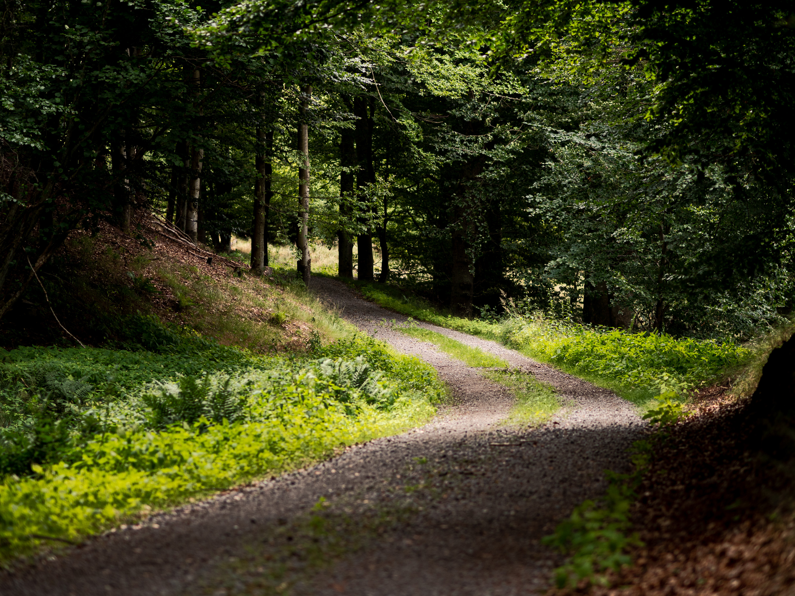
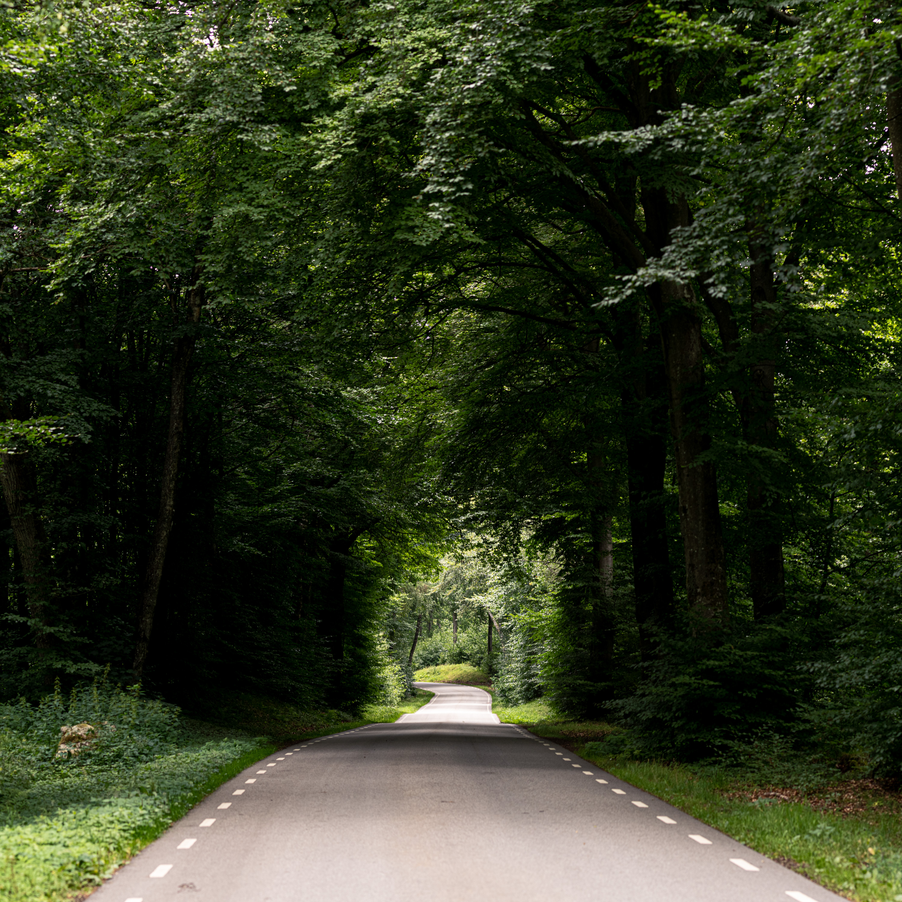
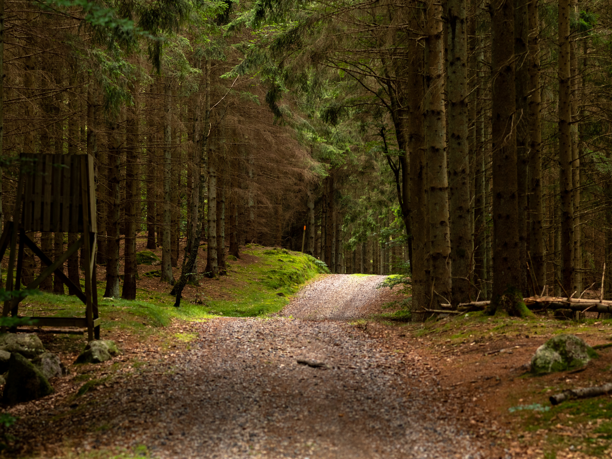
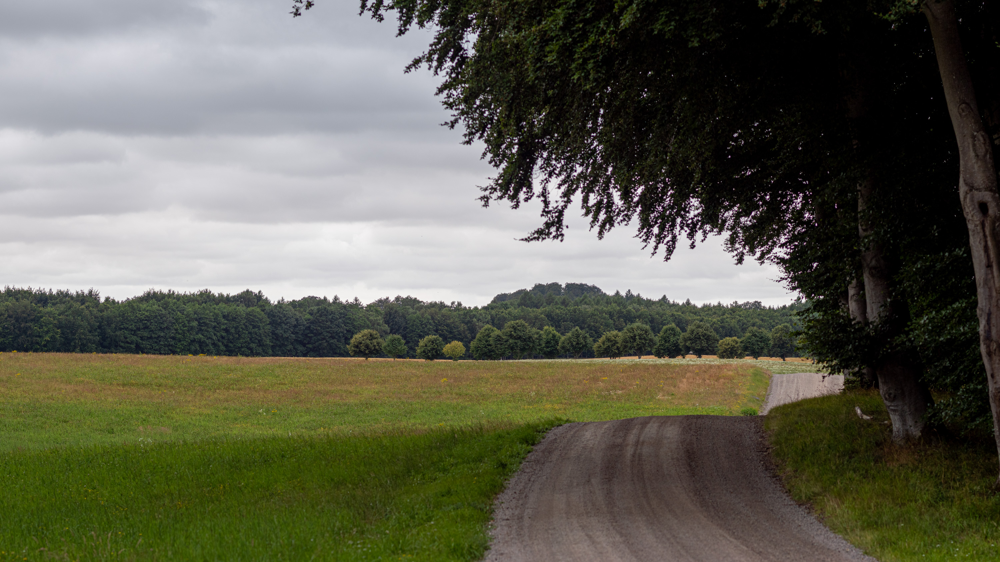
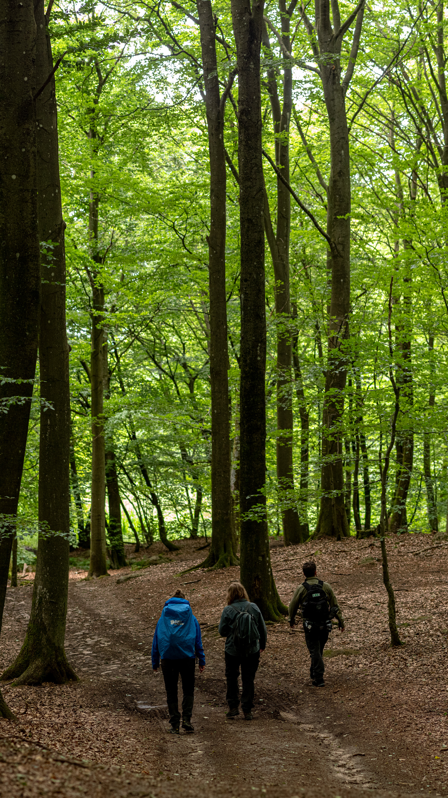
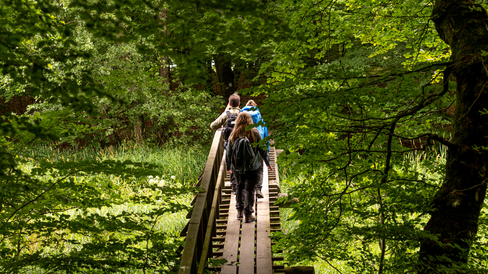

I onsdags var vi och vandrade en runda i Häckeberga på ~12km. Vi ville utgå från samma plats för att bara behöva en bil så vi valde att inte gå en av de etablerade lederna i området.

{.-full}

Rundan vi tittade ut utgick från parkeringen sydost om Häckebergasjön och sedan gick vi österut på stigar och skogsvägar bort till Skåneleden etapp 2 som går mellan Sturup och Dörröd.

{.-wide}

Det var en perfekt dag för vandring, gott om moln som gav fina temperaturer och lagom med skugga. När vi passerade de öppna fälten svalkade vinden skönt.

Vi följde Skåneleden till vi passerade Häckebergavägen en bit söder om parkeringen där vi utgick från och fortsatte sedan västerut där vi vek av från Skåneleden.

Vi gick sedan vidare på en skogsväg genom en halvöppen granskog några hundra meter till vi hittade en liten stig, denna visade sig sedan vara för MTB men vi såg ingen cykel som kom.

{.-wide}

En bit senare öppnade skogen upp sig och vi befann oss istället på ett klassiskt halvöppet Skånelandskap med åkermark och alléer. Här tyckte vi det var en bra idé att ta en paus och åt vår massäck.

{.-full}

Sista biten gick vi längs södra sidan av Häckebergasjön där det var klassisk fin öppen bokskog.

Vi hittade även flera utmärkta lägerplatser intill sjön där vi kan övernatta vid någon framtida vandring.

{.-full}

Det blev en precis lagom runda. Nu siktar vi mot Bankerydsleden och äntligen lite tältning!
