  
Bankerydsleden är en vandringsled på 24,5km i Jönköping som utgår från hembygsgården i Bankeryd och rör sig över öppna jordbrukslandskap, skogsområdet Högamon och fina utsiktsplatser som Labbarpaberget.{.lead}

Leden är välskött och har gott om faciliteter som vindskydd, toaletter och grillplatser. Den är även lättillgänglig med lokala bussar från Jönköpings tätort som går väldigt ofta. Kort och sagt, en perfekt led för 1–1,5 dags vandring med potential för övernattning.

<figure class="map -full">
    <iframe style="border:none" src="https://en.frame.mapy.cz/s/gabeporena" width="100%" height="500" frameborder="0" alt="Karta över Bankeryd med Bankerydsleden utmärkt med röd linje."></iframe>
    <figcaption><a href="https://en.mapy.cz/turisticka?x=14.0721374&y=57.8475668&z=14&l=0">Bankerydsleden på Mapy.cz</a></figcaption>
</figure>

I går passade vi på och gå Bankerydsleden med planen att gå större delen av leden första dagen och övernatta vid vindskyddet på Högamon för att sen gå de sista 5 kilometrarna andra dagen och ta bussen hem tidigt på morgonen.

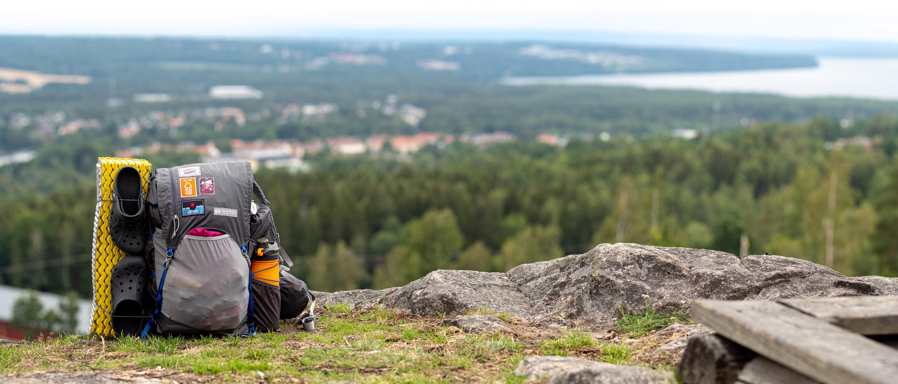{.-full}

## Utrustning

Det var även mitt första test av min utrustning för året. De tidigare vandringarna har varit utan övernattning så de flesta sakerna har lämnats hemma. Packningen hade en basvikt på {{ packstack.bankerydsleden_2022.base_weight | prettyDigits }}g och en totalvikt på 10,3kg med mat & vatten.



## Utsikt och kohagar

Leden utgår normalt motsols från Bankeryds hembygsgård, vi utgick istället från busshållplatsen Hovagärdet och gick leden medsols med en början mot Labbarpaberget och Labbarp. Upp mot Labbarp kom troligtvis det som var den mest intensiva klättringen på hela turen, ett bra sätt att få upp flåset och utsikten som sen kom var definitivt värt mödan.

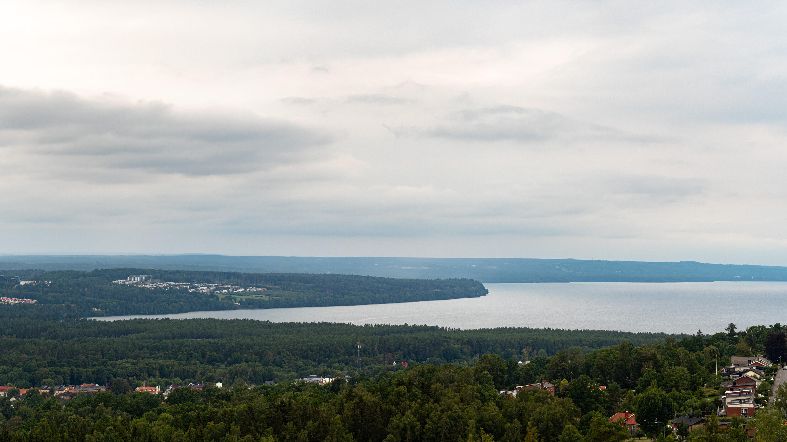{.-full}

Efter berget gick vi sen ner mot Labbarp där vi gick igenom en kohage full med kossor som hade bestämt sig för att stigen var bästa stället att sova på. När vi närmade sig reste de sig upp och följde oss nyfiket med blicken.

## Småvägar och åkermark

Leden fortsatte på småvägar (både asfalt och grus) ner i dalen mellan småhus och åkermark och sedan upp ur dalen igen mot riksväg 26/47.

{.-full}

För att komma förbi riksväg 26/47 gick vi genom en tunnel.

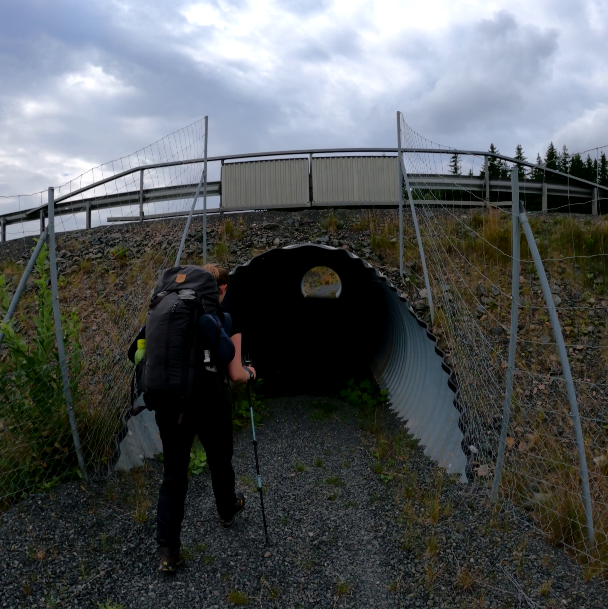

{.-full}

## Fika och regn

Efter att vi passerat vägen gick vi återigen bland åkermark men nu på jordbruksvägar och stigar, vi hade lämnat civilisationen bakom oss för en stund.

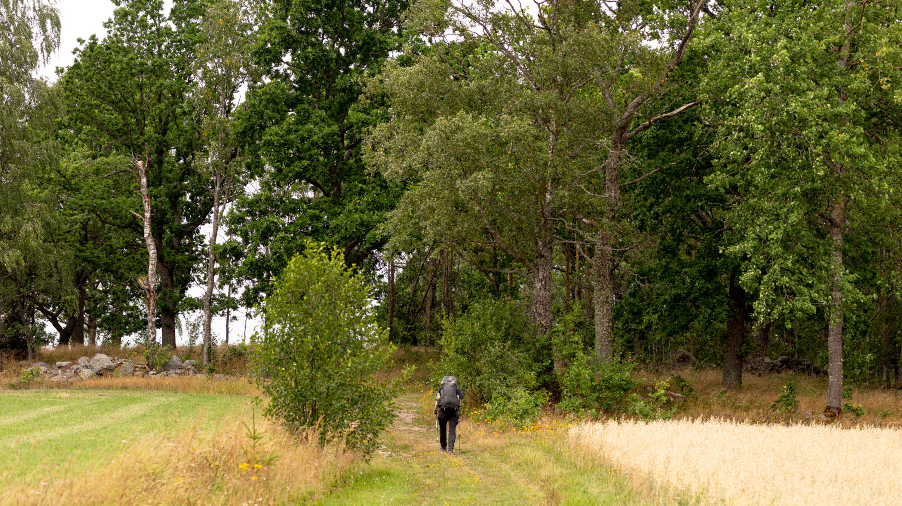{.-full}

Efter åkrarna kom vi in i ett litet skogsparti med det första vindskyddet (Svinhaga) där vi passade på att äta vår första fika (eller var det kanske lunch?). Vi hade nu gått ungefär 8km.

Jag har tyvärr ingen bra bild på fikan, men vi åt halvtinade pizzabullar som smakade gott, även om de kanske skulle tinat lite till.

{.-wide}

Sen kom regnet, så vi drog på oss regnskydd, regnkläder och gick vidare.

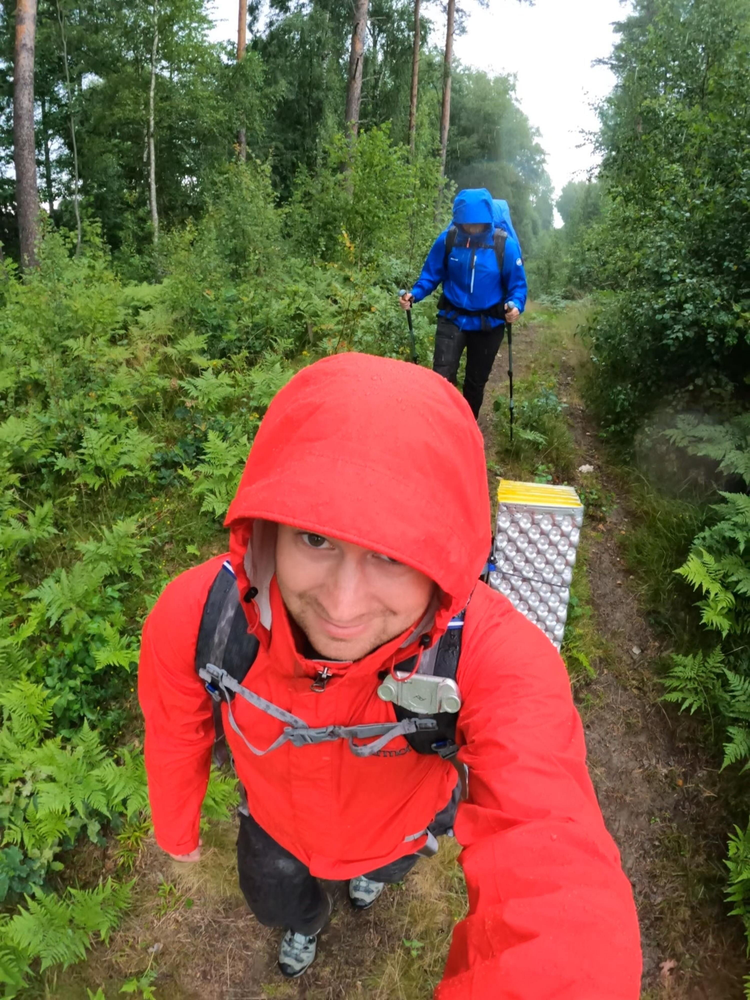

Regnet varade dock inte mer än en kvart ungefär så vi kunde snabbt ta av oss regnjackorna och gå vidare, nu inte i mulet väder utan strålande sol!

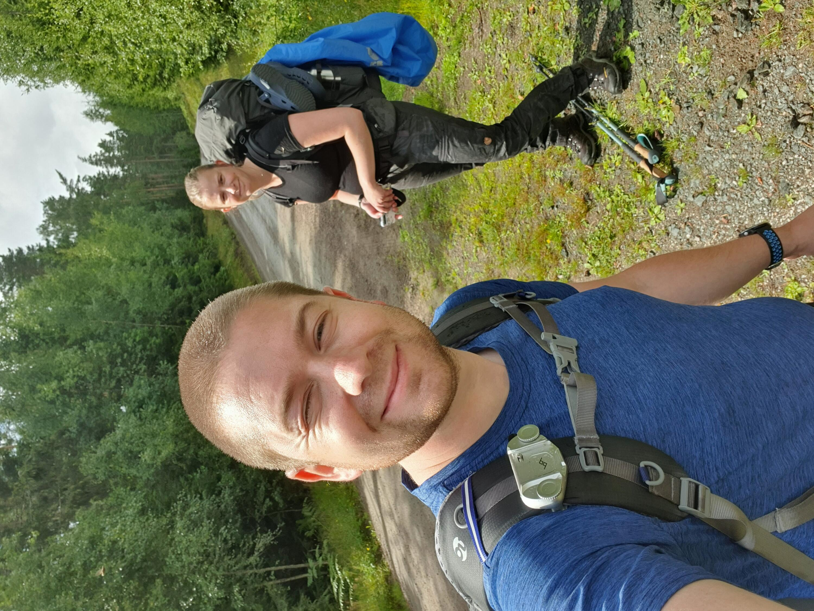

## Norrut mot Högamon

Vi gick på ganska tråkiga breda grusvägar norrut för att senare korsa väg 26/47, denna biten var inte så rolig att fotografera så jag har tyvärr inga bilder.

Innan vi gick under vägen såg vi att rastplatsen vid Risbro var bara ett stenkast från undergången med riktiga toaletter och gott om picknickplats. Vi passade på att stanna till här innan vi fortsatte vidare under vägen vidare norrut mot Högamon.

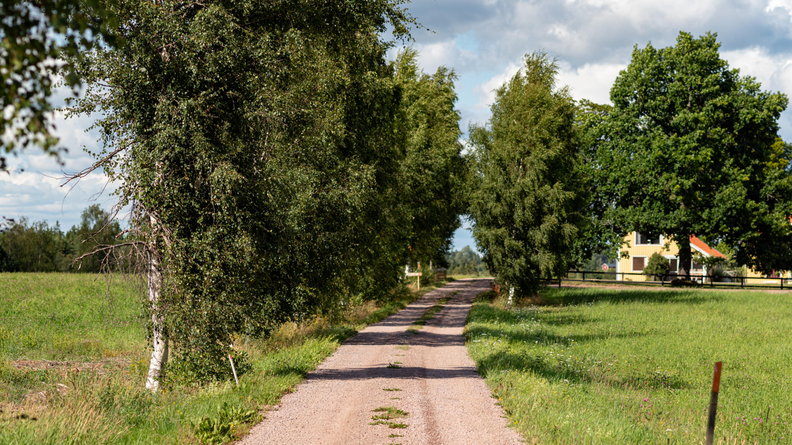{.-full}

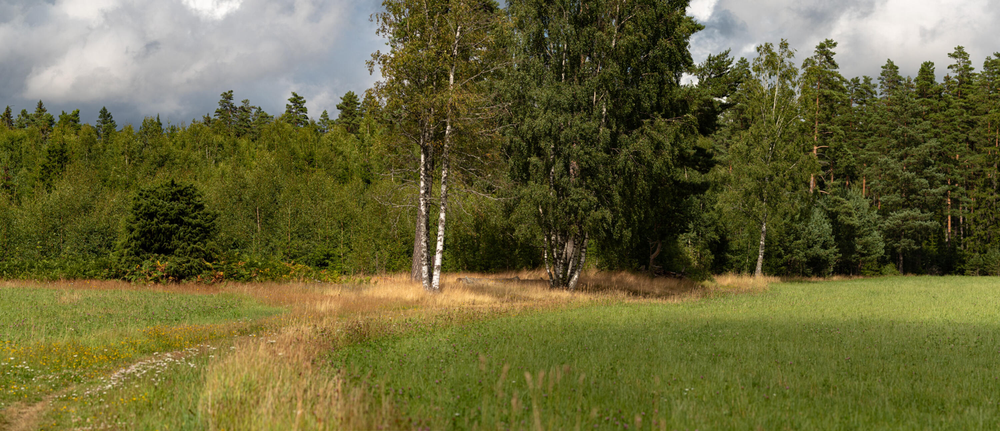{.-full}

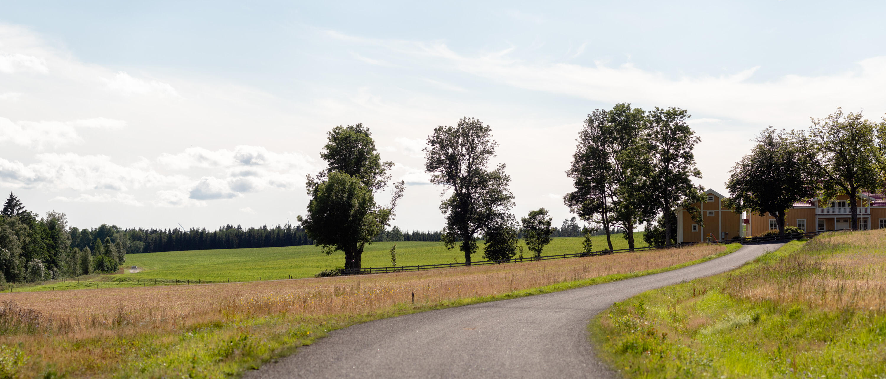{.-full}

## Högamon

Slutet av vår tur på första dagen gick genom skogsområdet Högamon som är ett sandigt område med mycket tallskog. Här stannade vi för dagen vid vindskyddet Kleinafallet där vi slog upp vårt tält.

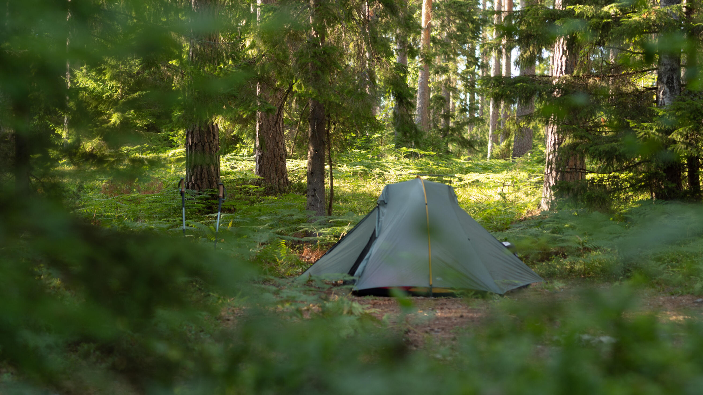

Några hundra meter sydost om vindskyddet finns en picknick- och grillplats vid Klerebodammen där vi bestämde oss för att äta vår frukost.

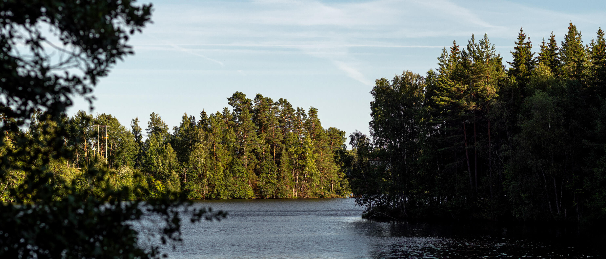{.-full}

Frukosten bestod av tunnbrödsrullar med mjukost, enkelt och gott!

:::: gallery
::: row
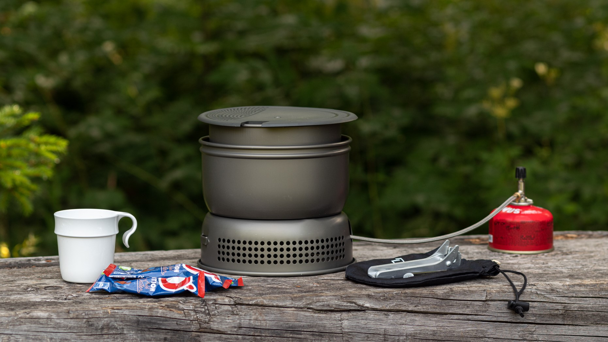{.-inline}
{.-inline}
:::
::::

## Mot Bankeryd

Eftersom Högamon var den högsta punkten på turen var det nu mestadels nedförsbacke, och vi hade bara drygt 6km av vandring kvar.

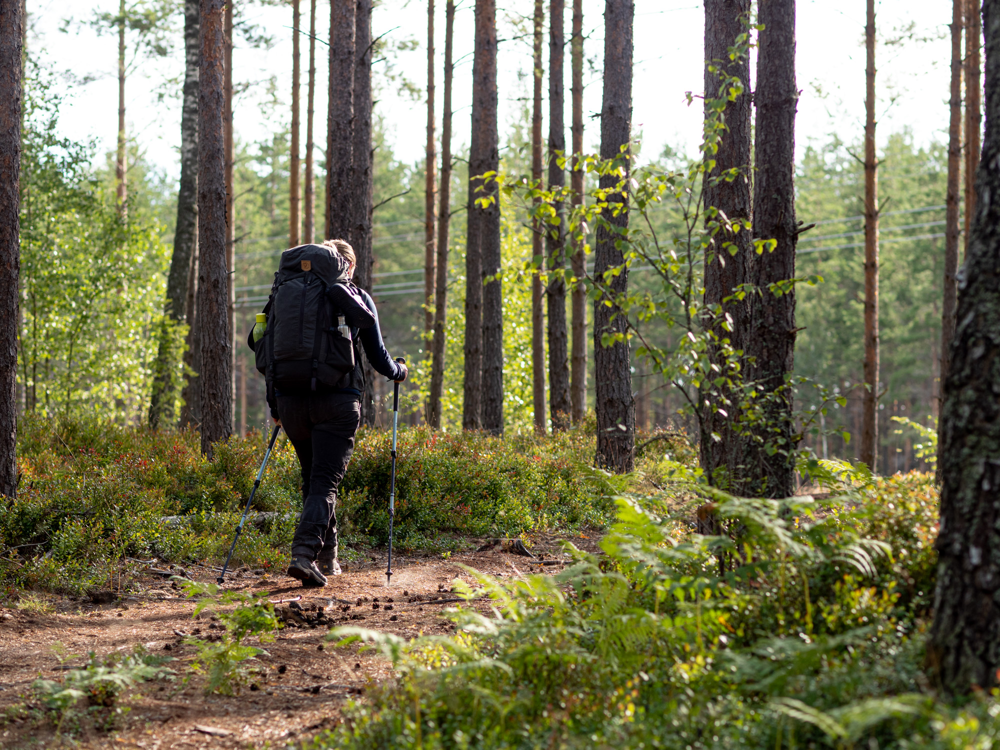{.-wide}

På de lättvandrade stigarna var vandringen lätt, vi gick i ett mycket högre tempo och kunde nu börja kolla på vilken buss vi skulle matcha.

Men först var det dags för en liten sidotur ner mot Domneån som fanns med på vissa dragningar av leden men inte andra (de fysiska ledmarkörerna gick ner mot Domneån, jag ska ta kontakt med berörda organisationer så att de kan korrigera kartorna).

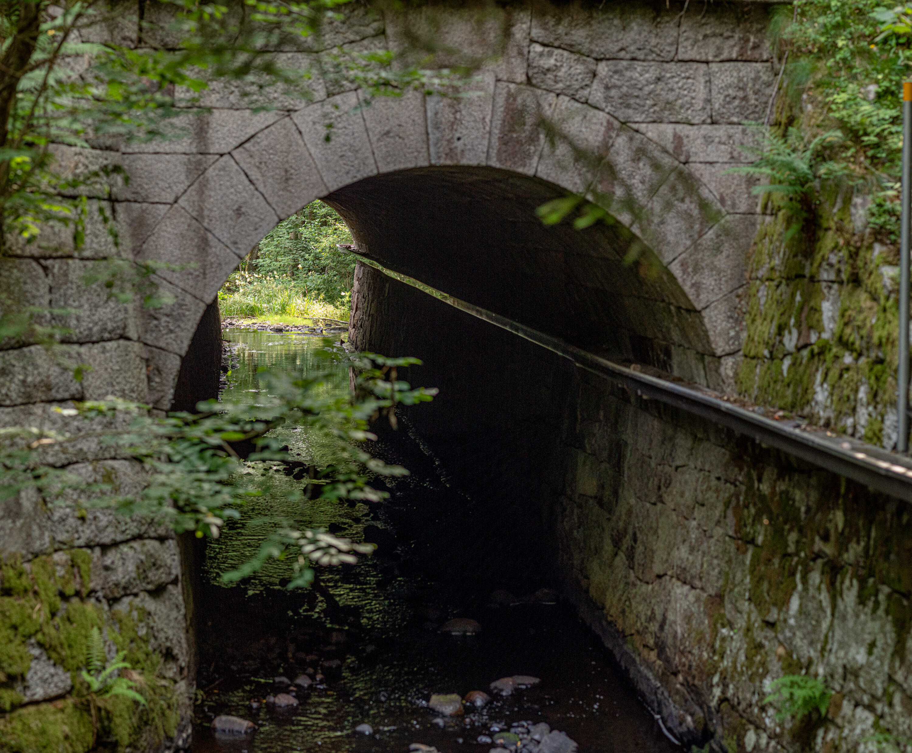{.-full}

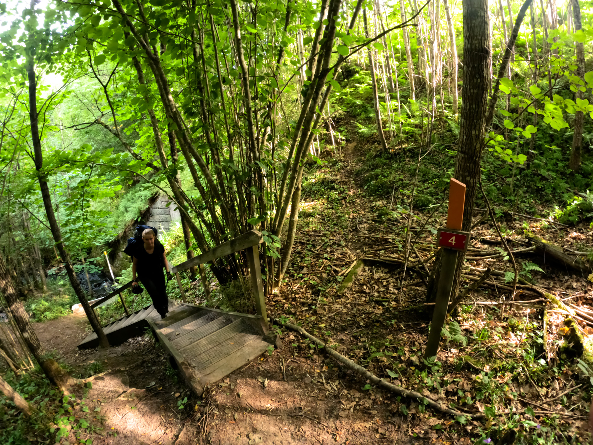{.-wide}

Efter sidoturen (som innebar ganska många extra höjdmeter) var det ganska rakt på. Vi gick på vägar och stigar som nästan aldrig vek av från kursen utan bytte bara skepnad.

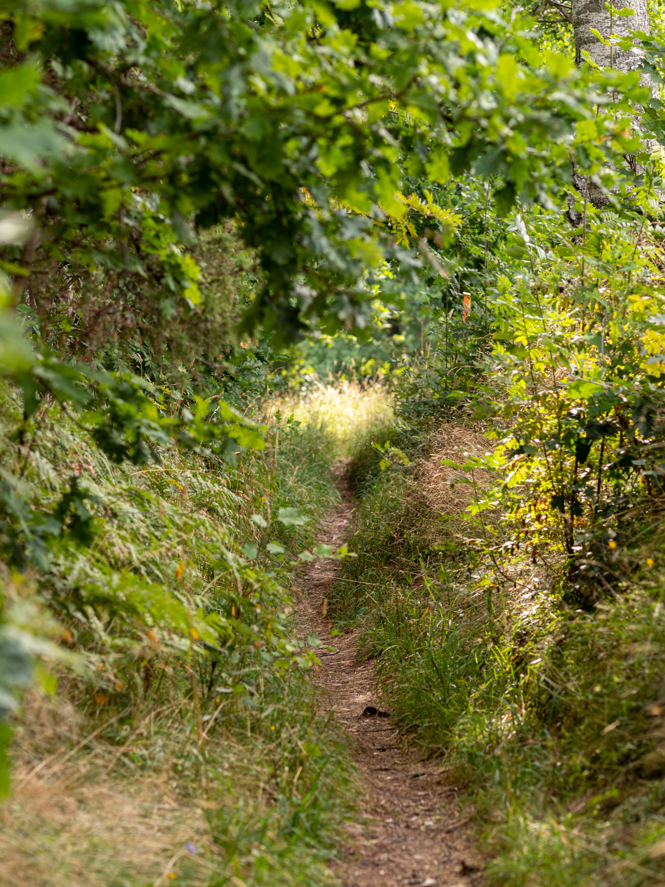

Kort och gott en perfekt tur för lite mer än en dags vandring med övernattning.

