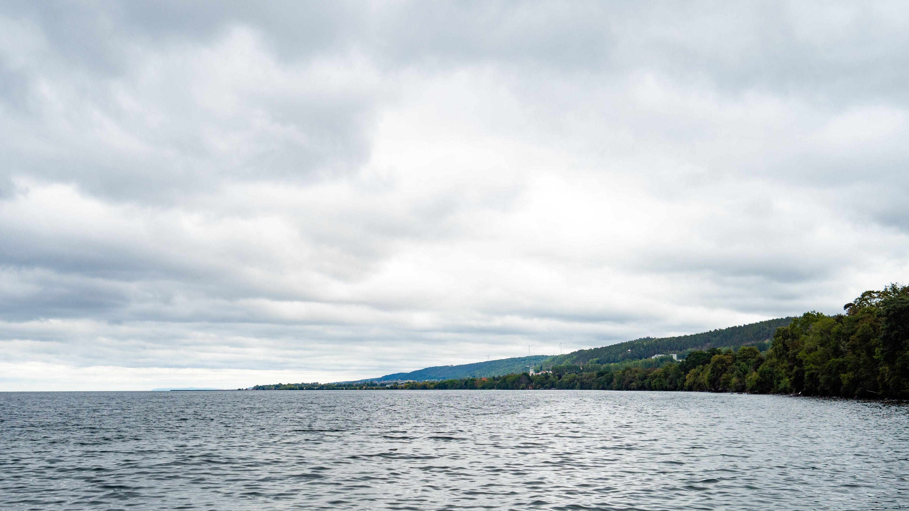

I lördags var det vandringens dag och vi tog en tur bort till Röttle och Västanåleden.{.lead}

Från parkeringen där vi ställde oss är det bara ett stenkast ner till "hamnen" i Röttle som egentligen mer är en pirarm än en hamn. Det var ett tag sedan sist jag varit där och det hade hänt en hel del. Det var flera fina nya picknickbord och delar av piren hade fått en gjuten betongplatta och det var vad som såg ut som en träbrygga på gång. Kul att det händer saker!

{.-wide}

Från piren gick vi sedan Röttleleden längs med Röttleån upp mot vattenfallet som visade sig i sin finaste prakt. Det muliga vädret förstärkte färgerna i grönskan.

{.-full}

Efter att vi kollat på vattenfallet en stund gick vi bort mot Västanåleden som vi sedan följde någon kilometer längs med kusten. Just denna biten vi gick är även en kort sträcka av John Bauerleden. 

Västanåleden är mestadels bokskog med fin utsikt mot Visingsö längs med kuststräckan.

:::: gallery {.-wide}
::: row
{.-inline}
{.-inline}
:::
::::

Egentligen är Västanåleden en stor rundslinga men vi kände inte riktigt för att gå hela leden så vi vek av upp mot en skogsväg som vi tog tillbaka.

Eftersom leden går längs med en väldigt hög brant som är raka stup på sina håll och att halva varvet går uppe på branten så finns det bara några få ställen som det går att vända på (förutsatt att man inte vill gå samma väg tillbaka eller inte vill avvika från leden)

Skogsvägen som går parallellt med leden var väldigt fin den också, det var fullt av gamla väldigt höga träd och det var en helt annan typ av skog. Att man gick precis nedanför branten var ganska häftigt med.

