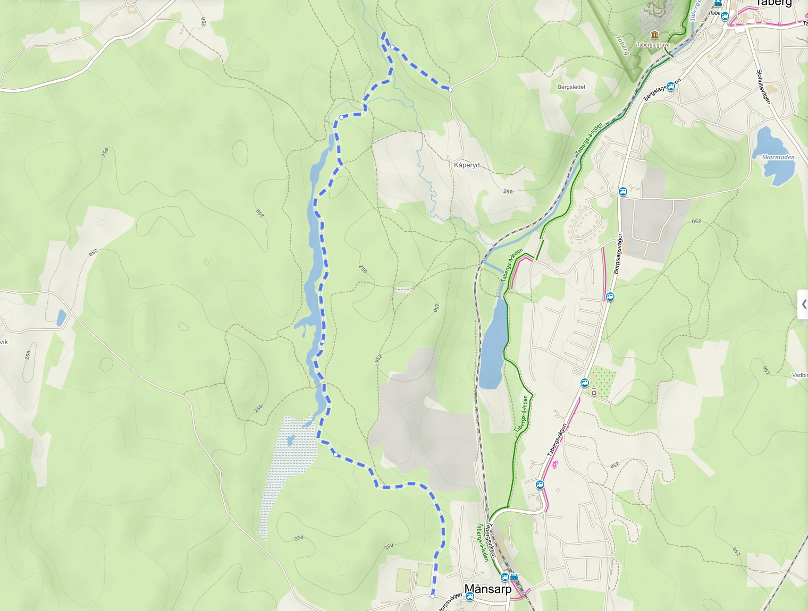
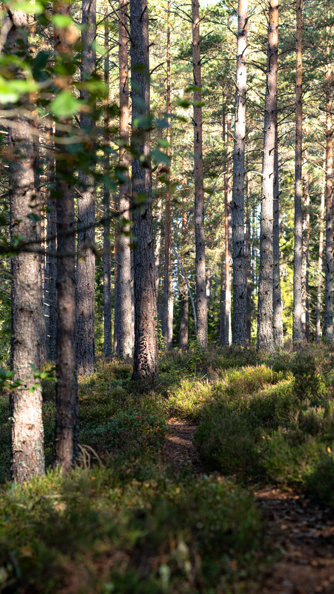
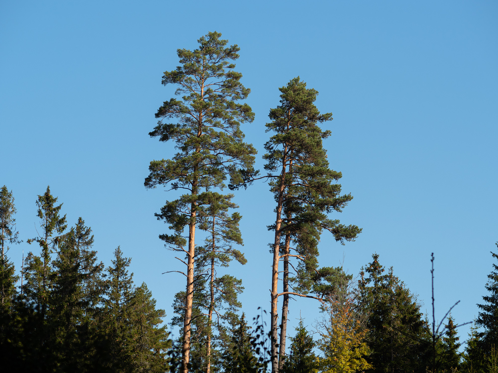
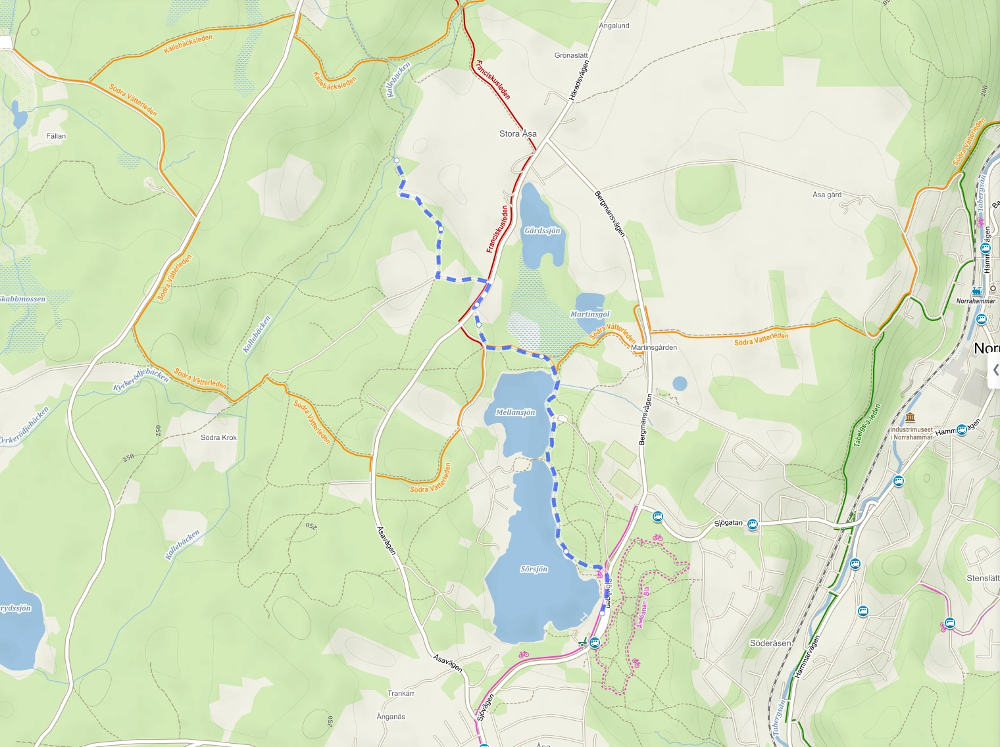
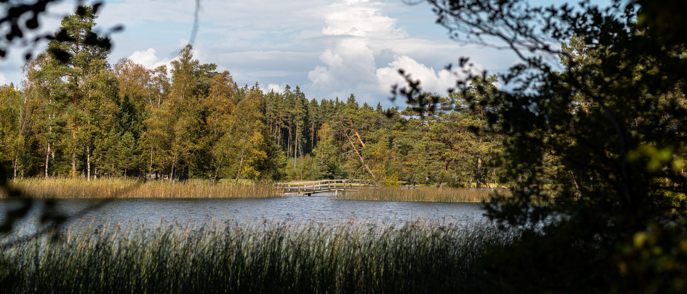
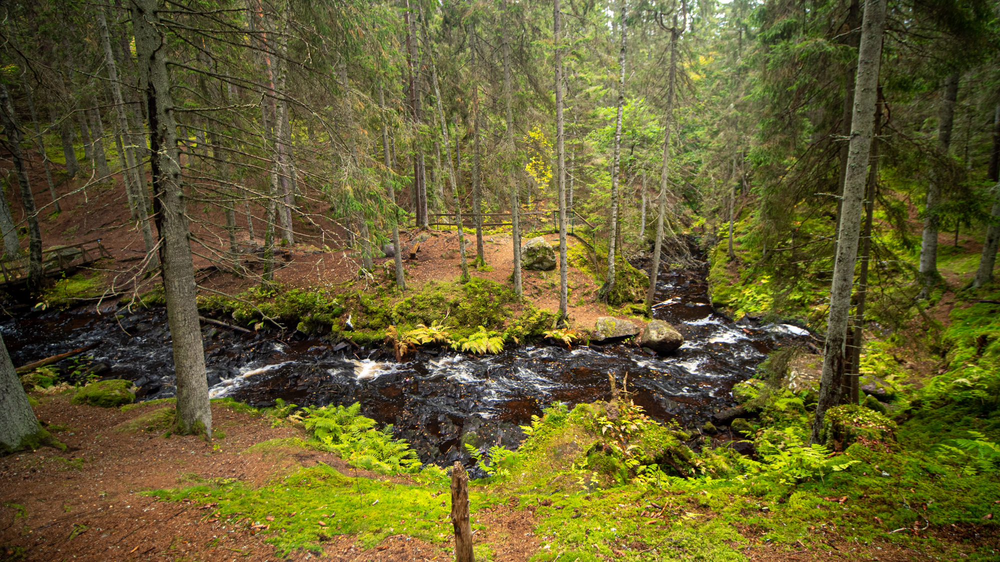

Det finns många fina vandringsleder runt Jönköping, men det finns också många fina platser värda att besöka som inte ligger vid en uppmärkt led. Igår gick jag en rutt som passerade så många sådana fina platser som möjligt, en vandring med vyer.{.lead}

Vandringen utgick från Månsarp, mer specifikt busshållplatsen Månsarp centrum (busslinje 27), därefter gick den norrut förbi bland annat Tabergstoppen, Sörsjön, Kallebäcken, Varkullen och Hassafall för att avslutas vid Hovslätts hembygdsgård och busshållplatsen Hovslättsrondellen (busslinje 28).

## Från Månsarp till Kåperyds dammar

{.-full}

Första biten gick på fina lättvandrade stigar i öppen tallskog.

Höstfärgerna har fläckvis börjat färga skogen gult och orange men det gröna dominerar fortfarande.

:::: gallery {.-wide}
::: row
{.-inline}
{.-inline}
:::
::::

På avstånd kunde jag se Tabergstoppen som jag lite senare skulle klättra över.

{.-wide}

Efter ungefär tre kilometer kom jag fram till Kortgölen och det vattendrag som slingrar sig norrut därifrån upp mot Kåperyds dammar.

{.-full}

Här gick stigen bara några meter från vattnet.

:::: gallery {.-wide}
::: row
{.-inline}
{.-inline}
:::
::: row
{.-inline}
:::
::::

Vid den norra änden av vattendraget finns Kåperyds dammar, en gammal ruin där det ska ha funnits en masugn där malm från Tabergsgruvan smälts.

{.-full}

## Tabergstoppen

{.-full}

Efter att ha sett Tabergstoppen från avstånd så var det nu dags bestigning. Från Kåperyds dammar började det sakta bli brantare och brantare ju närmre Tabergstoppen jag kom. En bit innan jag närmade mig den värsta klättringen öppnade landskapet upp sig med öppna fält.

:::: gallery {.-wide}
::: row
{.-inline}
{.-inline}
:::
::::

Uppe på toppen bjöd Tabergstoppen på en fantastisk utsikt hela vägen till Visingsö.

{.-full}

Att ta sig ned för berget gick betydligt mycket snabbare. Först nedför den gamla skidbacken och sedan genom ett bostadsområde och längs en GC-väg sista biten bort mot JOK-stugan och Sörsjön där det finns toaletter.

{.-wide}

## Sörsjön

{.-full}

{.-full}

Jag följde Sörsjöns kant norrut tills jag kom in på Södra Vätterleden som jag gick några hundra meter på, därefter följde jag Sörgårdens milspår bort förbi Bengans backe och bort mot Kallebäcksleden

## Kallebäcksleden

{.-full}

Kallebäcksleden är nog den tråkigaste sträckan på hela vandringen sedan de avverkade skog i området och breddade stigen från 1m till upp mot 10m.

Jag traskade på i fart med regnjackan på eftersom det börjat regna så smått.

:::: gallery
::: row {.-no-wrap}
{.-inline}
{.-inline}
:::
::::

## Varkullen & Hassafall

{.-full}

[Varkullen brukar bjuda på fina utsikter](/2016/06/19/hassafallsleden/), denna gången var det mest ett regnigt Jönköping.

{.-wide}

Regnet hade nu flyttat sig norrut över Jönköping, det droppade fortfarande lite från träden så jag behöll regnkläder och regnskydd på och gick vidare mot Hassafallet.

{.-full}

Kanske inte min bästa bild på fallet, men det var i alla fall fina färger av den fuktiga terrängen.

:::: gallery {.-wide}
::: row
{.-inline}
{.-inline}
:::
::::
