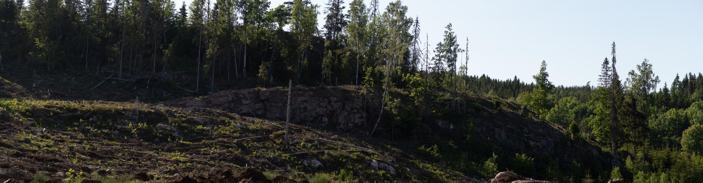
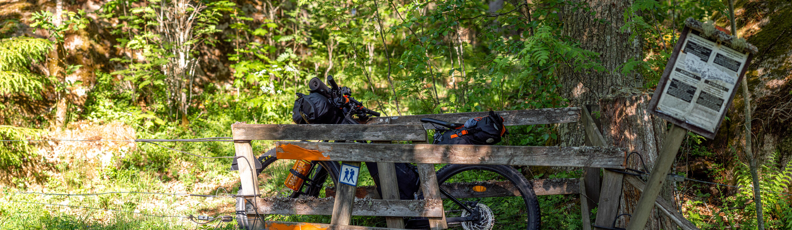
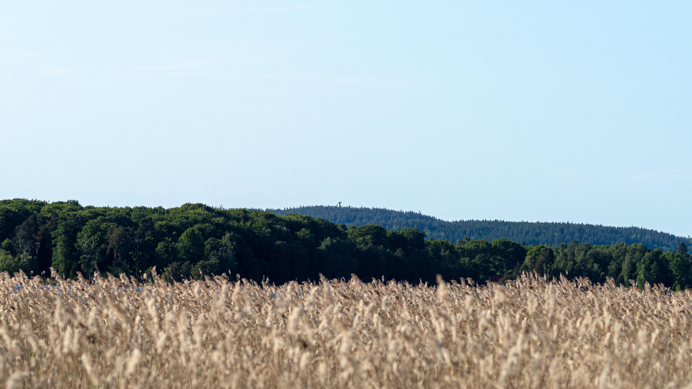
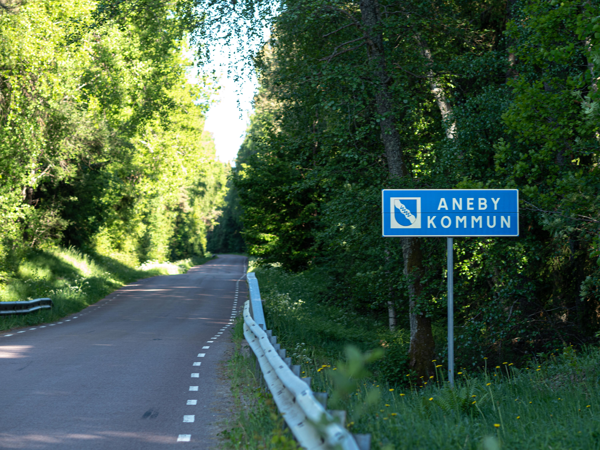
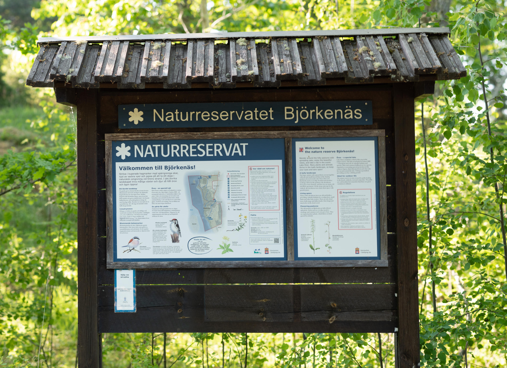
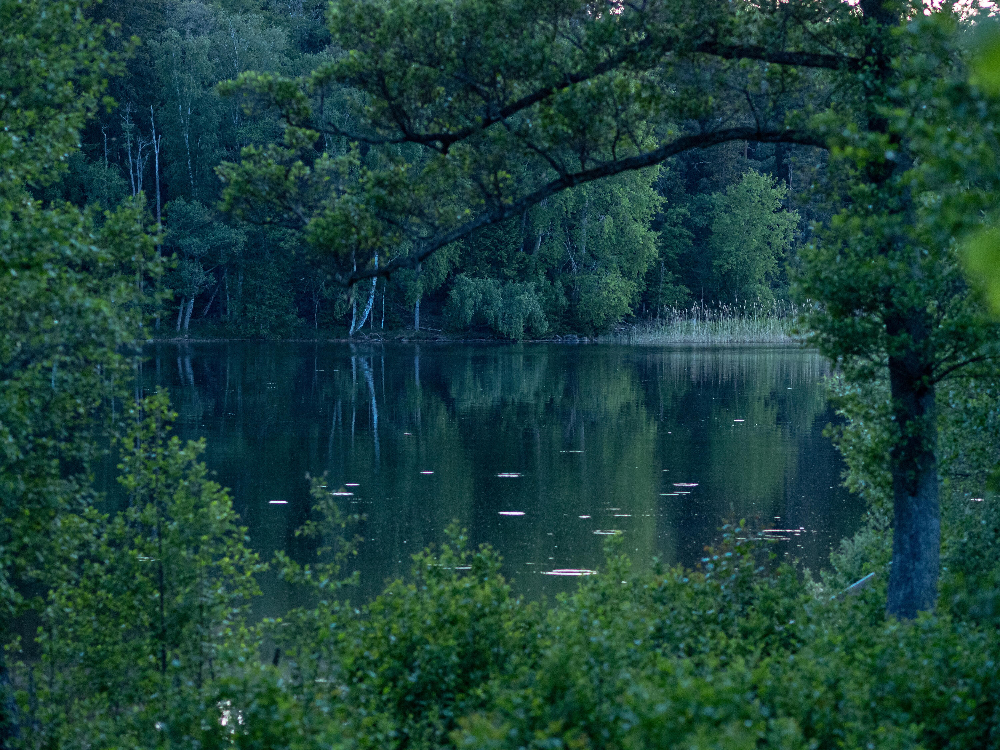
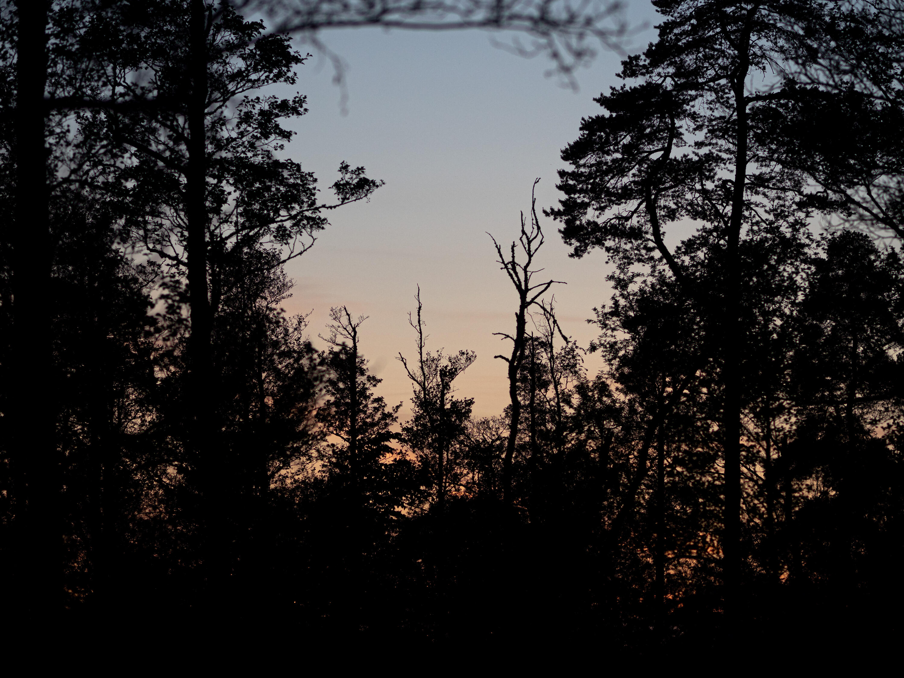
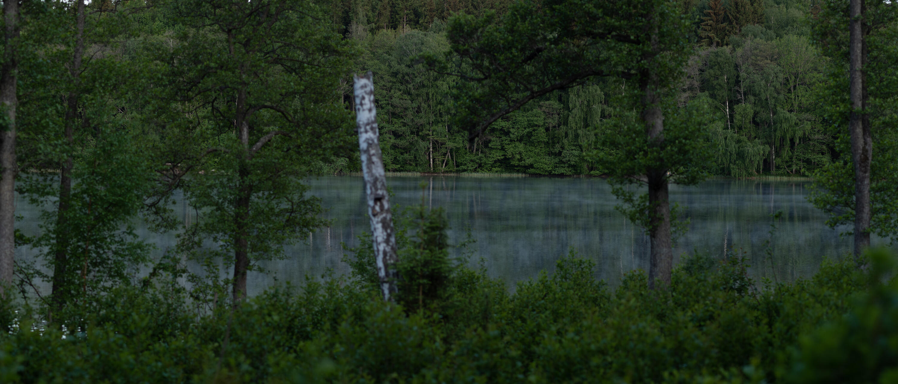
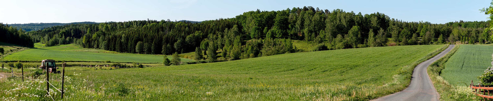
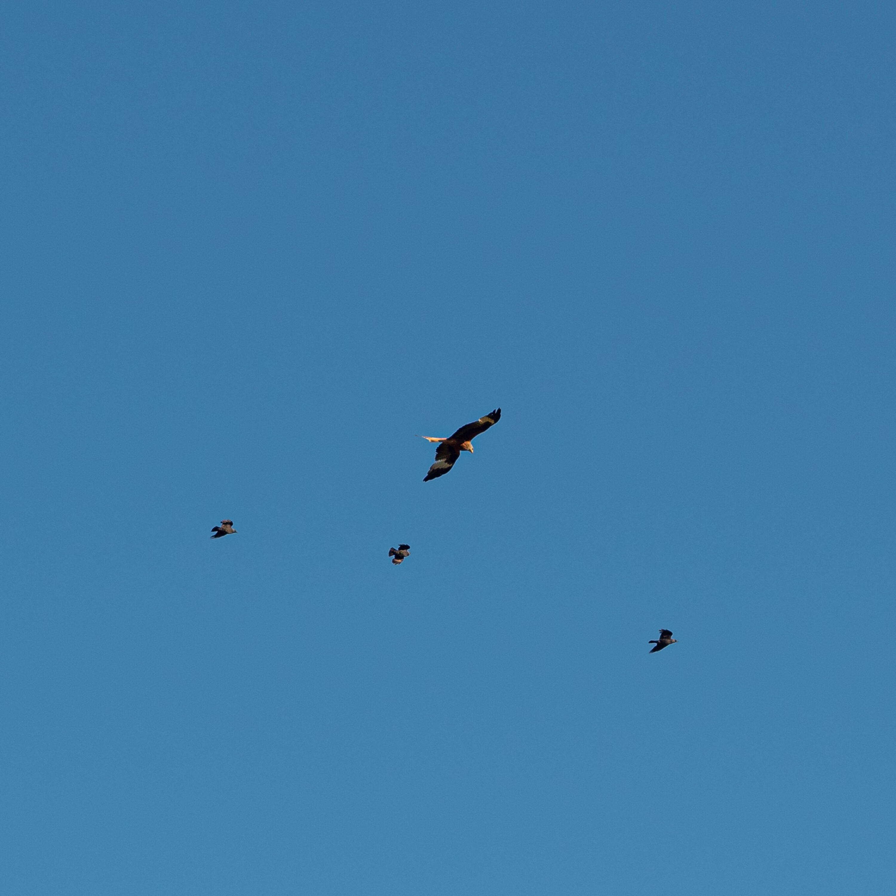

I helgen var det äntligen dags för min första bikepackingtur med cykeln. Det bar av till naturreservatet Björkenäs vid sjön Ören som ligger i grannkommunen Aneby, strax intill kommungränsen nära Bunn.

## Packlistan



Rutten gick till en början på grus- eller asfaltvägar via Huskvarna, Vista kulle och sen runt Landsjön. Därefter klättring upp mot John Bauerleden som jag skulle följa bort till Bunn. Sista biten var på vanliga landsvägar.

{.-full}

Jag började cykla mitt på eftermiddagen för att delvis slippa den värsta solen och för att komma fram någon gång efter 18.

{.-full}

Vägen förbi Vista kulle fick jag ha för mig själv, troligtvis på grund av alla varningsskyltar om att de sprängde berg (dock bara vardagar).

Därefter rundade jag Landsjön för att komma bort till Skärstad och sen börja klättringen upp till skogen.

{.-wide}

[Vi har tidigare gått John Bauerleden](/2020/07/16/vandring-pa-john-bauerleden-siringe-ikhp/) från samma utgångspunkt, men då gick vi söderut mot Huskvarna. Nu var det norrut mot Bunn.

Det var helt nya områden för mig och det visade sig att den mycket välskötta John Bauerleden kanske bara är något som går att applicera på den sydliga delen av John Bauerleden.

Det var mycket kalhyggen eller nya trädplantager som var extremt täta och svåra att forcera till fots, omöjliga på sadeln.

{.-full}

På flera ställen fick jag leda, knuffa och lyfta cykeln för att ta mig fram.

:::: gallery {.-wide}
::: row
{.-inline}
:::
::: row
{.-inline}
{.-inline}
:::
::::

När jag närmade mig Bunn släppte det dock, de smala stigarna blev skogsvägar som var lättcyklade, och sen övergick det helt i asfalterade landsvägar. Trots det tråkiga underlaget så vägde den fantastiska utsikten upp.

{.-wide}

{.-full}

:::: gallery {.-wide}
::: row {.-no-wrap}
{.-inline}
{.-inline}
:::
::::

Vid kommungränsen var det inte långt kvar. Framme i naturreservatet slog jag direkt upp tältet på första bästa plats för att lättare kunna ta fram packningen och göra ett snabbt ombyte.

Trots att jag nu var ganska hungrig så valde jag att ta ett dopp i sjön innan jag gjorde något annat. Det var väldigt långgrunt så jag gav upp med att hitta djupt vatten efter några meter och bara gjorde ett snabbt dopp.

Med lite mat i magen tog jag på mig lite myggskyddande kläder och gick iväg för att se om jag kunde fånga något på bild med kameran.

{.-full}

Efter solnedgången väcktes skogen och sjön till liv.

:::: gallery {.-wide}
::: row {.-no-wrap}
{.-inline}
{.-inline}
:::
::::

Under natten vaknade jag några gånger av djur som rörde sig nära tältet, när solen sen gick upp började ett stort antal kor mua högt en bit bort. Eftersom lägerplatsen jag slagit upp tältet i också är en hage blev jag lite nojig och steg upp.

{.-full}

Det visade sig att det var sjön som transporterade ljudet långa vägar, så det var aldrig någon risk. Eftersom jag redan var uppe tog jag kameran och gick en tur och dokumenterade morgonen istället.

{.-wide}

Hemfärden hade jag från början bestämt skulle gå på lite lättare vägar och efter gårdagens tuffa etapp var det inget tal om att ändra på den planen.

Strax innan sju rullade jag iväg från naturreservatet. Det är något speciellt att vara ute på morgonen innan världen har vaknat och allt är stilla.

{.-full}

Vid Bunn hade jag hunnit möta några som börjat dagen, vinden hade även börjat blåsa så smått.

{.-full}

Istället för att cykla leden tog jag vägen över Ölmstad och förbi Flättinge som bjöd på öppna jordbrukslandskap istället för trolsk Bauerskog. På cykel föredrar jag definitivt det öppna landskapet (fast det kanske är för att jag är skåning?).

{.-full}

Vid Fagerslätt var det en glada som bråkade med några kråkor, oklart om vad.

{.-wide}

{.-full}

Sista biten från Skärstad och förbi Kaxholmen gick snabbt eftersom det i princip bara gick nedför nu. Vid Gissebo fick jag en fin belöning av lite kyligare Vättervindar och en fin vy över Jönköping på andra sidan vattnet.

{.-full}
