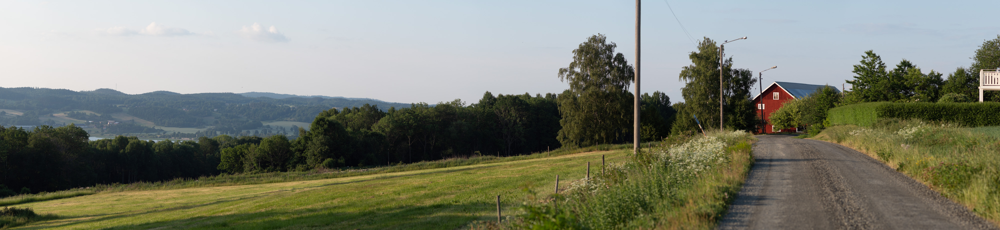
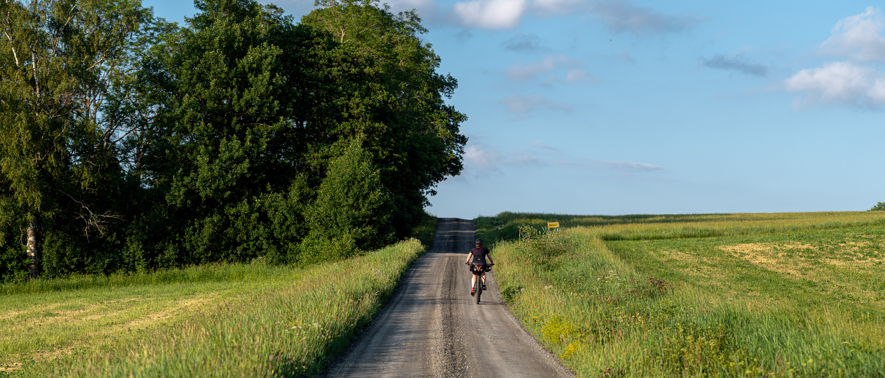

I måndags tyckte [Jossan](https://josefinenilsson.se) att det kunde vara kul att ta en kort bikepackingtur med hennes nya cykelväskor. Jag hade redan en tur jag spanat in sedan tidigare som passade perfekt för en kort övernattning.

Strax efter 18 rullade vi iväg frå Jönköping. Vi cyklade upp till Kaxholmen och sedan uppför de branta backarna till tältplatsen Fjällstorp som ligger på John Bauerleden. Hela vägen är på fina cykelvägar eller grusvägar och bortsett från de branta backarna så är det lättcyklat. Sträckan bjuder också på mycket fina vyer över Landsjön, Skärstadalen och Vättern.

Upp till Kaxholmen fick vi en fin uppvärmning med en jämn lutning på backen, därefter skulle vi klättra upp mot Måla kulle och då blev det riktigt brant.

Väl uppe fick vi en fantastisk utsikt ut över Landsjön och Vättern.

{.-full}

Sen var klättringen i princip klar, vi cyklade på grusvägar som gick längs med backen.

{.-full}

Helt utan backar var det dock inte, vägen gick upp och ner.

{.-full}

Framme vid Fjällstorp slog vi upp tältet på gräsmattan, [sedan sist vi var här](/2020/07/16/vandring-pa-john-bauerleden-siringe-ikhp/) har det rustats upp lite grann med en riktig fin övergång över staketet och lite bättre uppmärkning av leden.

{.-full}

Tidigt på morgonen därpå rullade vi hemåt, nu nästan enbart i nedförsbacke. Innan vi rullade ner till Kaxholmen stannade vi till och njöt av utsikten.

{.-full}

Vi var hemma igen innan klockan 9 på morgonen och möttes av två mycket kränkta katter som fått sova helt själva under natten.
