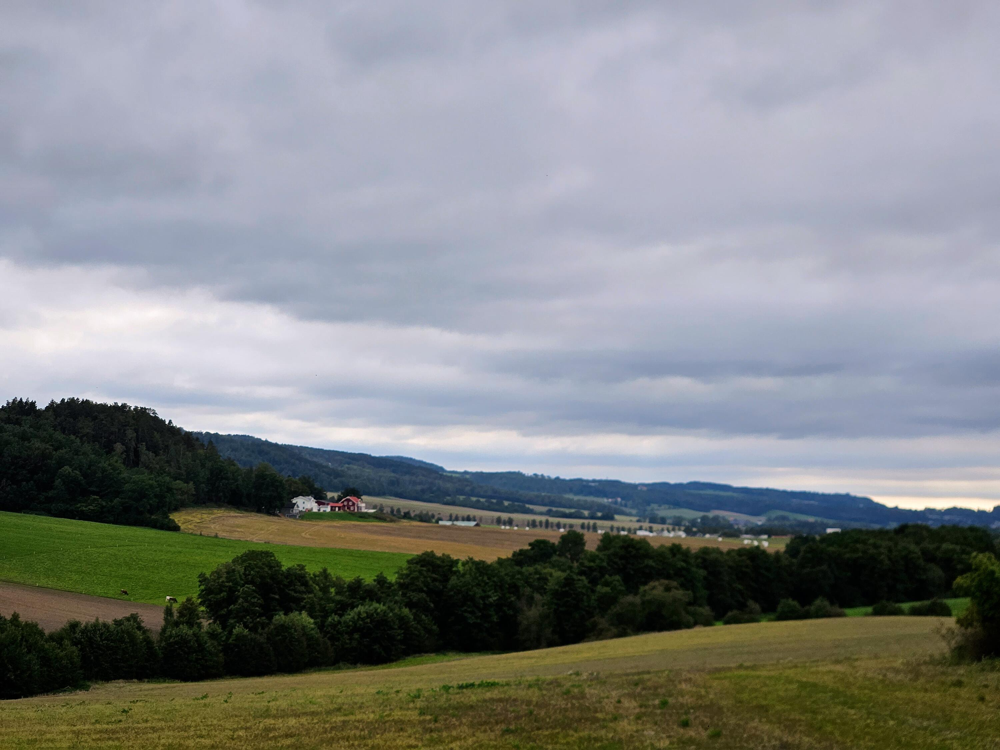
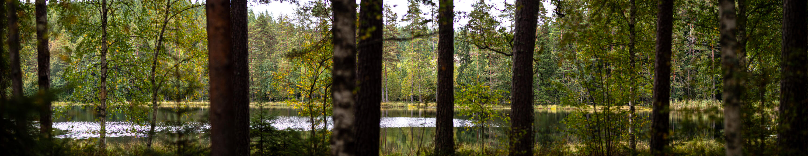
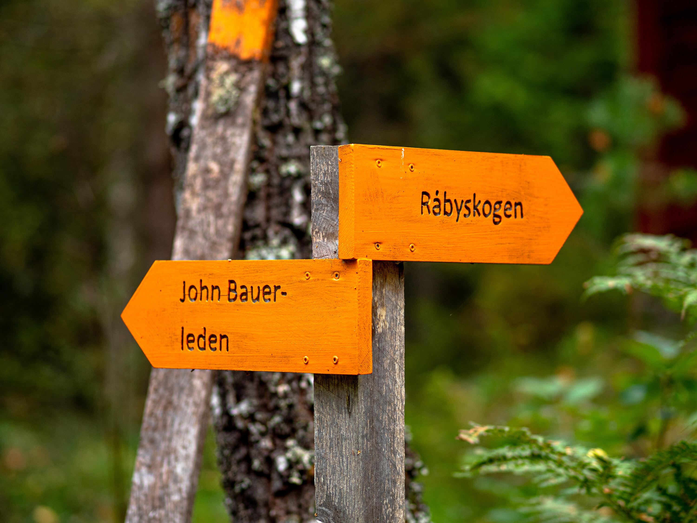
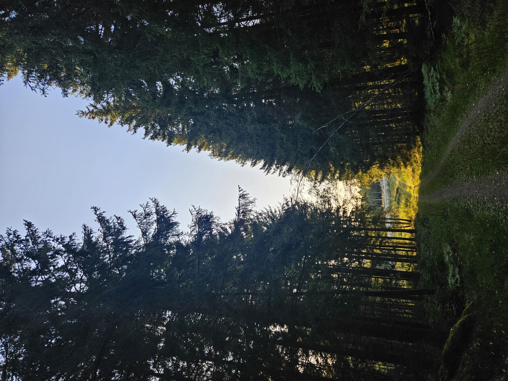
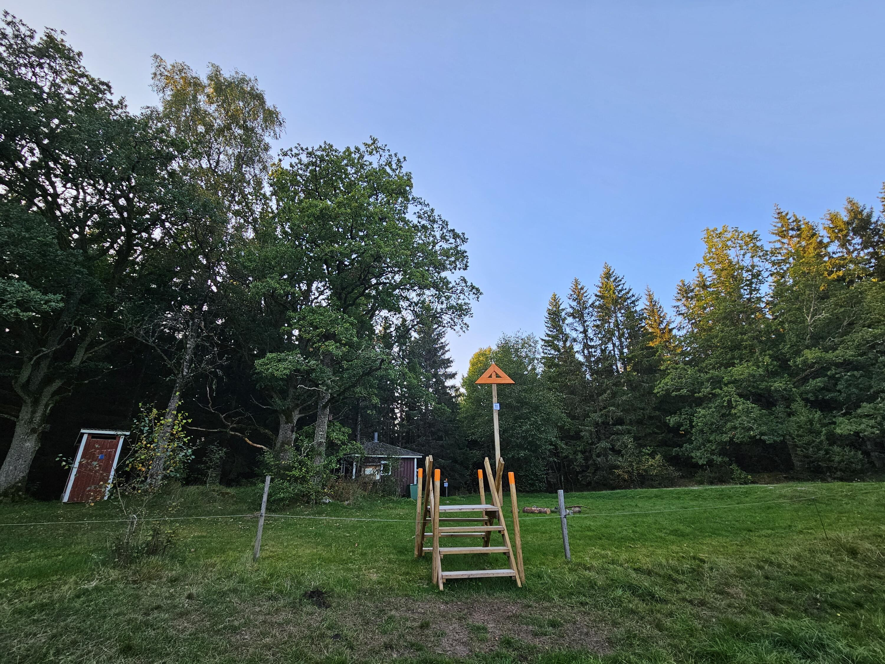
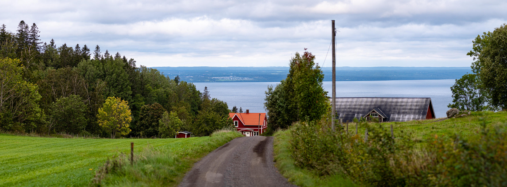
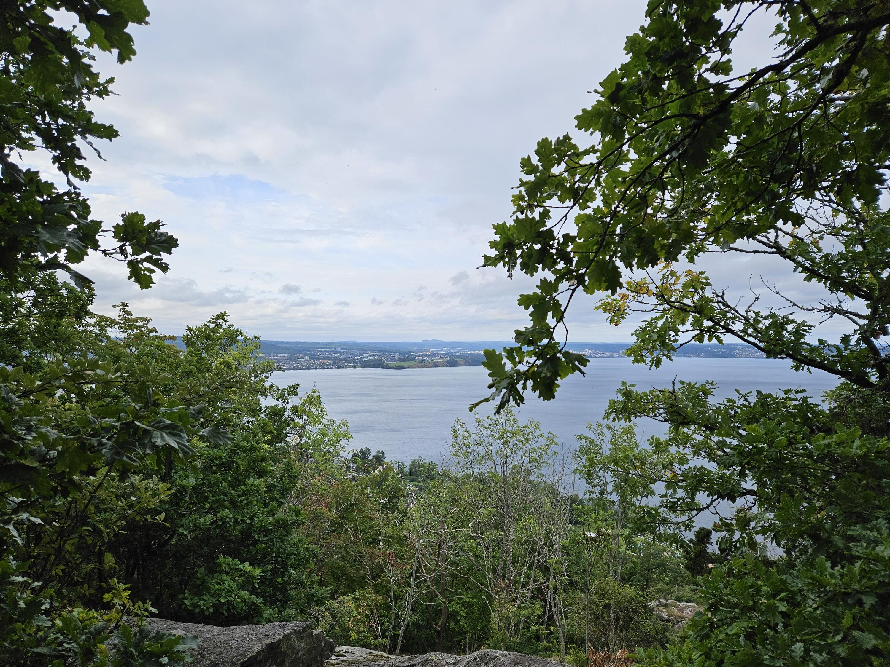

Jag började turen från busshållplatsen Kullen i Skärstad, därifrån gick jag mellan åkrarna upp mot skogen och John Bauerleden.

:::: gallery {.-wide}
::: row {.-no-wrap}
{.-inline}
{.-inline}
:::
::::

Istället för att gå hela vägen bort till Ramsjön och följa John Bauerleden den vägen ([som vi gjorde sist](/2020/07/16/vandring-pa-john-bauerleden-siringe-ikhp/)) så svängde jag av mot Råbyskogen för att se hur det ser ut där.

{.-full}

Råbyskogen är ett litet naturreservat med en rundslinga som bland annat används som lägerplats för diverse lokala scoutföreningar.

När jag går själv brukar jag hålla ganska hög fart, jag stannar mest när jag hittar något att fotografera, vilket jag inte gjorde på många kilometer förrän jag kom till Pukasjön.

{.-full}

Efter Pukasjön kom jag fram till den biten av John Bauerleden som är avstängd på grund av sprängningar vid det stora bygget av vindkraftverk. Det var ingen som jobbade en söndag men jag valde ändå att följa omledningen.

Omledningen var lika exemplariskt skyltad som resten av John Bauerleden, alltid kul att se saker som är välskötta!

Efter jag gått omledningen passerade jag de nybyggda grusvägarna för byggtrafiken för vindkraftverken och kom sedan till en hage.

:::: gallery {.-wide}
::: row {.-no-wrap}
{.-inline}
{.-inline}
:::
::::

På andra sidan hagen var dagens mål: tältplatsen Fjällstorp.

:::: gallery {.-wide}
::: row {.-no-wrap}
{.-inline}
{.-inline}
:::
::::

Dagen därpå tog jag den (nästan) obligatoriska omvägen förbi utsikten vid Måla kulle.

{.-full}

Andra dagen var en måndag som jag tagit ut en semesterdag på. Jossan jobbade så jag ville hem till katterna så fort som möjligt och vandrade på i hög fart mot Brunstorpsberget.

{.-full}

{.-inline}

Vid Brunstorpsberget beundrade jag utsikten en liten stund och gick sedan ned längs Brunstorpsleden och tog bussen hem från busshållplatsen vid Brunstorp.

{.-wide}
