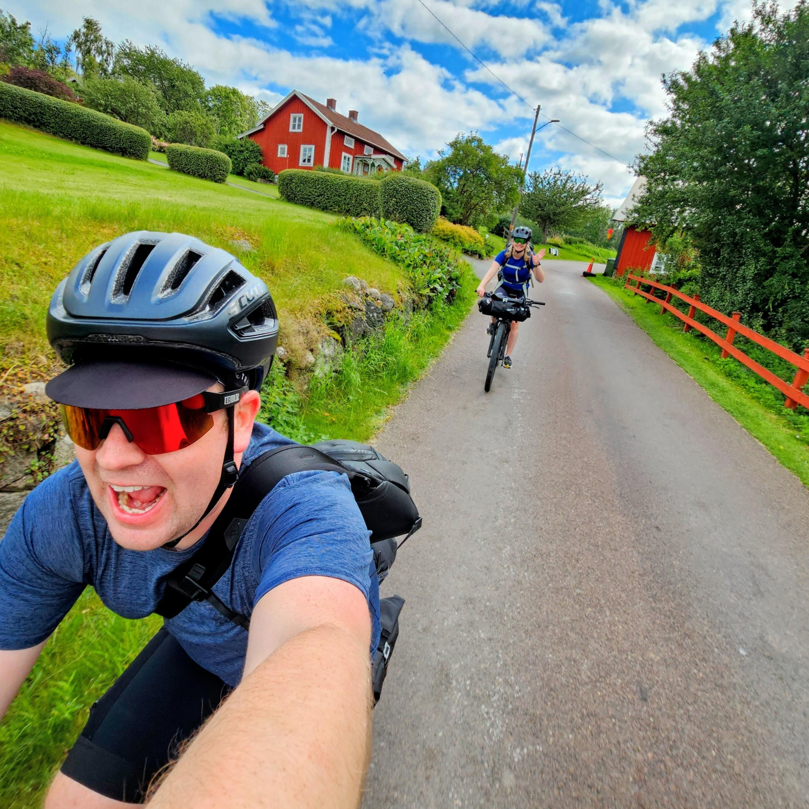
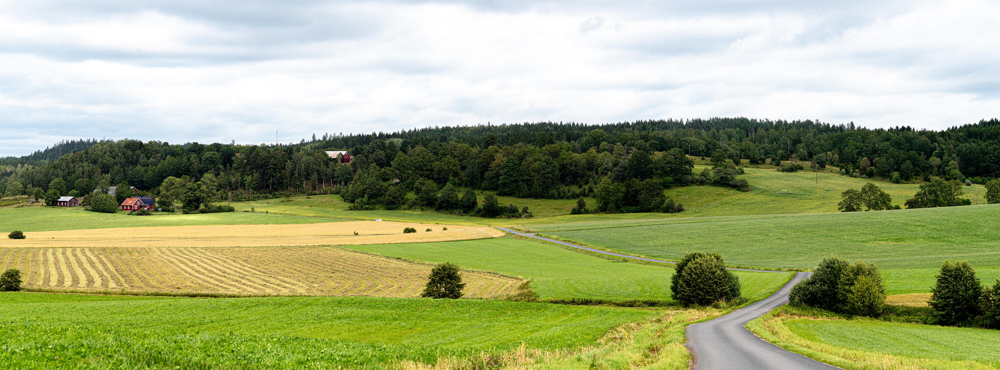
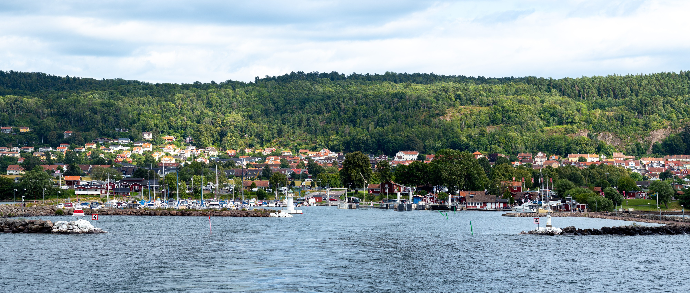
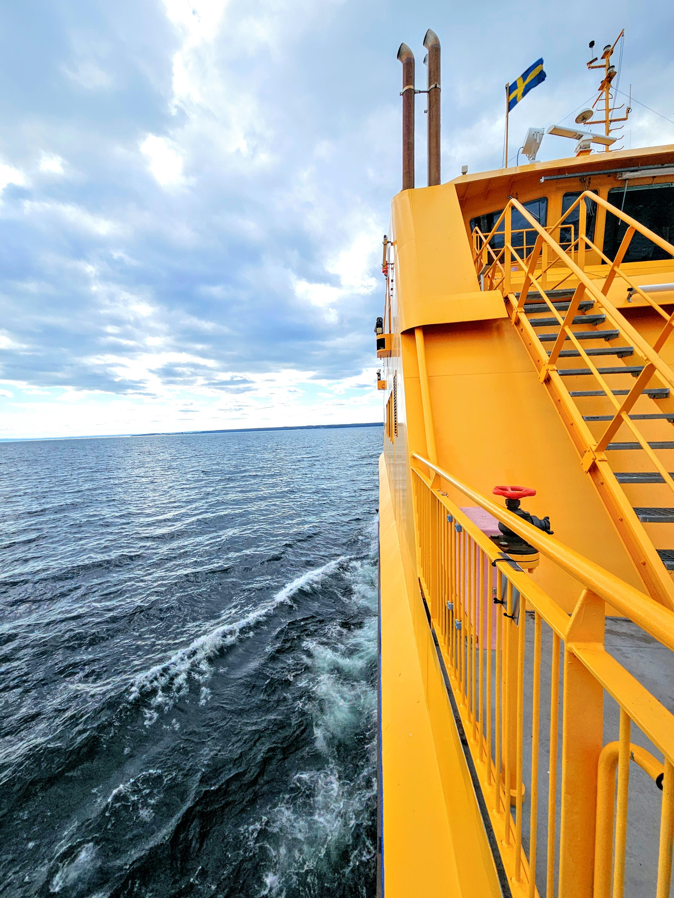
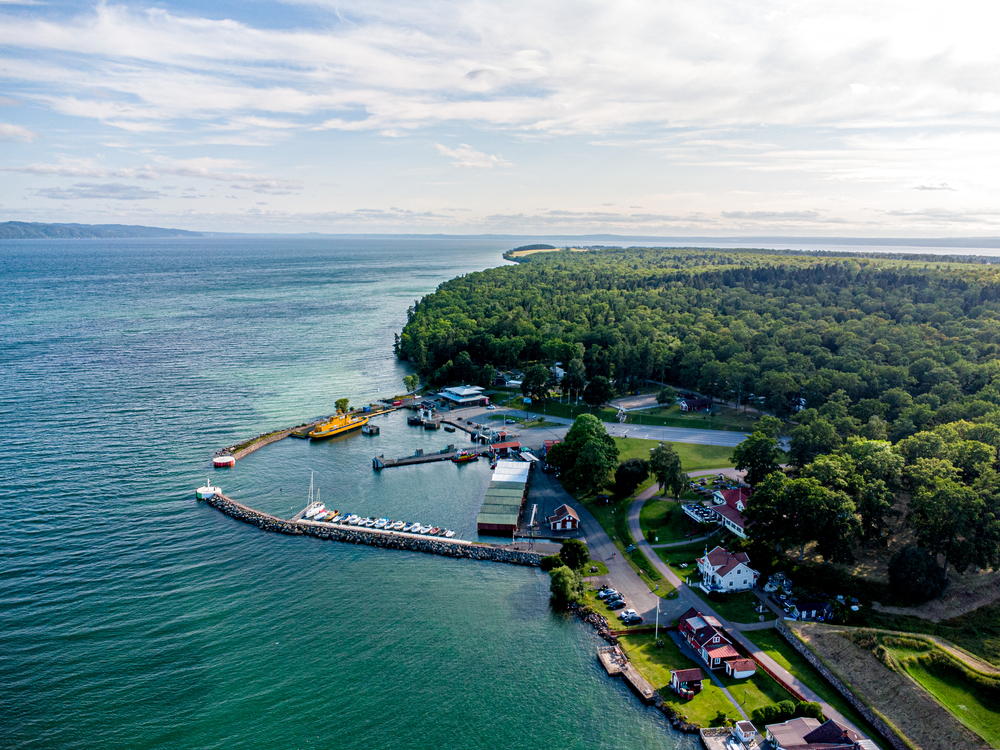

I veckan kom vi äntligen iväg på en tur som vi pratat om ett tag, en cykeltur till Visingsö, på Visingsö, och hem från Visingsö. Ursprungligen planerade vi att resan skulle vara över tre dagar med två nätter på ön men andra planer gjorde att vi tryckte ihop det till två dagar.{.lead}

## Turen till Visingsö

På första dagen (i torsdags) var det enda målet att ta oss fram till Visingsö samt att hinna dit innan restaurangerna stängde på kvällen. [Vi valde att inte ha med oss så mycket egen mat eller matlagningsgrejer](#utrustningen) utan att köpa all mat på vägen.

:::: gallery {.-wide}
::: row
{.-inline}
{.-inline}
:::
::: row
{.-inline}
{.-inline}
:::
::::

Vädret på första dagen var optimalt, det blåste kraftigt i precis rätt riktning som gjorde att vi i princip cyklade i vad som kändes som vindstilla eftersom vi rörde oss i vindens hastighet.

{.-full}

Trakterna längs gamla Riksettan (Grännavägen) är fantastiska mellan Jönköping och Gränna. Landskapet skiftar mellan öppna åkrar, djupa skogar, mysiga hagar och är fullt av gamla fina hus. Att det inte är särskilt mycket trafik gör det till en fantastisk upplevelse från cykelsadeln.

Framme i Gränna efter ungefär 45km var cyklingen för dagen över och endast en båttur återstod till vår destination. Båten går en gång i halvtimmen ungefär och är så smidig som den kan bli.

{.-full}

Kollektivtrafik 💚

:::: gallery {.-wide}
::: row
{.-inline}
{.-inline}
:::
::::

Framme i Gränna tog vi oss upp till [ställplatsen](https://talt.visingsostallplats.se/) där vi slog upp vårt tält intill ekskogen. Vi valde ställplatsen över andra, gratis tältplatser som den som ligger norr om hamnen för att vi ville få tillgång till dusch och toaletter. (Att få duscha på kvällen är svårslaget efter en dag på cykeln)

{.-full}

{.-full}

## Visingsö runt

Andra dagen började vi med att äta frukost på restaurang Framnäs uppe i byn. Med magarna fulla var vi redo att ta oss an dagen. Vi började med att möta upp två kompisar som kom in med morgonfärjan med sina cyklar.

Cykelturen började söderut genom ekskogen ner mot [Näs slottsruin](https://sv.wikipedia.org/wiki/N%C3%A4s_slott). Precis som första dagen var det soligt och fint, nu med lite mindre vind.

Därifrån cyklade vi sedan norrut. På vägen stannade vi och åt glass (jag åt en vaniljglass och Josefine åt en med polkasmak). Innan vi cyklade söderut mot hamnen tog vi även ett dopp på Strandudden, det var friskt (vi var i princip de enda som gick i vattnet). Jag gissar på att det var kanske 16–18°C.

{.-full}

Framme i hamnen igen efter ungefär 6–7 timmars cykling var det dags att börja tänka på att ta oss hem till Jönköping igen. Vi hade inte längre kattpassning och var tvungna att komma hem samma kväll.

Men innan vi började cykla tog vi ett mål mat på [Pir Kro i Gränna hamn](https://www.pirkro.se/) och fyllde på energierna.

## Cykelturen hem

Även om både Gränna och Jönköping ligger på samma höjd och man cyklar exakt samma sträcka mellan städerna så skiljer sig de två olika riktningarna åt väldigt mycket på cykel.

Norrut mot Gränna är det (på sträckan som vi tog) tre branta backar med en lång nedförsbacke på slutet där man får tillbaka alla höjdmeter på en gång. Söderut mot Jönköping är det istället en väldigt lång backe på slutet och de branta backarna (nu nedför) märks knappt. Det gör att det borde kännas betydligt lättare att cykla hemåt.

{.-full}

Med nu ungefär 80km i benen så kan jag inte påstå att det var så det upplevdes. Trots det tog vi oss hem en halvtimme snabbare än det tog att cykla till Gränna.

## Utrustningen{id=utrustningen}



{.-full}
