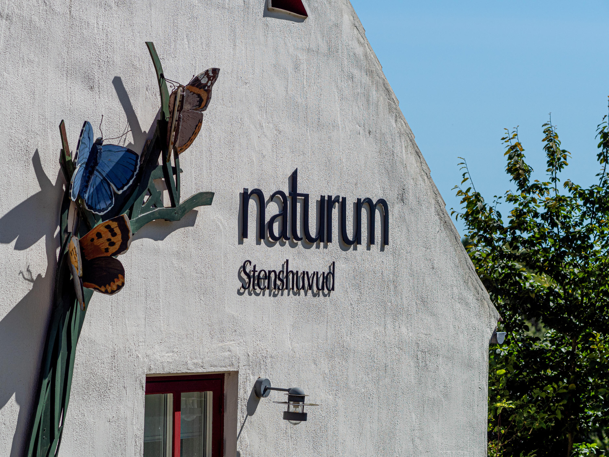
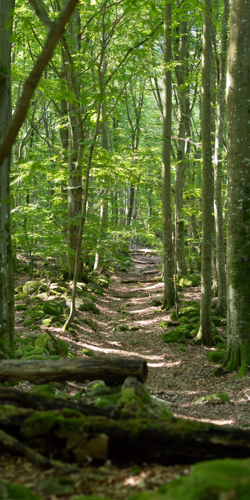
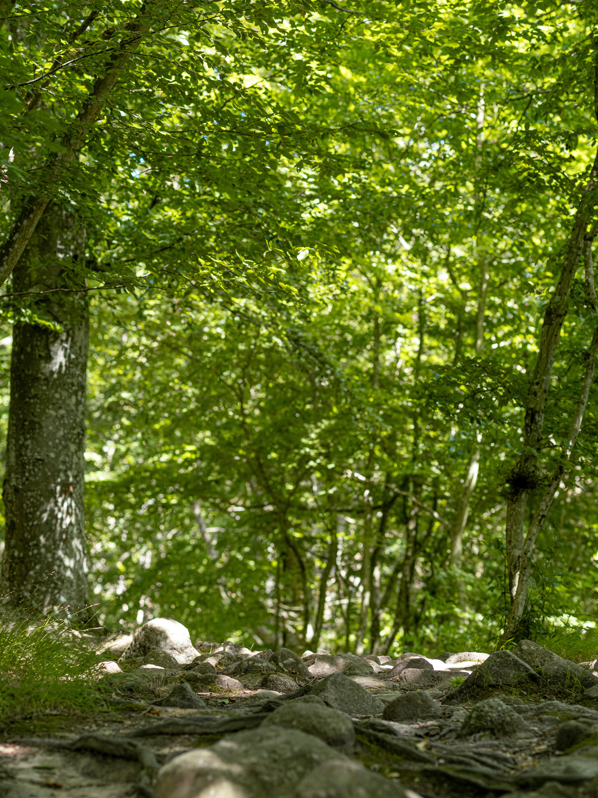
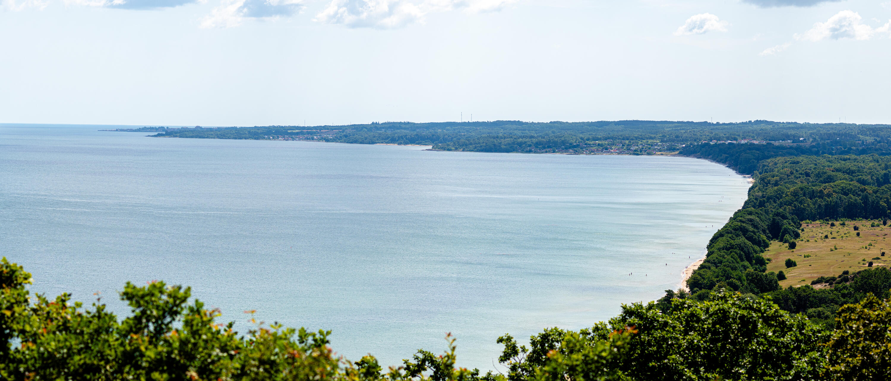

I måndags var vi och vandrade i Stenshuvud nationalpark på Österlen.{.lead}

Det finns flera bra parkeringar att utfå ifrån när man ska vandra i nationalparken (se kartan längre fram i inlägget), en till norr vid Kiviks musteri, en i söder intill Rörums sommarby och en i mitten där Naturum finns. Vi valde den vid Naturum.

Stenshuvud är inte en av våra största nationalparker (enbart 400 hektar) och det tar inte särskilt lång tid att gå runt så den lämpar sig perfekt för en dagstur. Själva berget är inte särskilt högt men formen och branten gör ändå det till ett häftigt landmärke. [Det ska ha använts som ett sjömärke i hundratal år](https://sv.wikipedia.org/wiki/Stenshuvud), troligtvis eftersom det är väldigt synligt från sjön. Från land syns det knappt eftersom man kommer från Linderödsåsen som är högre (och som Stenshuvud är avslutningen för).

De större lederna i parken är som en åtta där en slinga (Kortelsslingan, i lila på kartan) går upp på höjden Kortelshuvud och en slinga som går runt Stenshuvud upp till Hälleviken (Hälleviksslingan, i ljusblått på kartan).

Sedan finns några mindre leder, mest nämnvärd där är självklart Stenshuvudslingan som går upp på berget från Naturum (märkt i rött på kartan) samt Skåneledens etapp 5 som går genom parken (i streckad orange linje på kartan).

Vi valde att gå den södra leden upp på Kortelshuvud först för att sedan gå norrut. Den mesta av skogen i Stenshuvud nationalpark består av öppen bokskog (min favorit 💚).

Från Kortelshuvud syns den mäktiga höjden på Stenshuvud mot Hanöbukten.

{.-full}

Mellan Kortelshuvud och Stenshuvud är det en hel del öppna ängar som bryter bokskogen. Här bestämde vi oss snabbt för att vi var tvungna att ta ett bad senare på dagen eftersom det blivit väldigt varmt i solen.

{.-wide}

Stora delar av Stenshuvud är väldigt stenigt och det är viktigt att kolla var man sätter fötterna så man inte trampar snett.

{.-wide}

Promenaden upp på berget gick långsamt, vi hade inte bråttom så vi lät det ta tid för att spara energi och inte bli allt för varma (sen är det knappt fler höjdmeter än en vanlig promenad upp till Stadsparken är i Jönköping).

Uppe på höjden belönas vi sedan av inte mindre än tre olika utsiktsplatser som vätter i tre olika riktningar. Södra och norra toppen hade bäst vyer (enligt mig).

{.-full}

{.-full}

Efter toppen följde vi sedan Skåneleden en bit nedför trapporna för att sedan gå Hälleviksslingan förbi Kiviks musteri för lite fika.

Badplatsen var lägligt nog placerad vid slutet av Hälleviksslingan nära Naturum. Vi avslutade dagen med ett svalkande dopp. 🏖️