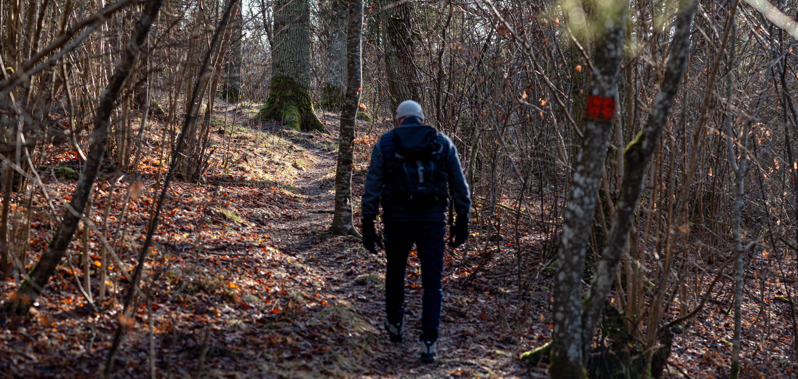
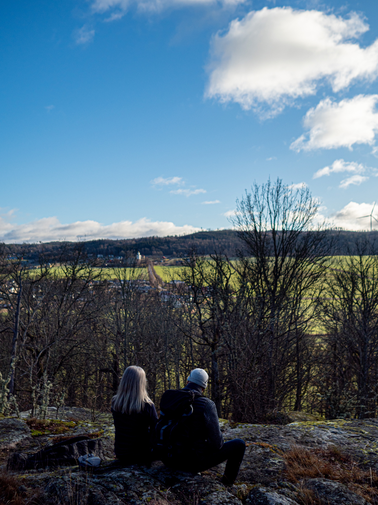

Förra helgen var vi och gick en promenad i det fantastiska vädret i [Slottsbergets naturreservat](https://www.lansstyrelsen.se/jonkoping/besoksmal/naturreservat/slottsberget.html), eller Lyckås ekskog, som det också heter.

Det är ett litet naturreservat i Skärstad nordost om Jönköping som inte är särskilt välbesökt. Många av stigarna blir nästan helt övervuxna på sommaren.

{.-full}

Hela slingen är bara strax över 2km i längd, men bitvis är den teknisk med förrädiskt underlag med många stenar, ojämn mark, och vid detta besöket var även den norra bron (som bara är en liten spång) bortspolad. På grund av det fick vi passera bäcken genom att hoppa över stenarna.

:::: gallery {.-wide}
::: row
{.-inline}
{.-inline}
:::
::::

Trots den korta slingan bjuds det på väldigt fina vyer. Vi passerade tre fina utsikter, en som är allra längst ut till väster ute i en hage (ej utmärkt på kartan). där kunde man se västerut mot Landsjön. Sedan fanns den nordvästra utsiktsplatsen högst upp på berget där man kunde se ut över Skärstaddalen.

{.-full}

Sist passerade vi den östra utsiktsplatsen, där ser man även Skärstad.

