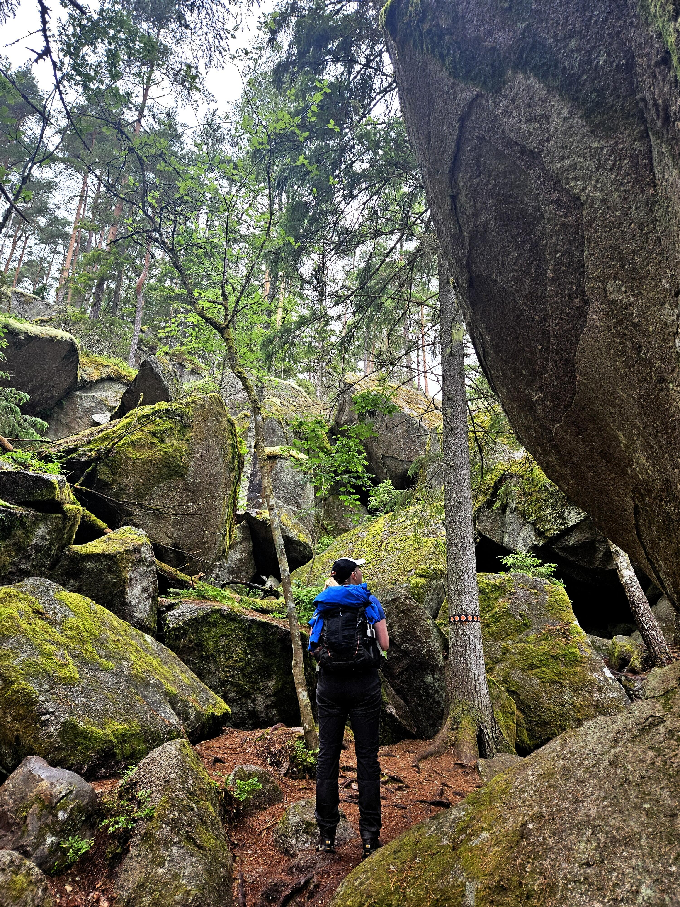

[Efter Omberg](/2025-06-28/ellen-keys-led-pa-omberg/) var det dags att köra vidare till nästa destination, Tiveden! Men först tog vi ett kort stopp för lunch i Askersund.{.-lead}

Tidig eftermiddag kom vi fram till Tiveden. Vi valde att utgå från entré Vitsand eftersom den var nära den lägerplats (Käringaudden) vi valt. På det viset kunde vi lämna en del av vår utrustning i bilen och slapp släpa på den när vi var ute och gick.

{.-full}

## Tärnekullerundan

Första dagen valde vi att gå den lite kortare, men relativt tuffa leden Tärnekullerundan. Beroende på riktning (vi följde den medsols) så går den först genom en ravin där man får klättra över stenar. Det hade regnat hela förmiddagen så det var otroligt halt. Efter ravinen kommer man upp till den platta toppen och går bland blåbärsris.

:::::: gallery {.-wide}
:::: row
{.-inline}
{.-inline}
:::: 
:::::: 

Från toppen klättrar man sedan ner bland stora klippblock och genom en grotta (Vitsandsgrottorna). Från stigen ser man ned mot Vitsandstärnarna, två sjöar som ligger norr om Vitsand.

{.-wide}

## Käringaudden och Vitsand

Efter vår lilla runda upp på Tärnekullen gick vi tillbaka till Vitsand och tömde bilen. 

Nästa uppdrag var mat och hitta en bra plats för vårt tält!

{.-full}

Vi var inte först, men bland de första att komma till Käringauddens lägerplats. De som var först hade hittat vad som nog var den bästa platsen, en stor öppen yta utan allt för mycket rötter. 

Vårt lilla tunneltält är inte så kräset dock, vi hittade en fin plats mellan två träd där vi kunde slå upp tältet.

:::::: gallery
:::: row
{.-inline}
{.-inline}
::::
::::::

Några timmar senare dök det upp två familjer som slog upp sina tält en bit bort. De var nog lite mer nybörjare för det tog en väldigt lång stund för dem att slå upp sitt tält, men det blev nog rätt bra till slut.

{.-full}

Det enda som återstod var att fixa lite mat på de väldigt fina grillplatserna. De har verkligen lagt mycket resurser på att få en bra standard i nationalparken.

Små detaljer som att ledmarkeringar och bänken runt grillplatsen har samma hexagonform som nationalparkslogotypen, eller att ledmarkeringarna är tillgänglighetsanpassade med både färgkodning och symboler för de utan färgseende, är väldigt trevligt. Någon har verkligen brytt sig!

:::::: gallery {.-wide}
:::: row
{.-inline}
::::
:::: row
{.-inline}
{.-inline}
::::
::::::

## Stigmansrundan (och dag 2)

Nästa dag var det bara vandring som stod på schemat. Vi hade valt ut Stigmansrundan som vårt mål för dagen. Det är en kort led på 4,2km, men som är beräknat att ta runt 3 timmar att gå. Den passerar många av de finare platserna som Stenhälleklack, Stenkällan samt Stigmanspasset.

{.-full}

Vi gick leden motsols. Vi började att gå ner i ravinen mellan Stenhälleklack och Svartsjöklack.  Nere i ravinen är det ett litet speciellt klimat som gör att vissa mossor som annars mest finns i fjällmiljö växer här.

:::::: gallery {.-wide}
:::: row
{.-inline}
{.-inline}
::::
:::: row
{.-inline}
{.-inline}
::::
::::::

Från leden finns ett sidospår som går att ta, upp på Stenhälleklack.

Denna hade vi läst om och såg fram emot. Det skulle gå att se *HELA VÄGEN TILL VÄTTERN!*

Leden upp gick först upp för några trappor, sen var det brant upp längs med en klippa.

{.-full}

Väl uppe fick vi vår belöning, utsikt hela vägen till Vättern, som utlovat. Men kanske inte riktigt vad vi förväntade oss. Särskilt inte efter att [dagen innan varit på Omberg](/2025-06-28/ellen-keys-led-pa-omberg/) med utsikt flera mil i alla riktningar.

{.-full}

Efter Stenhälleklack följde vi leden bort mot huvudentrén som gick över en massa kala klippor. Terrängen på denna delen av leden påminde väldigt mycket om delar av Höga kusten. Om jag skulle säga att något utmärkte Tivedens nationalpark så är det just variationen. Från mossiga raviner till höga kala klippor på bara några hundra meter.

{.-wide}

Efter huvudentrén där vi åt en lätt lunch gick vi vidare på den norra delen av leden. Den slingrade sig genom en för Småland ganska typisk tallskog med blåbärsris (fast väldigt mycket äldre och orörd). Lite då och då skymtas Trehörningen eller någon tjärn mellan träden.

:::::: gallery {.-wide}
:::: row
{.-inline}
{.-inline}
::::
::::::

Längs delar av leden var vegetationen runt stigen helt övervuxen med meterhöga blåbärsbuskar och annat.

{.-wide}

Sen helt plötsligt öppnar det upp sig och så ligger det gigantiska klippblock utan något annat runt.

{.-full}

{.-wide}

{.-wide}

Till slut kom vi tillbaka där vi gick på leden och till anslutningsleden bort till entré Vitsand som ledde oss bort till bilen.

{.-full}

Enligt nationalparkens regler får man bara sova över en natt (även om man flyttar till en annan lägerplats). På grund av det hade vi två alternativ, antingen köra hem sent på kvällen, eller att hitta en annan plats att sova på. Vi valde det senare alternativet.

## Tivedstorp

Sju minuter (med bil) norr om nationalparken ligger ett gammalt torp där STF driver vandrarhemmet Tivedstorp.

Vandrarhemmet kändes precis som varenda STF-vandrarhem jag varit på. Trevlig personal, gamla, slitna, men välstädade lokaler och mycket charm.

Vi betalade för en tältplats för natten och fick då också tillgång till köket och duscharna. Det visade sig sen att vi var de enda som skulle tälta, alla andra hade hyrt stugor, så vi hade duschar, kök och tältplatsen för oss själva.

:::::: gallery {.-wide}
:::: row
{.-inline}
{.-inline}
::::
:::: row
{.-inline}
{.-inline}
::::
::::::

Tiveden kommer vi att besöka igen!