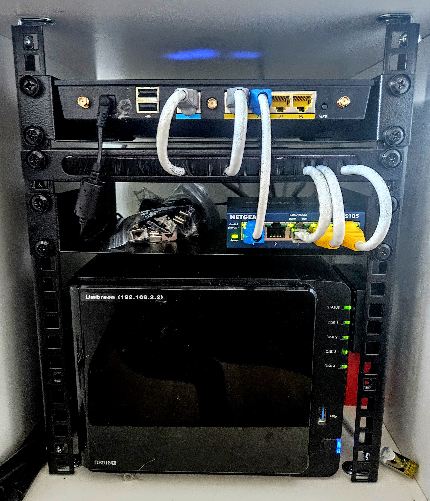
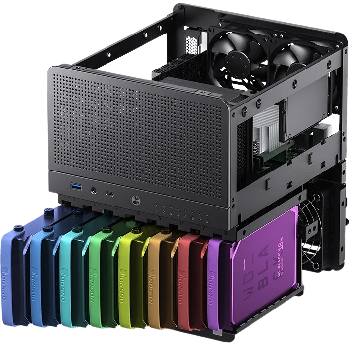
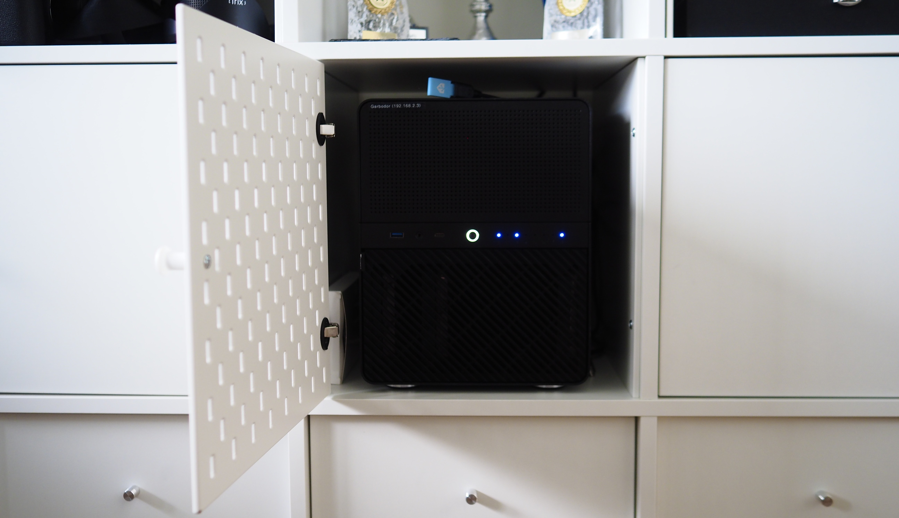

2013 skaffade jag min första hemmaserver, en DS212j från Synology som jag köpte främst för att ha ett bra ställe att lagra mina bilder. Ganska snabbt växte jag dock ur den och 2016 valde jag att uppgradera till DS916+, också från Synology. Den hade plats för fler diskar och betydligt bättre processor som gjorde det möjligt att drifta lite fler applikationer, särskilt via Docker.{.lead}

Efter 9 år känner jag att jag vuxit ur den också. Delvis på grund av lagringsutrymmet på 4 diskar men kanske mest på grund av operativsystemet DiskStation som visserligen är baserat på Linux samt har ett väldigt smidigt gränssnitt och några riktigt bra applikationer men som är ett stängt system och som inte längre får mer än säkerhetsuppdateringar.

Nya servern är ett hemmabygge som jag själv kan uppgradera och utöka över tid. Den är byggd för operativsystemet [Unraid](https://unraid.net/) som är perfekt för att successivt kunna bygga ut lagringen över tid på ett smidigt sätt och det är väldigt enkelt att drifta egna applikationer (mest via Docker).

Mina behov har under de senaste 9 åren vuxit rejält *(efter hand som jag lärt mig mer och ändrat min inställning till molntjänster och därför driftar fler tjänster själv)*.

På grund av det valde jag att höfta till lite grann i valet av komponenter, istället för att köpa något som täcker mina behov idag och sen behöva uppgradera igen om några år.

## En jämförelse med hårdvaran på den gamla servern

|             | Umbreon (Synology DS916+)         | Garbodor (Unraid NAS)               |
|-------------|-----------------------------------|-------------------------------------|
| *Processor* | Intel N3710  4x1,6 GHz (2,56 Ghz) | Intel i3-13100 4x3,4 GHz (4,5 Ghz)  |
| *Minne*     | 8GB DDR3                          | 32GB DDR5                           |
| *SSD* cache | `null`                            | 1TB (i RAID)                        |
| *Lagring*   | 4 diskar                          | (Upp till) 8 diskar                 |
| *Ethernet*  | 1 GbE                             | 2,5GbE                              | 

*(Ja, jag gillar att döpa alla mina enheter efter Pokémon)*

Chassit jag valde att bygga i är [Jonsbo N3](https://www.inet.se/produkt/6910255/jonsbo-n3-svart), ett kompakt NAS-chassi med plats för 8st 3,5"-diskar och några 2.5"-diskar. Enda problemet var egentligen att hitta ett moderkort med tillräckligt många SATA-portar. Jag tittade ett tag på specialbyggda NAS-moderkort som hade alla portar, men jag kände inte riktigt att jag litade på att beställa en så pass central del från Kina utan garanti, så det blev ett gejmingmoderkort som jag sedan kompletterade med en m.2—SATA-adapter.

{.-no-shadow}

Chassit valde jag att fylla med tysta Noctua-fläktar, jag snålade lite på processorkylaren och körde på den medföljande, men det blir nog en uppgradering så småningom eftersom den är väldigt högljudd under belastning.

Normal filåtkomst är runt 5 gånger så snabbt eftersom jag kan använda en SSD cache istället för att läsa direkt från arrayen av roterande metall. Den nya processorn har en högre basklocka än den gamla hade i boost och minnet är 4 gånger högre. Just minnet var nog det som kändes mest onödigt just nu, men om jag ska köra flera virtuella maskiner som jag funderat på så kan det snabbt behövas.

En framtida tanke är att ha en VM som bara är gjord för att köra [OpenDroneMap] och då hade jag egentligen velat ha flera hundra GB i RAM. 

🤷

Det enda som har blivit en försämring är energiförbrukningen. Servern har runt 30-40W i effekt under baslast. Min gamla server hade sina komponenter skräddarsydda för att fungera ihop och hade därför extremt låg energiförbrukning, oftast runt 3–6 watt. I teorin kan jag få ner energiförbrukningen betydligt mer, men eftersom jag driftar många olika applikationer så blir det inte så att processorn går ner i de djupare C-states. Oavsett så är 40W inte särskilt dåligt, bara runt 1 kWh om dagen. Vissa komponenter, som till exempel mitt m.2↔6xSATA-kort drar mer energi än om det skulle varit SATA portar direkt på moderkortet.

{.-wide}

## Unraid & applikationer

Nog sagt om hårdvaran. Det som visade sig vara kronjuvelen i projektet är operativsystemet [Unraid].

Efter någon månads användning så är jag så nöjd som det går att vara. Det är otroligt stabilt och väldigt enkelt att drifta lite vad som helst. Unraid gör det möjligt att gå från "jag kanske ska prova att hitta ett alternativ till Google Photos" till att ha en fullt fungerande [Immich]-server på under 5 minuter.

**Fantastiskt!**

Det enda som jag egentligen kan ha synpunkter på är Unraids beslut att själva operativsystemet ska ligga på ett USB-minne, och att licensen är direkt knuten till det. Jag hade mycket hellre haft det på en riktig disk eller partition.

Men eftersom det sällan skrivs till minnet utan bara läses bör det inte vara ett allt för stort hinder i längden. Jag hoppas verkligen det inte blir som med alla mina tidigare Raspberry Pis där minneskortet dör på väldigt kort tid på grund av allt skrivande.

Här är en liten tabell över det jag driftar just nu, bredvid den tidigare tjänsten jag använde (om det finns).

| Kategori              | *Tidigare*                                 | *Garbodor (Unraid)*                    |
|-----------------------|--------------------------------------------|----------------------------------------|
| Smart hem             | [Home Assistant] *(Umbreon)*               | [Home Assistant]                       |
| Smart hem             |                                            | [ESPHome]                              |
| Smart hem             |                                            | [Mosquitto]                            |
| Smart hem             |                                            | [NodeRED]                              |
| Övervakning           | [Surveillance Station] *(Umbreon)*         | [Frigate]                              |
| Fotolagring & delning | Google Photos                              | [Immich]                               |
| Backup                | [Hyper Backup] → [Synology C2] *(Umbreon)* | [Duplicati] → [Backblaze B2] + Umbreon |
| Ljudböcker            |                                            | [audiobookshelf]                       |
| Reverse Proxy         | Synology Proxy *(Umbreon)*                 | [Nginx Proxy Manager]                  |

I ett kommande inlägg tänkte jag gå in lite mer på [Home Assistant] och hur jag konfigurerat mitt smarta hem.

*[VM]: virtuell maskin
*[ZFS]: Zettabyte File System, ett modernt filsystem med många nya funktioner
*[RAID]: En metod för att få flera diskar att samarbeta som en enhet för att ge redundans eller för att öka prestanda

[Unraid]: https://unraid.net
[OpenDroneMap]: https://www.opendronemap.org/
[Home Assistant]: https://www.home-assistant.io/
[Surveillance Station]: https://www.synology.com/en-global/surveillance
[Frigate]: https://frigate.video/
[Hyper Backup]: https://www.synology.com/en-global/dsm/feature/hyper_backup
[Synology C2]: https://c2.synology.com/en-global
[Duplicati]: https://duplicati.com
[Backblaze B2]: https://www.backblaze.com/cloud-storage
[audiobookshelf]: https://audiobookshelf.org
[NodeRED]: https://audiobookshelf.org
[Immich]: https://immich.app
[ESPHome]: https://esphome.io/
[Mosquitto]: https://mosquitto.org
[Nginx Proxy Manager]: https://nginxproxymanager.com/
