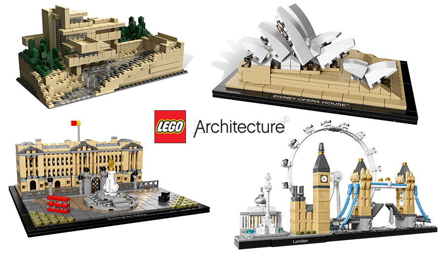
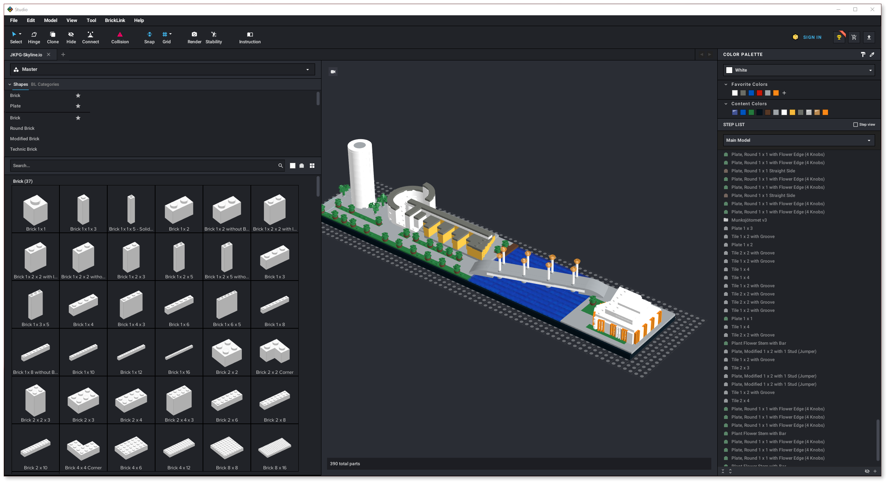
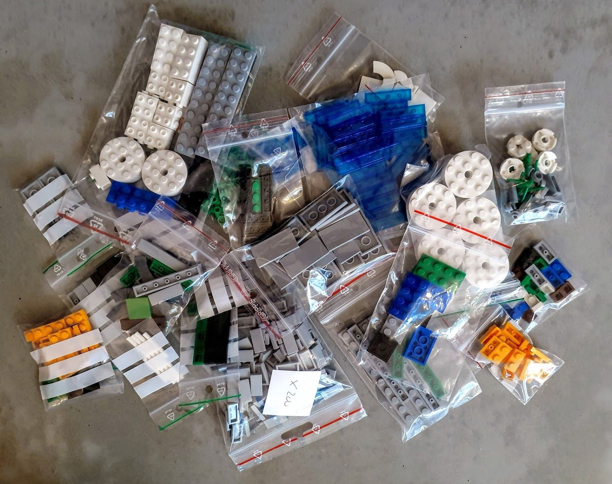
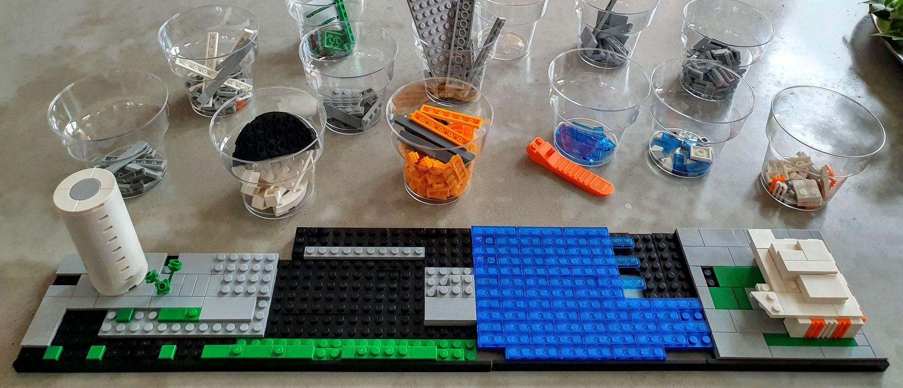
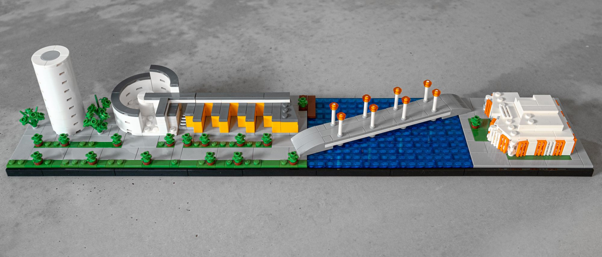
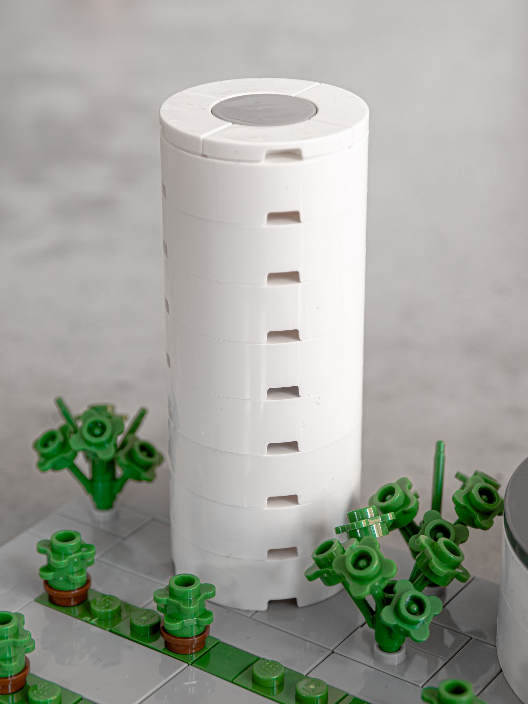
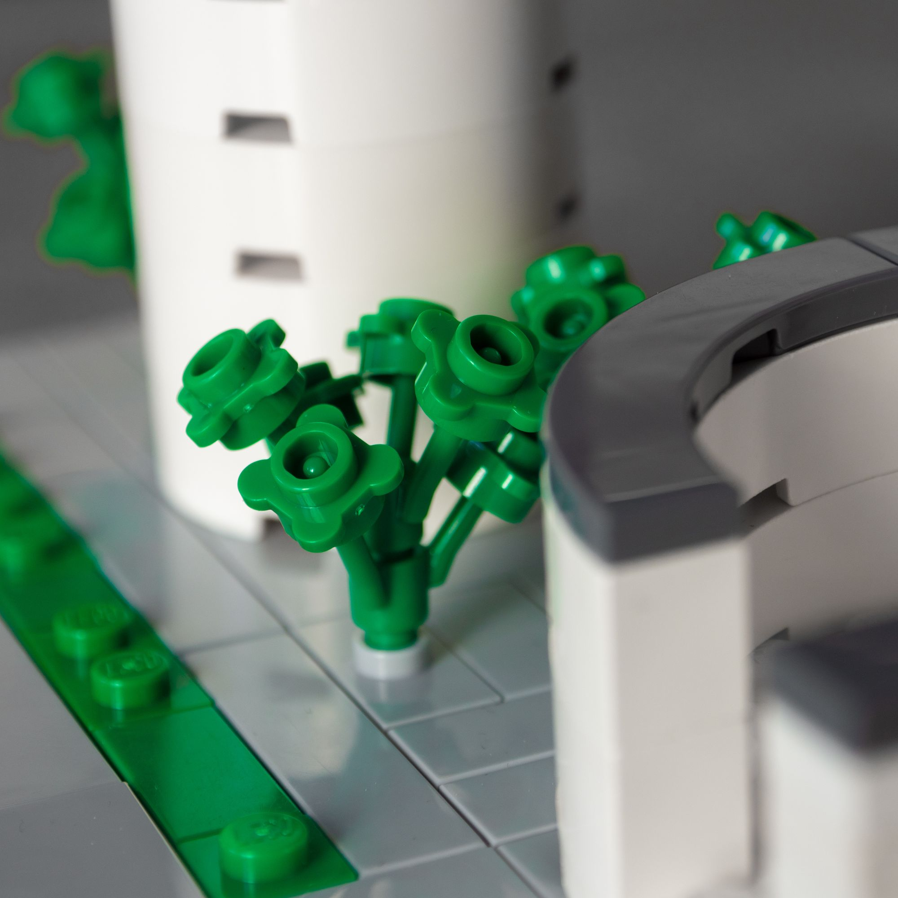
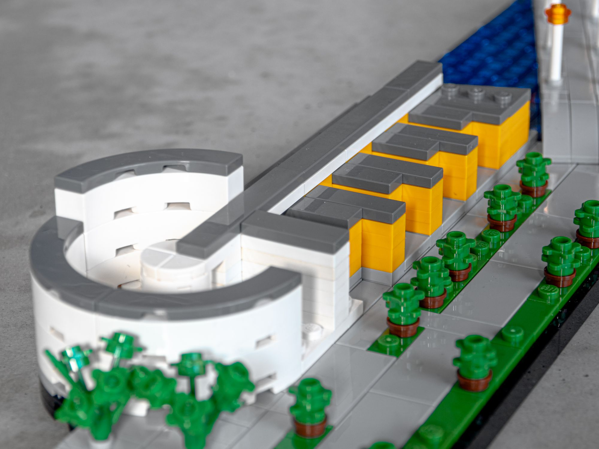
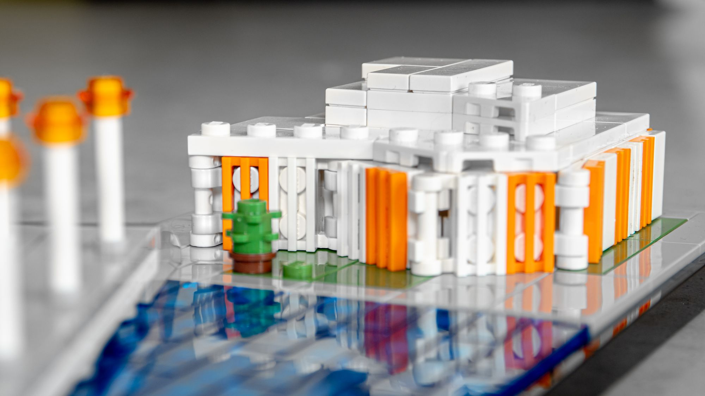
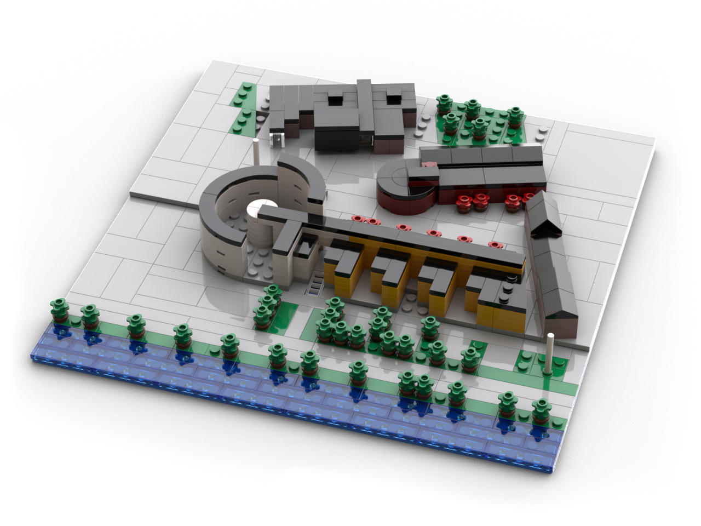

Min favoritserie av LEGO-sets är Architecture. En serie där varje set är ett axplock av kända byggnader och platser från en viss stad i mikroskala[^\[Brickipedia\]^](https://lego.fandom.com/wiki/Microscale).

{.-inline}

Mikroskala är oerhört roligt på grund av utmaningen att få till små detaljer trots den lilla skalan och med brist på bitar i rätt färg och form. Det är också lite enklare eftersom det är färre (oftast i alla fall) bitar vilket gör det snabbare att bygga.

<figure class="kg-card kg-image-card kg-card-hascaption"> <figcaption>Officiella setet för Paris i LEGO™ Architecture</figcaption>
</figure>

I några år har jag samlat på LEGO Architecture för de städer jag besökt, som till exempel Shanghai men har också sneglat på den uppsjö av MOCs[^\[Brickipedia\]^](https://lego.fandom.com/wiki/List_of_LEGO_Abbreviations) som många har skapat i alla storlekar, från små modeller som den över Paris ovan till [monsterstora modeller som den över Köpenhamn av Ulrik Hansen](https://imgur.com/gallery/Ezj1L) nedan.

")

Det var någonstans i den vevan som jag hittade [Stud.io](https://stud.io) eller Studio som den numera heter _(Jag föredrar det gamla namnet)_.

Stud.io är ett fantastiskt litet CAD-liknande program specifikt för LEGO. Det går att enkelt bygga modeller med alla tillgängliga och otillgängliga bitar. Det går även att få en prisuppskattning för en viss bit för den som vill vara lite ekonomisk och välja en annan liknande bit.

{.-wide}

Jag bestämde mig för att göra en egen variant på LEGO Architecture för Jönköping.

Första steget var att välja ut vilka byggnader som jag ville göra. Högskolan, Munksjöbron och Kulturhuset Spira var givna kandidater, de är de byggnader som sticker ut mest (på ett bra sätt) i den Jönköpingska stadsbilden. Men det fanns även fler byggnader som Sofiakyrkan och Toarullen (Munksjötornet) som skulle kunna vara med.

De jag landade i var till slut Toarullen, Högskolan (JIBS + JTH), Munksjöbron och Kulturhuset Spira. Sofiakyrkan föll bort för att den skulle bli för stor för att passa in bland de andra, och det blev ett fokus mer på byggnader kring Munksjön snarare än Jönköping i sin helhet. Det blir nog Sofiakyrkan i en egen design senare.

{.-wide .-no-shadow}

Från Stud.io är det väldigt enkelt. Företaget bakom Stud.io: Bricklink.com som är en köp-och-säljsida för begagnade och nya legobitar har gjort det möjligt att ladda upp filer direkt från Stud.io som sen genererar inköpslistor utifrån de filter som en själv sätter upp. Jag valde att endast köpa från svenska säljare. Därefter beställer en från de butiker som valts ut och till slut kommer paketet (oftast) i brev hem till brevlådan. Snabbt och smidigt!

Sen var det dags att bygga, jag använder lite plastglas för att organisera upp alla olika bitar. _Nästa gång ska jag inte organisera efter färg utan typ (Färg är alltid lätt att hitta oavsett)._

{.-full}

Och sen en färdig modell. Storleksmässigt är den 2-3 gånger större än de flesta officiella LEGO Architecture eftersom skalan jag valt är betydligt större samt att de flesta officiella set är främst höghus som inte tar så mycket yta.

Är väldigt nöjd med resultatet!

{.-full}

:::: gallery {.-wide}
::: row {.-no-wrap}
{.-inline}
{.-inline}
:::
::: row {.-no-wrap}
{.-inline}
{.-inline}
:::

<figcaption>
Toarullen och högskolan
</figcaption>
::::

:::: gallery {.-wide}
::: row {.-no-wrap}
{.-inline}
{.-inline}
:::

<figcaption>
Munksjöbron
</figcaption>
::::

{.-wide}

Vet inte riktigt vad nästa bygge blir, har påbörjat en design på högskoleområdet men får se om det blir nästa jag faktiskt bygger eller om det blir längre fram.

{.-no-shadow}
