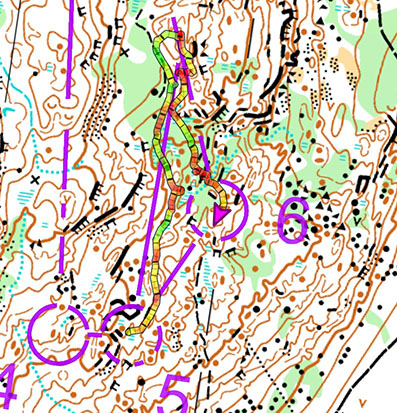

  
En liten löprapport från Tiomila 2022 i Ånnaboda, Örebro.{.lead}

[Tiomila](https://tiomila.se) är *(förmodligen)* orienteringens största budkavle som arrangerats nästan årligen sedan 1945. På grund av pandemin har det nu varit uppehåll sedan 2019 så den var efterlängtad av många.

{.-full}

På grund av diverse anledningar har jag tyvärr missat de flesta av orienteringssportens största tävlingar som Tiomila och O-ringen. Med lite hjälp från min hemmaklubb Hallby SOK och lite andra klubbar fick jag denna helg hjälp att delta i ett av dessa.

I år arrangerades den på och runt campingområdet Ånnaboda nordväst om Örebro.

Vårt lag var en kombination av klubbarna Anderstorps SOK, IF Hallby SOK, OK Reftele och OK Tyr.

Tävlingen består av 10 sträckor som sammanlagt uppgår till ungefär 10 mil, därav namnet. Starten går kl 21:30 och flera av sträckorna går på natten. I vårt fall var det sträckorna 1–5 som gick i mörker med pannlampa, de lite snabbare lagen hade fler sträckor på natten.

{.-full}

Jag sprang sträcka 9 som är på 9,7km (fågelvägen). Sammanfattningsvis gick det oerhört bra med endast några missar. I början av banan hängde jag med i farten med de andra löparna (vi hade en masstart eftersom vi omstartade) vilket gjorde att jag inte hängde med lika bra på orienteringen, framförallt på kontroll nummer 6 gjorde jag en bom där jag sprang för långt och var nästan borta vid kontroll 7. Denna lilla extratur kostade minuter men framförallt energi som jag hade behövt på slutet.

Efter denna miss lugnade jag ner min löpning lite och fokuserade på kartan, i slutändan gjorde detta att jag faktiskt lyckades få ett högre snittempo då jag inte stannade lika mycket. Trots att det var många andra löpare som hade samma sträcka körde jag mitt eget race (vid så mycket som tre kontroller var det jag som var först fram i gruppen).

{.-full}

Andra halvan av loppet kan vara den bästa orientering jag gjort (dock inte min bästa löpform och kondition som jag behöver jobba mer på).

[Kolla hur jag sprang på tjänsten Livelox](https://www.livelox.com/Viewer/Tiomila-i-Annaboda-Orebro/Tiomilakavlen/9?classId=469776&relayLeg=9).

