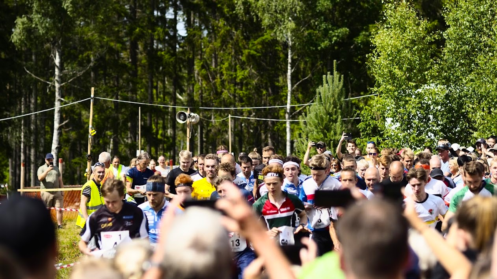
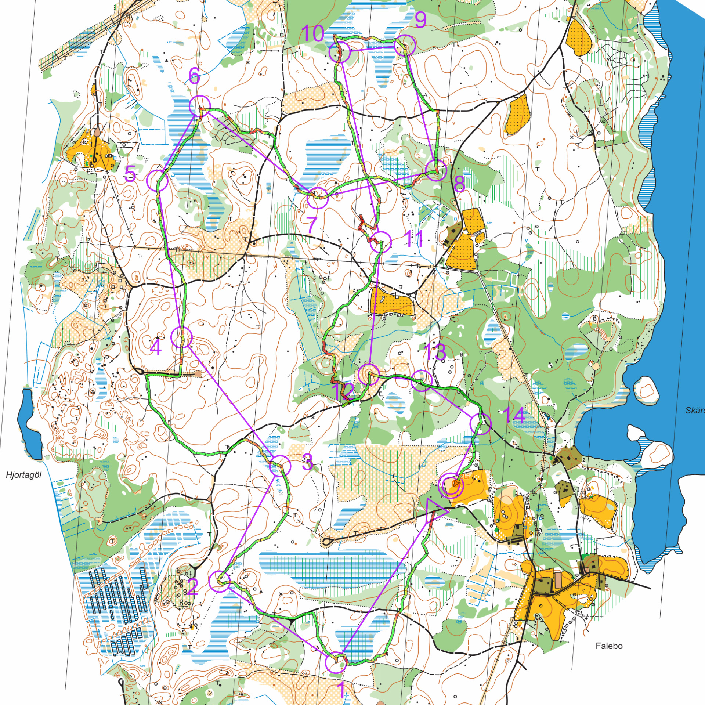

Tjoget är en årlig nationell budkavle (stafettorientering) med 20 delsträckor.

Till skillnad från [Tiomila](/2022/05/08/tiomila-2022-i-annaboda-orebro/) som är mer elitinriktad så riktar sig Tjoget istället till den breda massan med både enkla, svåra, korta och långa sträckor. Vissa sträckor är också begränsade till vissa åldrar (under 14 eller över 40) eller för enbart damer.

> Max 9 löpare från klasserna H18–H40 får ingå i laget.
> 
> Minst 5 sträckor skall löpas av damer.
> 
> För att sträcka 3 eller 14 skall räknas som damsträcka, skall alla tre löparna vara damer.
> 
> Om någon löpare på sträcka 14 är från klasserna H18–H40 räknas den som en sådan sträcka. 
> 
> Inga spridningsmetoder förekommer.

{.-wide}

Vårt lag i år bestod av löpare från IF Hallby SOK, Anderstorps OK och Jönköpings OK. Vi hade en blandning av allt från rutinerade orienterare till helt gröna men eftersom sträckorna fanns i en så stor variation på svårighet och längd var det inget problem utan vi kunde förlägga banorna efter förmåga.

Jag hade sträcka 17 som var en av de svårare men inte en av de längsta på 6 600m.

Vårt främsta mål med helgen var att alla skulle fullfölja och i andra hand få en bättre placering än sist som var runt lag 40.

{.-full}

Tjoget startade på lördagen kl 15:00 med de första 7 sträckorna. Efter att de kommit in var det ett uppehåll fram till klockan 01:00 på söndagen där det var en jaktstart beroende på hur långt efter det ledande laget en var på sträcka 7. Vi var mer än 45 minuter efter så vi startade 01:45 (*ingen startar mer än 45 minuter efter för att det inte ska bli för stor spridning*).

På jaktstarten gick vi ut på placering nummer 38 (som vi var nöjda med) men efter flera bra (och vissa fantastiska) prestationer var vi på placering 18 när det var dags för min sträcka.

Jag gick ut med en mindre bom (se den följande [kartan från Livelox](https://www.livelox.com/Viewer/Tjoget/Oppen/Str-17?classId=494139&relayLeg=17)) redan till första kontrollen, inget som kostade så mycket tid men tillräckligt för jag inte skulle komma in i ett flow.

Området var inte särskilt kuperat vilket var skönt. Däremot var undervegetationen bestående av mest blåbärsris väldigt svårlöpt. När det väl kom en myr som i vanliga fall är det som är lite mer tunglöpt så var det här en frälsning från blåbärsriset.

{.-full}

För att undvika det mesta av riset tog jag en omväg på stigar mellan kontroll 3 och 4. Därefter fanns det tyvärr inte så många sådana val (kanske mellan 11 och 12, men det missade jag).

Kontrollerna satt ganska djupt och gick oftast inte att se förrän en var intill dem på grund av riset. Trots det flöt det på ganska bra fram till kontroll nummer 11 där jag hade en lång sträcka utan något som fångade upp, jag blev osäker på hur långt jag hade sprungit och var rädd för att jag sprungit förbi kontrollen och då behövde springa tillbaka. Efter en stund hann två löpare (på samma sträcka) ikapp och jag såg att de sprang vidare. Då insåg jag att jag inte sprungit förbi och kunde fortsätta utan nojan.

Till sträcka 12 tog jag vad jag trodde var ett finurligt vägval men det blev istället en stor försening. Jag sprang kortaste biten genom ett ljust grönområde och sen över ett kalhygge för att sen springa på en stig som ledde nästan rakt på kontrollen. Istället gjorde jag en felbedömning på var jag kommit ut från grönområdet och missade stigen.

Så här i efterhand skulle jag tagit omvägen på vägen (och då passerat kontroll 13 två gånger), men det är lätt att vara efterklok.

På grund av mitt långsamma tempo genom grönområdet innan kontroll 12 hade jag bra med energi och kunde göra en ordentlig slutspurt i mål, då på placering 21. Att bara tappa tre placeringar är jag väldigt nöjd med.

[Vi slutade på plats 18](https://eventor.orientering.se/Events/ResultList?eventId=34635&groupBy=EventClass).

